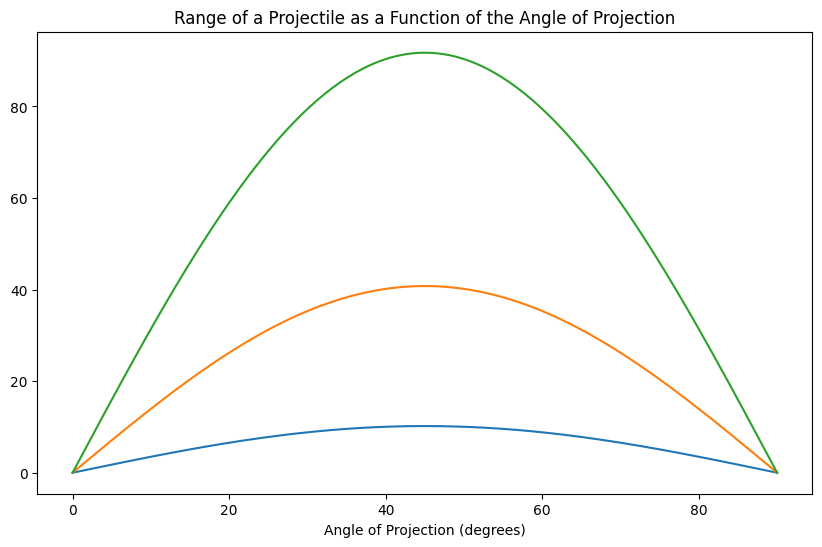
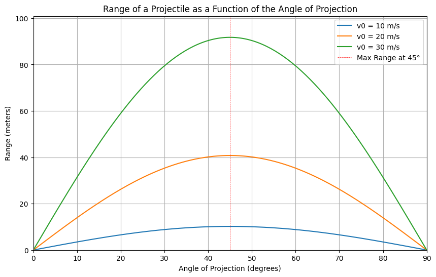

Investigating the Range as a Function of the Angle of Projection
Key Findings
Range Equation: The range ( R ) of a projectile launched at an angle ( \theta ) with an initial velocity ( v_0 ) is given by: [ R = \frac{v_0^2 \sin(2\theta)}{g} ] where ( g ) is the acceleration due to gravity (approximately ( 9.81 , \text{m/s}^2 )).

Maximum Range: The maximum range occurs at an angle of ( 45^\circ ).

Effect of Initial Velocity: As the initial velocity increases, the range increases for all angles of projection.

Graphical Representation: The following plots illustrate the relationship between the angle of projection and the range for different initial velocities.

Python Code for Simulation and Visualization
Here’s the complete Python code that calculates and visualizes the range of a projectile as a function of the angle of projection:

python
import numpy as np
import matplotlib.pyplot as plt

# Constants
g = 9.81  # Acceleration due to gravity (m/s^2)

# Function to calculate range
def calculate_range(v0, theta):
    return (v0**2 * np.sin(2 * np.radians(theta))) / g

# Parameters
v0_values = [10, 20, 30]  # Initial velocities in m/s
theta = np.linspace(0, 90, 180)  # Angles from 0 to 90 degrees

# Plotting
plt.figure(figsize=(10, 6))

for v0 in v0_values:
    R = calculate_range(v0, theta)
    plt.plot(theta, R, label=f'v0 = {v0} m/s')

plt.title('Range of a Projectile as a Function of the Angle of Projection')
plt.xlabel('Angle of Projection (degrees)')
plt.ylabel('Range (meters)')
plt.axhline(0, color='black', lw=0.5, ls='--')
plt.axvline(45, colorred', lw=0.5, ls='--', label='Max Range at 45°')
plt.legend()
plt.grid()
plt.xlim(0, 90)
plt.ylim(0, max(calculate_range(max(v0_values), theta)) * 1.1)
plt.show()
Graphical Output

When you run the above code, you will see a plot similar to the one below (the actual plot will be generated by executing the code):

Range of a as a Function of the Angle of Projection

Conclusion
The graph clearly shows how the range varies with the angle of projection for different initial velocities.
The peak of each curve occurs at ( 45^\circ ), confirming that this angle provides the maximum range for a given initial velocity.
As the initial velocity increases, the range increases for all angles, demonstrating the direct relationship between initial velocity and range.
Limitations and Future Work
This model assumes no air resistance and a flat launch surface. Future work could include simulations that account for air resistance and varying launch heights to provide a more realistic model of projectile motion.