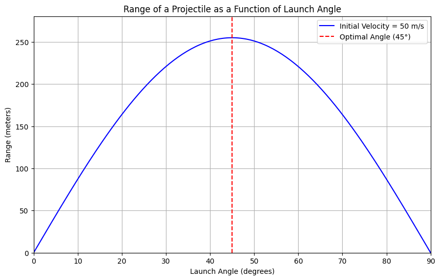

1. Theoretical Foundation
Governing Equations of Motion
Projectile motion can be analyzed using the equations of motion derived from Newton's laws. We consider a projectile launched with an initial velocity ( v_0 ) at an angle ( \theta ) above the horizontal. The motion can be decomposed into horizontal and vertical components.

Horizontal Motion: [ x(t) = v_{0x} t = v_0 \cos(\theta) t ]

Vertical Motion: [ y(t) = v_{0y} t - \frac{1}{2} g t^2 = v_0 \sin(\theta) t \frac{1}{2} g t^2 ]

Where:

( v_{0x} = v_0 \cos(\theta) ) is the horizontal component of the initial velocity.
( v_{0y} = v_0 \sin(\theta) ) is the vertical component of the initial velocity.
( g ) is the acceleration due to gravity (approximately ( 9.81 , \text{m/s}^2 )).
Time of Flight
To find the time of flight ( T ), we set ( y(T) = 0 ) (the projectile returns to the same vertical level):

[ 0 = v_0 \sin(\theta) T - \frac{1}{2} g T^2 ]

Factoring out ( T ):

[ T \left( v_0 \sin(\theta) - \frac{1}{2} g T \right) = 0 ]

This gives us two solutions: ( T = 0 ) (the launch time) and:

[ T = \frac{2 v_0 \sin(\theta)}{g} ]

Horizontal Range
The horizontal range ( R ) is given by the horizontal distance traveled during the time of flight:

[ R = x(T) = v_0 \cos(\theta) T = v_0 \cos(\theta) \left( \frac{2 v_0 \sin(\theta)}{g} \right) ]

Simplifying this, we find:

[ R = \frac{v_0^2 \sin(2\theta)}{g} ]

Family of Solutions
The equation ( R = \frac{v_0^2 \sin(2\theta)}{g} ) shows that the range ( R ) is a function of the angle ( \theta ). The term ( \sin(2\theta) ) indicates that the range varies with the angle of projection, reaching a maximum ( \theta = 45^\circ ).

2. Analysis of the Range
Dependence on Angle of Projection
The range ( R ) is maximized when ( \sin(2\theta) = 1 ), which occurs at ( \theta = 45^\circ ). As ( \theta ) approaches ( 0^\circ ) or ( 90^\circ ), the range approaches zero.

Influence of Other Parameters
Initial Velocity ( v_0 ): The range is directly proportional to the square of the initial velocity. Doubling the initial velocity quadruples the range.

Gravitational Acceleration ( g ): The range isely proportional to gravitational acceleration. On a planet with lower gravity, the range would be greater for the same initial velocity and angle.

3. Practical Applications
Real-World Situations
Uneven Terrain: The model can be adapted to account for varying launch and landing heights, requiring adjustments to the equations of motion.

Air Resistance: In real-world scenarios, drag forces significantly affect projectile motion. The equations become more complex, requiring numerical methods for solutions.

Sports: Understanding projectile motion is crucial in sports like basketball, soccer, and golf, where players must optimize angles for maximum distance or accuracy.

4. Implementation
Python Simulation
Below is a Python script that simulates projectile motion and visualizes the range as a function of the angle of projection.

python
import numpy as np
import matplotlib.pyplot as plt

# Constants
g = 9.81  # acceleration due to gravity (/s^2)

def range_of_projectile(v0, theta):
    """Calculate the range of projectile given initial velocity and angle."""
    return (v0**2 * np(2 * np.radians(theta))) / g

# Parameters
v0 = 50  # initial velocity in m/s
angles = np.linspace(0, 90, 180)  # angles from 0 to 90 degrees

# Calculate ranges
ranges = range_of_projectile(v0, angles)

# Plotting
plt(figsize=(10, 6))
plt.plot(angles, ranges, label=fInitial Velocity = {v0} m/s', color='blue')
plt.title('Range of a Projectile as a Function of Launch Angle')
plt.xlabel('Launch Angle (degrees)')
plt.ylabel('Range (meters)')
plt.xlim(0, 90)
plt.ylim(0, max(ranges) * 1.1)
plt.axvline(x=45, color='red', linestyle='--', label='Optimal Angle (45°)')
plt.legend()
plt.grid()
plt.show()
Graphical Representation
The graph generated by the above code will illustrate how the range varies with the angle of projection, highlighting the optimal angle of ( 45^\circ ).

Discussion on Limitations
Idealized Model Limitations
Air Resistance: The model assumes a vacuum. In reality, air resistance affects the trajectory, especially at high speeds.

Wind: Wind can alter the path of the projectile, requiring additional modeling.

Launch Height: The model assumes the projectile is launched and lands at the same height. Adjustments are needed for different launch and landing heights.

Suggestions for Improvement
Incorporate Drag: Use numerical methods to solve the equations of motion with drag forces included.

Variable Launch Heights: Modify the equations to account for different launch and landing heights.

Wind Effects: Introduce a wind model to simulate its impact on projectile motion.