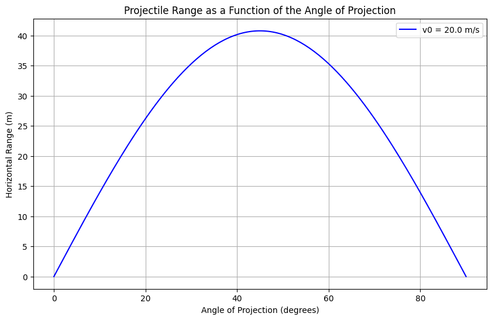

Problem 1
 
Below is a comprehensive Markdown document that outlines the derivation, analysis, and simulation of projectile motion with a focus on how the horizontal range depends on the launch angle. The document includes theoretical derivations, discussion of parameter effects and limitations, as well as a Python simulation to visualize the range versus the angle of projection.
 
---
 
# Investigating the Range as a Function of the Angle of Projection
 
<br/>
 
## 1. Introduction
 
Projectile motion is a classic problem in mechanics that offers deep insights into the interplay between linear and quadratic relationships. By varying parameters such as the initial velocity, gravitational acceleration, and launch height, one can obtain a rich family of solutions that model real-world phenomena ranging from sports to aerospace engineering.
 
In this document, we:
 
- Derive the governing equations of motion.
- Analyze the dependence of the horizontal range on the angle of projection.
- Discuss the influence of initial velocity and gravitational acceleration.
- Explore practical applications and limitations of the idealized model.
- Implement a simulation in Python to visualize these relationships.
 
---
 
## 2. Theoretical Foundation
 
### Derivation of Equations of Motion
 
Assume a projectile is launched with an initial speed $v_0$ at an angle $\theta$ relative to the horizontal. Under the assumption of uniform gravitational acceleration $g$ and no air resistance, the equations of motion are:
 
$$
x(t) = v_0 \cos(\theta) \, t,
$$
 
$$
y(t) = v_0 \sin(\theta) \, t - \frac{1}{2} g t^2.
$$
 
### Time of Flight and Range
 
For a projectile launched from and landing at the same vertical level ($y = 0$), setting $y(T) = 0$ gives:
 
$$
0 = v_0 \sin(\theta) \, T - \frac{1}{2} g T^2.
$$
 
This yields two solutions:
 
1. $T = 0$ (the launch moment), and
2. $$
   T = \frac{2 v_0 \sin(\theta)}{g}.
   $$
 
The horizontal range $R$ is the horizontal displacement at $T$:
 
$$
R = x(T) = v_0 \cos(\theta) \, T = v_0 \cos(\theta) \cdot \frac{2 v_0 \sin(\theta)}{g} = \frac{v_0^2 \sin(2\theta)}{g}.
$$
 
Thus, the range as a function of the angle $\theta$ is:
 
$$
R(\theta) = \frac{v_0^2 \sin(2\theta)}{g}.
$$
 
---
 
## 3. Analysis of the Range
 
### Dependence on the Angle of Projection
 
- **Optimal Angle:**  
  For a given $v_0$ and $g$, the maximum range is achieved when $\sin(2\theta)$ is maximized. Since $\sin(2\theta)$ reaches its maximum value of 1 when $2\theta = 90^\circ$, the optimal angle is:
 
  $$
  \theta = 45^\circ
  $$
 
- **Parameter Influences:**
  - **Initial Velocity $v_0$:**  
    The range scales with $v_0^2$; increasing $v_0$ results in a quadratic increase in the range.
  - **Gravitational Acceleration $g$:**  
    A higher gravitational acceleration reduces the range. On celestial bodies with lower $g$, the projectile would travel farther.
  - **Launch Height:**  
    For non-zero launch heights, the time of flight and range are modified. This case introduces additional complexity and typically requires solving a quadratic equation for $T$.
 
---
 
## 4. Practical Applications and Limitations
 
### Applications
 
- **Sports:**  
  The model helps in understanding the optimal angles for throwing or hitting balls.
- **Engineering:**  
  Used in ballistics, trajectory planning, and robotics.
- **Astrophysics:**  
  Similar principles can be adapted to study trajectories in different gravitational fields.
 
### Limitations
 
- **Air Resistance:**  
  The idealized model neglects drag, which significantly affects real-world trajectories.
- **Wind Effects:**  
  Lateral forces are not considered.
- **Non-uniform Gravitational Fields:**  
  For large-scale projectiles (e.g., rockets), the assumption of constant $g$ is not valid.
- **Uneven Terrain:**  
  The analysis assumes level ground; varying terrain requires more complex modeling.
 
---
 
## 5. Implementation: Python Simulation
 
Below is a Python script that simulates projectile motion and visualizes the horizontal range as a function of the projection angle for different initial conditions.
 
```python
import numpy as np
import matplotlib.pyplot as plt
 
# Constants and parameters
g = 9.81  # gravitational acceleration (m/s^2)
v0 = 20.0  # initial velocity (m/s)
 
# Angle range from 0 to 90 degrees in radians
angles_deg = np.linspace(0, 90, 180)
angles_rad = np.deg2rad(angles_deg)
 
# Calculate range for each angle using R = (v0^2 * sin(2θ)) / g
ranges = (v0**2 * np.sin(2 * angles_rad)) / g
 
# Plot the Range vs. Angle of Projection
plt.figure(figsize=(10, 6))
plt.plot(angles_deg, ranges, label=f'v0 = {v0} m/s', color='blue')
plt.xlabel('Angle of Projection (degrees)')
plt.ylabel('Horizontal Range (m)')
plt.title('Projectile Range as a Function of the Angle of Projection')
plt.legend()
plt.grid(True)
plt.show()
```
 
### Simulation Output from Python code
 
Here is the static image generated from google colab:
 

---
 
### Explanation of the Code
 
- **Parameter Setup:**  
  We define the gravitational acceleration $g$ and the initial velocity $v_0$.
- **Angle Range:**  
  Angles are sampled from 0° to 90° and converted to radians.
- **Range Calculation:**  
  The range for each angle is computed using the derived formula.
- **Visualization:**  
  A plot is generated to show the dependence of the range on the angle of projection.
 
---
 
## 6. Conclusion
 
This investigation has provided:
 
- A derivation of the fundamental equations of projectile motion.
- A clear relationship showing that the range is maximized at a 45° angle for level ground.
- An analysis of how initial velocity and gravitational acceleration influence the trajectory.
- A Python-based simulation that visualizes these relationships.
 
While the idealized model offers significant insights, real-world applications require accounting for additional factors like air resistance, wind, and variable terrain. Future extensions might include these effects to provide a more comprehensive understanding of projectile motion in practical scenarios.
 