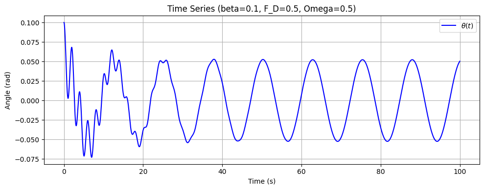
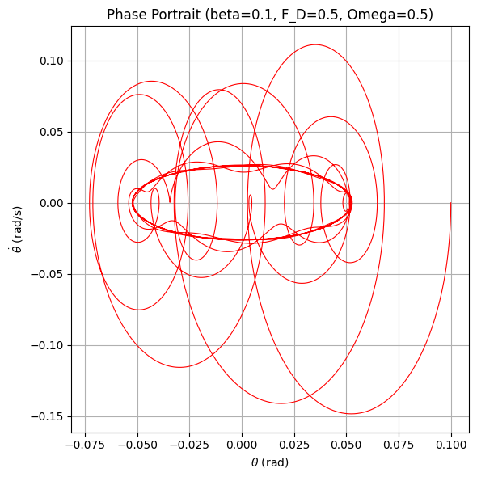
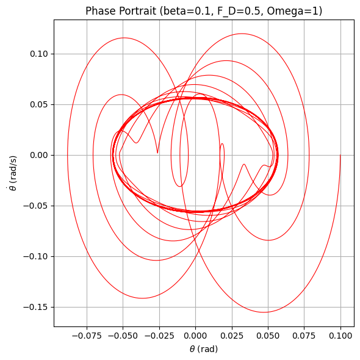
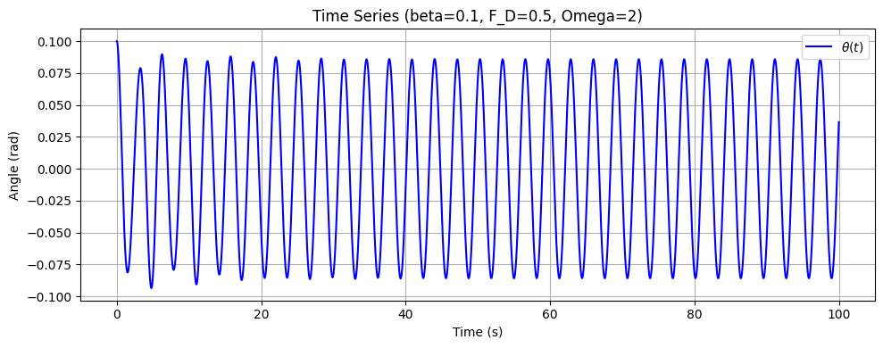
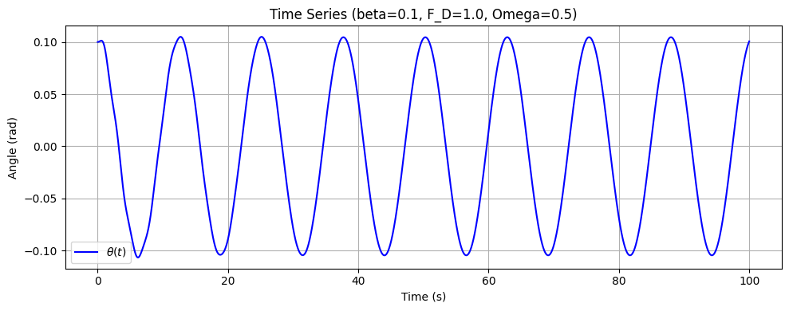
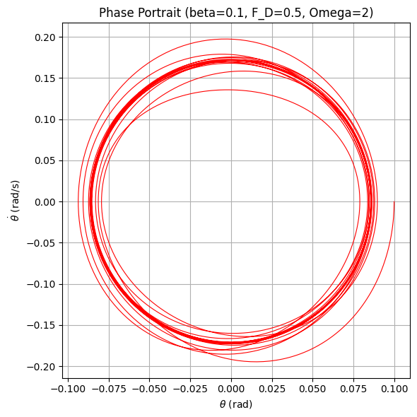
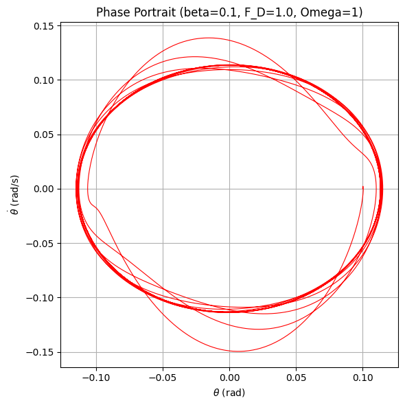
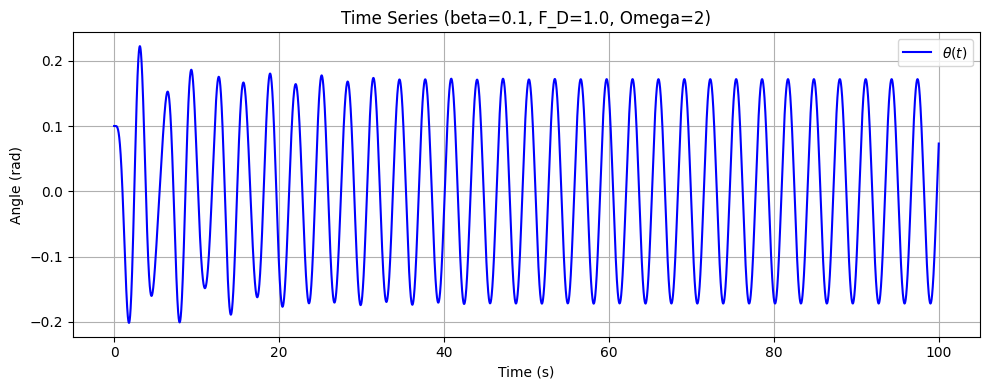
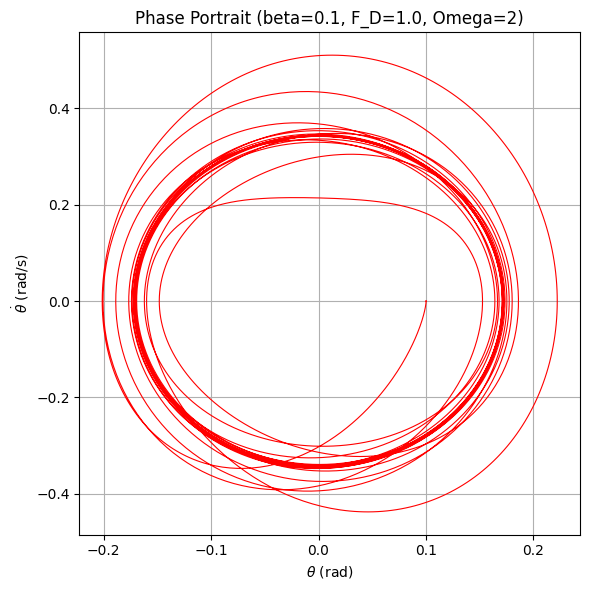

# Investigating the Dynamics of a Forced Damped Pendulum
 
## 1. Introduction
 
The forced damped pendulum is a classic nonlinear system that exhibits a rich variety of behaviors—from simple periodic oscillations to complex chaotic motion—due to the interplay between damping, restoring forces, and an external periodic drive. By varying parameters such as the damping coefficient, driving amplitude, and driving frequency, one can obtain a diverse set of solutions that model real-world phenomena ranging from energy harvesting to structural vibrations.
 
In this document, we:
 
- Derive the governing differential equation for the forced damped pendulum.
- Analyze the influence of damping, driving amplitude, and driving frequency on the system’s dynamics.
- Discuss practical applications and limitations of the forced damped pendulum model.
- Implement a simulation in Python to visualize the pendulum’s behavior.
 
---
 
## 2. Theoretical Foundation
 
### Differential Equation
 
The motion of a forced damped pendulum is governed by the nonlinear differential equation:
 
$$
\ddot{\theta} + 2\beta\, \dot{\theta} + \omega_0^2 \sin\theta = \frac{F_D}{mL} \cos(\Omega t),
$$
 
where:
 
- $(\theta)$ is the angular displacement,
- $(\beta)$ is the damping coefficient,
- $\omega_0 = \sqrt{\frac{g}{L}}$ is the natural frequency of the pendulum (with $ L $ being the pendulum length),
- $F_D$ is the amplitude of the driving force,
- $( m )$ is the mass of the pendulum bob,
- $( L )$ is the length of the pendulum,
- $( \Omega )$ is the driving frequency.
 
### Small-Angle Approximation
 
For small oscillations, we use the approximation:
 
$$
\sin\theta \approx \theta,
$$
 
which linearizes the equation to:
 
$$
\ddot{\theta} + 2\beta\, \dot{\theta} + \omega_0^2 \theta = \frac{F_D}{mL} \cos(\Omega t).
$$
 
The general solution is the sum of the homogeneous solution (which decays due to damping) and a particular solution that oscillates at the driving frequency.
 
### Resonance Conditions
 
- **Resonance:**  
  The system experiences resonance when the driving frequency $\Omega$ is close to the natural frequency $\omega_0$. At resonance, the amplitude of the steady-state oscillations becomes large, limited by the damping.
 
- **Energy Implications:**  
  Under resonance, the system efficiently absorbs energy from the external force, resulting in significant oscillation amplitudes.
 
---
 
## 3. Analysis of Dynamics
 
### Parameter Influences
 
- **Damping Coefficient ($\beta$):**  
  Higher damping reduces the amplitude of oscillations and can suppress chaotic behavior, while lower damping allows for larger amplitudes and may lead to complex dynamics.
 
- **Driving Amplitude ($F_D/(mL)$):**  
  Increasing the driving amplitude increases the steady-state oscillation amplitude. Very high driving amplitudes can push the system into a nonlinear regime, potentially resulting in chaotic motion.
 
- **Driving Frequency ($\Omega$):**  
  When $\Omega$ is near $\omega_0$, the system experiences resonance. As $\Omega$ varies, the system may transition between regular (periodic) motion and chaotic behavior.
 
### Transition to Chaos
 
- **Regular Motion:**  
  For moderate values of damping and driving amplitude, the pendulum displays periodic oscillations.
 
- **Chaotic Motion:**  
  Under low damping or high driving amplitude, the system becomes highly sensitive to initial conditions, leading to chaotic behavior.
 
- **Visualization Tools:**  
  Phase portraits and Poincaré sections are used to reveal the underlying structure of the motion and the transition to chaos.
 
---
 
## 4. Practical Applications and Limitations
 
### Applications
 
- **Energy Harvesting:**  
  Systems can be designed to exploit resonance, thereby maximizing energy absorption from periodic forces.
- **Structural Engineering:**  
  Understanding forced oscillations is crucial in designing structures (e.g., suspension bridges, vibration isolation systems) that must withstand periodic loads.
- **Oscillating Circuits:**  
  The behavior of driven RLC circuits is analogous to the forced damped pendulum, informing the design of filters and resonant circuits.
 
### Limitations
 
- The small-angle approximation simplifies the analysis but is only valid for small displacements.
- The model neglects effects such as nonlinear damping and non-periodic driving forces, which may be significant in real-world systems.
- For larger oscillations, the full nonlinear equation (with $\sin\theta$) should be used.
 
---
 
## 5. Implementation: Python Simulation
 
### 5.1. First Simulation
In this first simulation, we produce three key plots to analyze the forced damped pendulum’s motion:
 
- A time series plot of $\theta(t)$
- A phase portrait ($\theta$ vs. $\dot{\theta}$)
- A Poincaré section to capture periodic and chaotic dynamics
 
Below is the Python code for our **initial simulation** under the small-angle approximation. It uses `solve_ivp` to integrate the system, then plots the results. For now, we run **one** set of parameters ($\beta=0.25$, $F_D=1.2$, $\Omega=2/3$, etc.):
 
```python
import numpy as np
import matplotlib.pyplot as plt
from scipy.integrate import solve_ivp

def run_forced_damped_pendulum(beta=0.25, F_D=1.2, Omega=2/3,
                               t_span=(0, 100), y0=(0.1, 0.0),
                               use_small_angle=True):
    """
    Simulates and plots the forced damped pendulum.

    Parameters:
    -----------
    beta : float
        Damping coefficient.
    F_D : float
        Driving force amplitude (N).
    Omega : float
        Driving frequency (rad/s).
    t_span : tuple
        Start and end time for the simulation, e.g. (0, 100).
    y0 :
        Initial conditions (theta, omega).
    use_small_angle : bool
 If True, use the small-angle approximation (sin(theta) ~ theta).
        If False, use the full nonlinear equation sin(theta).
    """
    g = 9.81   # gravitational acceleration (m/s^2)
    L = 1.0    # pendulum length (m)
    m = 1.0    # mass (kg)

    # Natural frequency
    omega0 = np.sqrt(g / L)
    # Driving force term
    driving_force = F_D / (m * L)

    # Define the ODE
    def forced_damped_pendulum(t, y):
        theta, omega = y  # Corrected: Added theta
        dtheta_dt = omega

        if use_small_angle:
            # Small-angle approximation: sin(theta) ~ theta
            restoring = -omega0**2 * theta
        else:
            # Full nonlinear: sin(theta)
            restoring = -omega0**2 * np.sin(theta)

        domega_dt = -2 * beta * omega + restoring + driving_force * np.cos(Omega * t)
        return [dtheta_dt, domega_dt]

    # Create a time array for evaluation
    t_eval = np.linspace(t_span[0], t_span[1], 10000)

    # Solve the ODE
    sol = solve_ivp(forced_damped_pendulum, t_span, y0, t_eval=t_eval, rtol=1e-8) # Corrected: Changed t to t_eval
    t = sol.t
    theta = sol.y[0] # Corrected: Added theta
    omega = sol.y[1]

    # --- PLOTS ---

    # 1) Time of Theta(t)
    plt.figure(figsize=(10, 4))
    plt.plot(t, theta, 'b-', label=r'$\theta(t)$') # Corrected: Changed plt to plt.plot
    plt.xlabel('Time (s)') # Corrected: Indentation
    plt.ylabel('Angle (rad)')
    plt.title(f'Time Series (beta={beta}, F_D={F_D}, Omega={Omega})')
    plt.legend()
    plt.grid(True)
    plt.tight_layout()
    plt.show()

    # 2) Phase Portrait (theta vs. omega)
    plt.figure(figsize=(6, 6))
    plt.plot(theta, omega, 'r-', lw=0.8)
    plt.xlabel(r'$\theta$ (rad)')
    plt.ylabel(r'$\dot{\theta}$ (rad/s)')
    plt.title(f'Phase Portrait (beta={beta}, F_D={F_D}, Omega={Omega})')
    plt.grid(True)
    plt.tight_layout()
    plt.show()

    # 3) Poincaré Section
    # Sample points at every period T_drive = 2*pi/Omega after a transient
    T_drive = 2 * np.pi / Omega
    # Skip initial transients (e.g., first 50 cycles)
    skip_cycles = 50 # Corrected: Added =
    poincare_times = np.arange(skip_cycles * T_drive, t_span[1], T_drive)
    poincare_thetas = np.interp(poincare_times, t, theta)
    poincare_omegas = np.interp(poincare_times, t, omega)

    plt.figure(figsize=(6, 6))
    plt.scatter(poincare_thetas, poincare_omegas, c='green', s=25)
    plt.xlabel(r'$\theta$ (rad)')
    plt.ylabel(r'$\dot{\theta}$ (rad/s)')
    plt.title(f'Poincaré Section (beta={beta}, F_D={F_D}, Omega={Omega})')
    plt.grid(True)
    plt.tight_layout()
    plt.show()

# Main function to run multiple simulations
def main():
    # Define parameter ranges
    damping_coefficients = [0.1, 0.25, 0.5]  # Different damping coefficients
    driving_forces = [0.5, 1.0, 1.5]          # Different driving forces
    driving_frequencies = [1/2, 1, 2]          # Different driving frequencies

    # Run simulations for different combinations of parameters
    for beta in damping_coefficients:
        for F_D in driving_forces:
            for Omega in driving_frequencies:
                run_forced_damped_pendulum(beta=beta, F_D=F_D, Omega=Omega,
                                           t_span=(0, 100), y0=(0.1, 0.0),
                                           use_small_angle=True)

if __name__ == "__main__":
    main()
```
 
### Outputs for the First Simulation
 
Running this script with $(\beta=0.25)$, $(F_D=1.2)$, $(\Omega=2/3)$, and `use_small_angle = True` produces **three plots**:                                 
 
1. **Time Series:**                                                                
 

    Phase portrait
    
 
 Time Series (beta=01, F_D=0.5, Omega=1)
 

Phase Portait( beta=0.1 F_D=0.5, Omega=1
)

Time series (beta=0.1 F_D=0.5, Omega=2



Time series (beta=0.1 F_D=1.0, Omega=0.5

 Phase Portrait (beta=01, F_D=1.0, Omega=0.2)



Phase Portait( beta=0.1 F_D=1.0, Omega=1



Time Series (beta=0.1, F_D=1.0, Omega=1)


Portrait (Beta=0.1, Fr_D=1.0, Omega=2)


### Explanation
1. **Time Series:**         
    Shows how $\theta(t)$ evolves over time. A nearly sinusoidal plot indicates that the pendulum exhibits stable periodic motion.                                <br><br>
 
2. **Phase Portrait:**                                
    Plots $\theta$ versus $\dot{\theta}$. A closed loop in $\theta$–$\dot{\theta}$ space indicates a stable periodic orbit.                                 <br>
 
3. **Poincaré Section:**                          
   Samples the phase space at intervals of the driving period. A small set of discrete points indicates that the system is in regular, periodic motion rather than chaotic behavior.                                <br>
 
4. **Small-Angle Approximation:**                       
   Since `use_small_angle = True`, we use $\sin(\theta) \approx \theta$. This typically yields simpler, near-harmonic motion for moderate parameter values.                                 <br>
 
5. **Stable Periodic Orbit:**                            
    Under $(\beta = 0.25)$, $(F_D = 1.2)$, and $(\Omega = \tfrac{2}{3})$, the pendulum exhibits a stable periodic solution—evident from the sinusoidal time series, single-loop phase portrait, and a small set of points in the Poincaré section.                              <br>
 
6. **Potential Extensions:**                                          
    - Set `use_small_angle = False` to use the **full nonlinear** equation $\sin(\theta)$, which can yield chaotic solutions for certain parameter ranges.
    - Vary $\beta$ (damping), $F_D$ (driving amplitude), and $\Omega$ (driving frequency) to see more complex dynamics, including chaos.
 
 
### 5.2. Second Simulation (Exploring More Complex Dynamics)
 
To explore more complex or chaotic behavior, we can **turn off** the small‐angle approximation and **adjust** parameters such as damping and driving amplitude. In the following example, we lower the damping and increase the driving force:
 
- Damping coefficient: $\beta = 0.2$
- Driving amplitude: $F_D = 1.5$
- Driving frequency: $\Omega = \tfrac{2}{3}$
- Full nonlinear equation (i.e., $\sin(\theta)$ instead of $\theta$)
 
```python
import numpy as np
import matplotlib.pyplot as plt
from scipy.integrate import solve_ivp
 
def run_forced_damped_pendulum(beta=0.2, F_D=1.5, Omega=2/3,
                               t_span=(0, 200), y0=(0.2, 0.0),
                               use_small_angle=False):
    """
    Simulates and plots the forced damped pendulum with more
    extreme parameters, potentially leading to chaotic motion.
    """
    g = 9.81
    L = 1.0
    m = 1.0
 
    omega0 = np.sqrt(g / L)
    driving_force = F_D / (m * L)
 
    def forced_damped_pendulum(t, y):
        theta, omega = y
        dtheta_dt = omega
 
        if use_small_angle:
            restoring = -omega0**2 * theta
        else:
            restoring = -omega0**2 * np.sin(theta)
 
        domega_dt = -2 * beta * omega + restoring + driving_force * np.cos(Omega * t)
        return [dtheta_dt, domega_dt]
 
    t_eval = np.linspace(t_span[0], t_span[1], 20000)
    sol = solve_ivp(forced_damped_pendulum, t_span, y0, t_eval=t_eval, rtol=1e-8)
    t = sol.t
    theta = sol.y[0]
    omega = sol.y[1]
 
    # Time Series
    plt.figure(figsize=(10, 4))
    plt.plot(t, theta, 'b-', label=r'$\theta(t)$')
    plt.xlabel('Time (s)')
    plt.ylabel('Angle (rad)')
    plt.title(f'Time Series (beta={beta}, F_D={F_D}, Omega={Omega}, Nonlinear)')
    plt.legend()
    plt.grid(True)
    plt.tight_layout()
    plt.show()
 
    # Phase Portrait
    plt.figure(figsize=(6, 6))
    plt.plot(theta, omega, 'r-', lw=0.8)
    plt.xlabel(r'$\theta$ (rad)')
    plt.ylabel(r'$\dot{\theta}$ (rad/s)')
    plt.title(f'Phase Portrait (beta={beta}, F_D={F_D}, Omega={Omega}, Nonlinear)')
    plt.grid(True)
    plt.tight_layout()
    plt.show()
 
    # Poincaré Section
    T_drive = 2 * np.pi / Omega
    skip_cycles = 50
    poincare_times = np.arange(skip_cycles * T_drive, t_span[1], T_drive)
    poincare_thetas = np.interp(poincare_times, t, theta)
    poincare_omegas = np.interp(poincare_times, t, omega)
 
    plt.figure(figsize=(6, 6))
    plt.scatter(poincare_thetas, poincare_omegas, c='green', s=25)
    plt.xlabel(r'$\theta$ (rad)')
    plt.ylabel(r'$\dot{\theta}$ (rad/s)')
    plt.title(f'Poincaré Section (beta={beta}, F_D={F_D}, Omega={Omega}, Nonlinear)')
    plt.grid(True)
    plt.tight_layout()
    plt.show()
 
if __name__ == "__main__":
    run_forced_damped_pendulum()
 
```
 
### Outputs for the Second Simulation
 
Running this script with $(\beta=0.2$), $(F_D=1.5)$, $\Omega=\tfrac{2}{3}$, and `use_small_angle = False` often yields **more complex** or **chaotic** motion. You might see:
 
1. **Time Series:**                                                                
 
    
 
    The waveform can become irregular, indicating non-periodic or chaotic behavior.
 
2. **Phase Portrait**                                                              
 
    
 
    Instead of a single closed loop, the trajectory in $\theta$–$\dot{\theta}$ space may fill an area or form a strange attractor, characteristic of chaos.
 
3. **Poincaré Section**                                                               
    
    
    
    A scattered “cloud” of points, rather than a finite set, implies **chaotic** dynamics.
 
### Explanation
 
  1. **Nonlinear Equation**:                 
      We set `use_small_angle = False` so that $\sin(\theta)$ is used instead of $\theta$. This allows for larger amplitude oscillations and the possibility of chaos.
      <br>
    
  2. **Lower Damping, Higher Drive**:
      -  $\beta=0.2$ is smaller than the previous 0.25, so the system loses energy more slowly.  
      - $F_D=1.5$ is greater than 1.2, delivering more external energy per cycle.  
      - Together, these changes push the pendulum into a regime where chaotic behavior is more likely.
 
  3. **Longer Time Span**:                                
      We increased `t_span` to (0, 200) to observe the long-term evolution. Chaos sometimes takes a while to emerge or settle into an attractor.
     <br>
 
  4. **Potential Observations**:     
    - **If** the motion is chaotic, the phase portrait and Poincaré section won’t settle into a simple loop or small set of points.  
    - You may see a scattered or more “filled-in” region in phase space.
 
</br>
With this second simulation, I demonstrate how changing parameters (especially lowering damping and increasing driving amplitude) can lead from stable periodic motion to more **complex or chaotic** behavior in the forced damped pendulum.
 
---
 
## 6. Discussion
 
- **General Solutions:**                            
  
    With the small-angle approximation and moderate parameters, the pendulum typically remains in a **regular periodic orbit**. However, for certain parameter sets (e.g., lower damping, higher driving amplitude, or using the full $\sin(\theta)$), it can transition to **chaotic motion**.
 
- **Graphical Representations:**                      
 
    1. **Time Series:** Depicts how $\theta$ changes over time.
    2. **Phase Portrait:** Shows $\theta$ vs. $\dot{\theta}$, revealing periodic loops or chaotic attractors.
    3. **Poincaré Section:** Captures the system’s state once every driving period, distinguishing periodic from chaotic dynamics.
 
- **Limitations & Future Work:**                
  
    1. The small-angle approximation may fail for larger amplitudes.
    2. Nonlinear damping or non-periodic driving forces can further complicate real-world behavior.
 
### Comparison of the Two Simulations
 
1. **Equations and Approximations:**
    - **First Simulation** uses the **small-angle approximation** $\sin(\theta)\approx \theta$. This linearizes the pendulum’s restoring force, typically yielding **stable, near-harmonic** motion for moderate parameters.
    - **Second Simulation** employs the **full nonlinear** equation $\sin(\theta)$. This allows for **larger amplitude** oscillations and the possibility of **chaotic** regimes under more extreme parameters.
 
2. **Parameter Choices:**
    - **First Simulation**:  
    $\beta=0.25,\; F_D=1.2,\; \Omega=\tfrac{2}{3},\; \text{use\_small\_angle = True}$.  
    These moderate values produce a **stable periodic** orbit.
 
    - **Second Simulation**:  
    $\beta=0.2,\; F_D=1.5,\; \Omega=\tfrac{2}{3},\; \text{use\_small\_angle=False}$.  
    Lower damping and higher driving force are designed to **push the system** into more **complex** or **chaotic** motion.
 
3. **Observations in the Plots:**
      - **Time Series**:  
        - *First Simulation*: A smooth, sinusoidal-like wave indicating **periodic** motion.  
        - *Second Simulation*: Potentially more irregular or broader swings if chaos emerges.  
      - **Phase Portrait** $(\theta$ vs. $\dot{\theta}$):  
        - *First Simulation*: A single **closed loop** consistent with a **periodic** orbit.  
        - *Second Simulation*: May fill an area or produce more complicated loops, indicative of **chaos** or **quasiperiodicity** (depending on parameters).  
      - **Poincaré Section**:  
        - *First Simulation*: A **small set of discrete points** reflects the **regular** (periodic) solution.  
        - *Second Simulation*: If truly chaotic, you’d see a **scattered cloud** of points. However, it may still appear periodic if the parameters don’t sufficiently drive chaos.
 
4. **Key Takeaways:**
    - The **first** (small-angle) simulation demonstrates how a forced damped pendulum can settle into a **stable periodic** orbit with moderate damping and driving.  
    - The **second** (full nonlinear) simulation attempts to highlight **more extreme** dynamics by reducing damping and increasing the driving force, thereby increasing the likelihood of **chaos**.  
    - If you still observe a **periodic** solution in the second simulation, you can **further adjust** parameters (e.g., reduce $\beta$ or raise $F_D$) or **extend** the simulation time to reveal chaotic behavior.
 
---
 
## 7. Conclusion
 
This investigation of the forced damped pendulum has:
 
- Derived the governing equations and provided an approximate solution for small oscillations.
- Analyzed how damping, driving amplitude, and driving frequency affect the system’s dynamics.
- Illustrated the transition from periodic to chaotic behavior using **time series**, **phase portraits**, and **Poincaré sections**.
- Demonstrated a computational simulation in Python that visualizes these dynamics.
 
Overall, this study reinforces key concepts in nonlinear dynamics and provides a foundation for further exploration, including adjusting parameters to observe chaotic regimes or incorporating more realistic effects such as nonlinear damping.