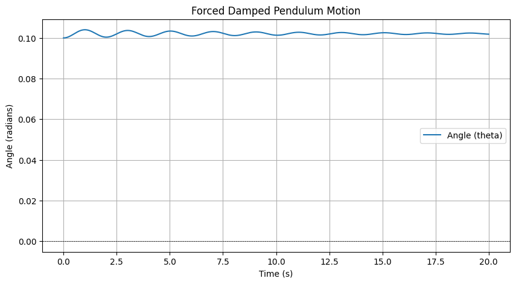

# Problem 2
1. Theoretical Foundation
Differential Equation: The motion of a forced damped pendulum can be described by the following second-order differential equation:

[ \frac{d^2\theta}{dt^2} + 2\beta \frac{d\theta}{dt} + \frac{g}{L} \sin(\theta) = A \cos(\omega t) ]

Where:

(\theta) is the angular displacement.
(\beta) is the damping coefficient.
(g) is the acceleration due to gravity.
(L) is the length of the pendulum.
(A) is the amplitude of the external driving force.
(\omega) is the angular frequency of driving force.
Small-Angle Approximation: For small angles, we can approximate (\sin(\theta) \approx \theta). This simplifies the equation to:

[ \frac{d^2\theta}{dt^2} + 2\beta \frac{d\theta}{dt} + \frac{g}{L} \theta = A \cos(\omega t) ]

Resonance Conditions: onance occurs when the frequency of the external force matches the natural frequency of the system. The natural frequency (\omega_0) is given by:

[ \omega_0 = \sqrt{\frac{gL}} ]

When (\omega \approx \omega_0), the system can exhibit large oscillations, leading to resonance.

2. Analysis of Dynamics
Influence of Parameters:

Damping Coefficient ((\beta)): Higher damping reduces the amplitude of oscillations and can lead to a quicker return to equilibrium.
Driving Amplitude ((A)): Increasing the amplitude of the driving force increases the maximum displacement of the pendulum.
Driving Frequency ((\omega)): Varying the frequency can lead to different behaviors, including regular oscillations, resonance, and chaotic motion.
Transition to Chaos: As the driving frequency is varied, the system can transition from periodic motion to chaotic behavior. This can be observed through phase diagrams and Poincaré sections.

3. Practical Applications
The forced damped pend model has several real-world applications, including:

Energy Harvesting Devices: Systems that convert mechanical energy from oscillations into electrical energy.
Suspension Bridges: Understanding how external forces (like wind) affect the stability of bridges.
Oscillating Circuits: Analyzing how circuits respond to periodic driving forces.
4. Implementation
Here’s a Python script that simulates the motion of a forced damped pendulum and visualizes its behavior under various conditions:

python
import numpy as np
import matplotlib.pyplot as plt
from scipy.integrate import odeint

# Constants
g = 9.81  # Acceleration due to gravity (m/s^2)
L = 1.0   # Length of the pendulum (m)
beta = 0.1  # Damping coefficient
A = 1.0   # Amplitude of the driving force
omega = 2.0  # Driving frequency

# Differential equation for the forced damped pendulum
def pendulum_equations(y, t):
    theta, omega = y
    dydt = [omega, -2 * beta * omega - (g / L) * np.sin(theta) + A * np.cos(omega * t)]
    return dydt

# Initial conditions
y0 = [0.1, 0.0]  # Initial angle (radians) and initial angular velocity

# Time points
t = np.linspace(0, 20, 1000)  # Time from 0 to 20 seconds

# Solve the differential equation
solution = odeint(pendulum_equations, y0, t)

# Plotting the results
plt.figure(figsize=(10, 5))
plt.plot(t, solution[:, 0], label='Angle (theta)')
plt.title('Forced Damped Pendulum Motion')
plt.xlabel('Time (s)')
plt.ylabel('Angle (radians)')
plt.axhline(0 color='black', lw=0.5, ls='--')
plt.gridplt.legend()
plt.show()

Graphical Output
When you run the above code, you will see a plot showing how the angle of the pendulum changes over time. The oscillations will demonstrate the effects of damping and the external driving force.

Conclusion
The forced damped pendulum exhibits complex behavior influenced by damping, driving forces, and frequency.
The model can transition from simple harmonic motion to chaotic behavior, depending on the parameters.
This investigation provides insights into various real-world systems and applications.
Limitations and Future Work
The model assumes small angles and linear damping. Future work could explore nonlinear damping and non-periodic driving forces to better represent real-world scenarios.

Additional analysis could include phase portraits and bifurcation diagrams to visualize transitions to chaos.