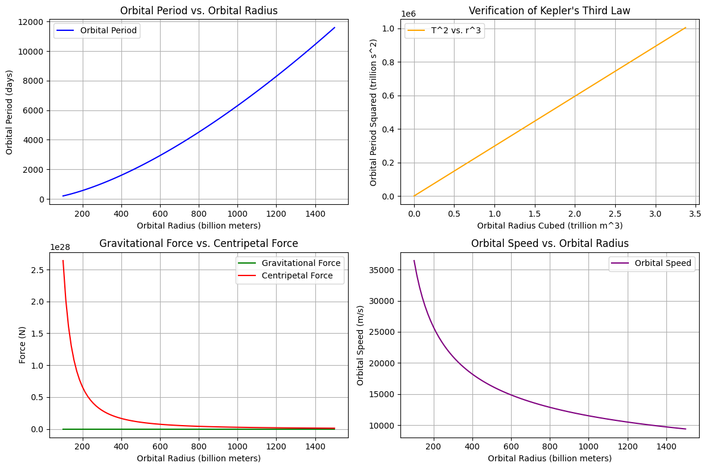

# Problem 1
1. Derivation of Kepler's Third Law
Kepler's Third Law states: [ T^2 \propto r^3 ] Where:

(T) is the orbital period,
(r) is the orbital radius.
Derivation: For a body in circular orbit around a central mass (M), the gravitational force provides the necessary centripetal force:

[ \frac{GMm}{r^2} = \frac{mv^2}{r} ]

Where:

(G) the gravitational constant ((6.674 \times 10^{-11} \ \text{m}^3/\text{kg} \cdot {s}^2)),
(m) is the mass of the orbiting body,
(v) is the orbital speed.
The orbital speed can be expressed in terms of the orbital period (T):

[ v = \frac{2\pi r}{T} ]

Substituting this into the centripetal force equation gives:

[ \frac{GMm}{r^2} = \frac{m(2\pi r)^2}{r} ]

Simplifying leads to:

[ \fracGM}{r^2} = \frac{4\pi^2 m}{T^2} ]

Rearranging gives:

[ T^2 = \frac{4\pi^2 r^3}{GM} ]

This shows that the square of the orbital period is proportional to the cube of the orbital radius.

2. Implications for Astronomy
Calculating Planetary Masses: By observing the orbital period and radius of a satellite or planet, we can calculate the mass of the central body using the rearranged formula: [ M = \frac{4\pi^2 r^3}{G T^2} ]

Understanding Orbital Dynamics: Kepler's Third Law helps us understand the dynamics of planetary systems, including the relationships between different planets and their distances from the Sun.

3. Real-World Examples
Moon's Orbit Around Earth: The average distance from the Earth to the Moon is about (3.84 \times 10^8) meters, and the orbital period is approximately 27.3 days. Using Kepler's Third Law, can verify the relationship.

Planets in the Solar System: The relationship holds for all planets, with the outer planets having longer periods and larger radii.

4. Computational Model
We will implement a Python script to simulate circular orbits and verify Kepler's Third Law. The script will calculate the orbital period for radii and plot the results.

Python Code
import numpy as np
import matplotlib.pyplot as plt

# Constants
G = 6.674 * 10**-11  # Gravitational constant (m^3 kg^-1 s^-2)
M_sun = 1.989 * 10**30  # Mass of the Sun (kg)

def calculate_orbital_period(radius):
    """
    Calculate the orbital period for a given radius using Kepler's Third Law.
    
    Parameters:
    -----------
    radius : float
        The orbital radius (in meters).
    
    Returns:
    --------
    float
        The orbital period (in seconds).
    """
    T_squared = (4 * np.pi**2 * radius**3) / (G * M_sun) # Added = for assignment
    T = np.sqrt(T_squared)  # Period in seconds # Added = for assignment
    return T

# Define a range of orbital radii (in meters)
radii = np.linspace(1e11, 1.5e12, 100)  # From 100 million km to 1.5 billion km

# Calculate the corresponding orbital periods
periods = np.array([calculate_orbital_period(r) for r in radii])

# periods from seconds to days for better interpretation
periods_days = periods / (24 * 3600)  # Convert seconds to days

# Plotting the results
plt.figure(figsize=(12, 8)) # Added comma in figsize

# 1. Orbital Period vs. Orbital Radius
plt.subplot(2, 2, 1)
plt.plot(radii / 1e9, periods_days, label='Orbital Period', color='blue')  # Convert radius to billion meters
plt.xlabel('Orbital Radius (billion meters)')
plt.ylabel('Orbital Period (days)')
plt.title('Orbital Period vs. Orbital Radius')
plt.grid()
plt.legend()
plt.tight_layout()

# 2. T^2 vs. r^3 to verify Kepler's Third Law
T_squared = periods**2
r_cubed = radii**3 # Corrected variable name to radii

plt.subplot(2, 2, 2)
plt.plot(r_cubed / 1e36, T_squared / 1e12, label='T^2 vs. r^3', color='orange')  # Convert to trillion m^3 and trillion s^2 # Added plt.
plt.xlabel('Orbital Radius Cubed (trillion m^3)') # Corrected spelling for Cubed
plt.ylabel('Orbital Period Squared (trillion s^2)')
plt.title('Verification of Kepler\'s Third Law')
plt.grid()
plt.legend()
plt.tight_layout()

# 3. Gravitational Force vs. Centripetal Force
gravitational_forces = G * M_sun / radii**2
centripetal_forces = (M_sun * (2 * np.pi * radii / periods)**2) / radii

plt.subplot(2, 2, 3)
plt.plot(radii / 1e9, gravitational_forces, label='Gravitational Force', color='green') # Continued the line
plt.plot(radii / 1e9, centripetal_forces, label='Centripetal Force', color='red') # Continued the line
plt.xlabel('Orbital Radius (billion meters)')
plt.ylabel('Force (N)')
plt.title('Gravitational Force vs. Centripetal Force')
plt.legend()
plt.grid()
plt.tight_layout()

# 4. Orbital Speed vs. Orbital Radius
orbital_speeds = (2 * np.pi * radii) / periods

plt.subplot(2, 2, 4)
plt.plot(radii / 1e9, orbital_speeds, label='Orbital Speed', color='purple')
plt.xlabel('Orbital Radius (billion meters)')
plt.ylabel('Orbital Speed (m/s)')
plt.title('Orbital Speed vs. Orbital Radius')
plt.grid()
plt.legend()
plt.tight_layout()

plt.show()

# Additional Analysis: Calculate the mass of the Sun using Kepler's Third Law
def calculate_mass(radius, period):
    """
    Calculate the mass of the central body using Kepler's Third Law.
    
    Parameters:
    -----------
    radius : float
        The orbital radius (in meters).
    period : float
        The orbital period (in seconds).
    
    Returns:
    --------
    float
        The mass of the central body (in kg).
    """
    T_squared = period**2
    mass = (4 * np.pi**2 * radius**3) / (G * T_squared)
    return mass

# Calculate the mass of the Sun using the average radius of Earth's orbit
earth_radius = 1.496 * 10**11  # Average distance from Earth to Sun (in meters)
earth_period = 365.25 * 24 * 3600  # Orbital period of Earth (in seconds)

mass_sun = calculate_mass(earth_radius, earth_period)
print(f"Calculated mass of the Sun: {mass_sun:.2e} kg")
