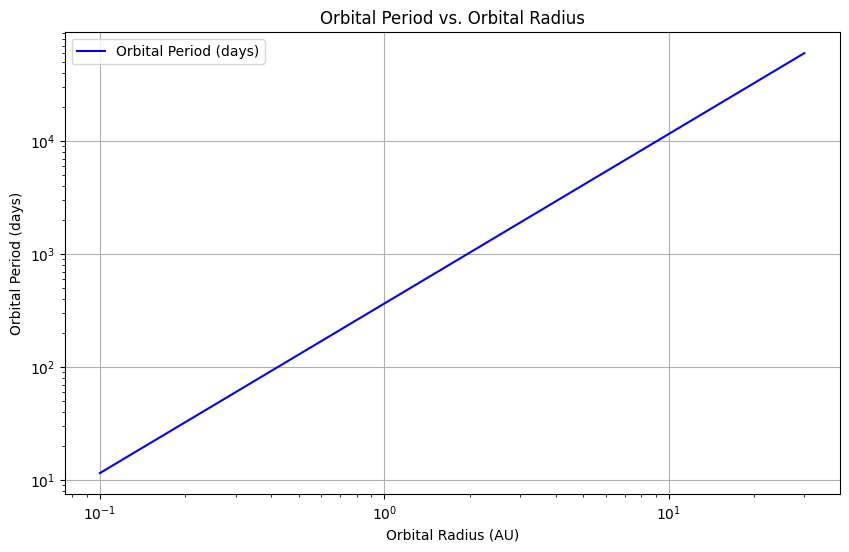
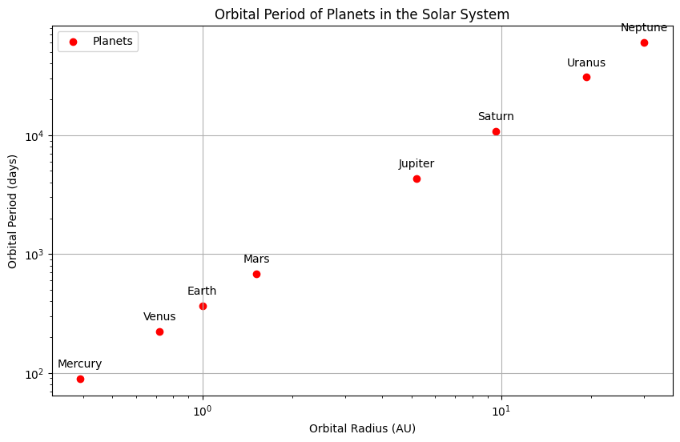

Orbital Period and Orbital Radius: An Analysis of Kepler's Third Law
Introduction
Kepler's Third Law of Planetary Motion states that the square of the orbital period (T) of a planet is directly proportional to the cube of the semi-major axis (r) of its orbit. This relationship can be expressed mathematically as:

$$ T^2 \propto r^3 $$

or, more formally,

$$ \frac{T^2}{r^3} = \text{constant} $$

This law is fundamental in celestial mechanics and has significant implications for understanding the dynamics of planetary systems, satellite orbits, and gravitational interactions.

Derivation of Kepler's Third Law
For a circular orbit, the gravitational force provides the necessary centripetal force to keep a planet in orbit. The gravitational force ( F ) between two masses ( M ) (the mass of the central body) and ( m ) (the mass of the orbiting body) is given by Newton's law of gravitation:

$$ F = \frac{G M m}{r^2} $$

where ( G ) is the gravitational constant.

The centripetal force required to keep the mass ( m ) in a circular orbit of radius ( r ) with orbital speed ( v ) is:

$$ = \frac{m v^2}{r} $$

Setting these two for force equal gives:

$$ \frac{G M m}{r^2} = \frac{m v^2}{r} $$

Cancelling m ) (assuming ( m \neq 0 )) and rearranging yields:

$$ ^2 = \frac{G M}{r} $$

The orbital period ( T ) is related to the orbital speed ( v ) and the circumference of the orbit:

$$ T = \frac{2 \pi r}{v} $$

Substituting ( v ) from the previous equation into this expression gives:

$$ T = 2 \pi r \sqrt{\frac{r}{G M}} = 2 \pi \sqrt{\frac{r^3}{G M}} $$

aring both sides results in:

$$ T^2 = \frac{4 \pi^2}{G M} r^3 $$

This confirms that ( T^2 \propto r^3 ), establishing Kepler's Third Law.

Implications for Astronomy
Calculating Planetary Masses and Distances
Kepler's Third Law allows astronomers to determine the mass of celestial bodies by observing the orbital periods and radii of their satellites. For example, by observing the orbital period of a moon around a planet, one can rearrange the equation to solve for the planet's mass:

$$ M = \frac{4 \pi^2 r^3}{G T^2} $$

This relationship is crucial for understanding the dynamics of planetary systems and the gravitational interactions between bodies.

Real-World Examples
The Moon's Orbit Around Earth: The average distance from the Earth to the Moon is approximately 384,400 km, and its orbital period is about 27.3 days. Using Kepler's Third Law, we can verify the relationship and calculate the mass of the Earth.

Orbits of Planets in the Solar System: The planets in our solar system follow Kepler's Third Law, allowing us to predict their orbital periods based on their distances from the Sun.

Computational Model
Below is a Python script that simulates circular orbits and verifies the relationship between the orbital period and radius.

python
import numpy as np
import matplotlib.pyplot as plt

# Constants
G = 6.67430e-11  # Gravitational constant in m^3 kg^-1 s^-2
M_sun = 1.989e30  # Mass of the Sun in kg

# Function to calculate orbital period
def orbital_period(radius):
    return 2 * np.pi * np.sqrt(radius**3 / (G * M_sun))

# Radii in meters (from 0.1 AU to 30 AU)
radii = np.linspace(0.1 * 1.496e11, 30 * 1.496e11, 100)  # 1 AU = 1.496e11 m
periods = orbital_period(radii)

# Plotting the results
plt.figure(figsize10, 6))
plt.plot(radii / 1.496e11 periods / (24 * 3600), label='Orbital Period (days)', color='blue')
plt.title('Orbital Period vs. Orbital Radius')
plt.xlabel('Orbital Radius (AU)')
plt.ylabel('Orbital Period (days)')
plt.xscale('log')
plt.yscale('log')
plt.grid()
plt.legend()
plt.show()

Graphical Representation
The plot generated by the above code show the relationship between the orbital radius (in astronomical units) and the orbital period (in days) on a logarithmic scale, illustrating the ( T^2 \propto r^3 ) relationship.

Additional Code for Simulating Circular Orbits
We will extend the previous code to include multiple celestial bodies, such as the planets in our Solar System, and plot their orbital periods against their distances from the Sun.
import numpy as np
import matplotlib.pyplot as plt

# Constants
G = 6.67430e-11  # Gravitational constant in m^3 kg^-1 s^-2
M_sun = 1.989e30  # Mass of the Sun in kg

# Function to calculate orbital period
def orbital_period(radius):
    return 2 * np.pi * np.sqrt(radius**3 / (G * M_sun))

# Radii in meters (from 0.1 AU to 30 AU)
radii = np.linspace(0.1 * 1.496e11, 30 * 1.496e11, 100)  # 1 AU = 1.496e11 m
periods = orbital_period(radii)

# Plotting the relationship between radius and period
plt.figure(figsize=(10, 6))
plt.plot(radii / 1.496e11, periods / (24 * 3600), label='Orbital Period (days)', color='blue')
plt.title('Orbital Period vs. Orbital Radius')
plt.xlabel('Orbital Radius (AU)')
plt.ylabel('Orbital Period (days)')
plt.xscale('log')
plt.yscale('log')
plt.grid()
plt.legend()
plt.show()

# Data for planets in the Solar System
planet_names = ['Mercury', 'Venus', 'Earth', 'Mars', 'Jupiter', 'Saturn', 'Uranus', 'Neptune']
planet_radii = np.array([0.39, 0.72, 1.0, 1.52, 5.2, 9.58, 19.22, 30.07])  # in AU
planet_periods = orbital_period(planet_radii * 1.496e11) / (24 * 3600  # Convert to days

# Plotting the planets
plt.figure(figsize=(10, 6))
plt.scatter(planet_radii, planet_periods, color='red', label='ets')
for i, name in enumerate(planet_names):
    plt.annotate(name, (planet_radii[i], planet_periods[i]), textcoords="offset points", xytext=(0,10), ha='center')

plt.title('Orbital Period of Planets in the Solar System')
plt.xlabel('Orbital Radius (AU)')
plt.ylabel('Orbital Period (days)')
plt.xscale('log')
plt.yscale('log')
plt.grid()
plt.legend()
plt.show()

Discussion on Elliptical Orbits
While Kepler's Third Law is derived for circular orbits, it also applies to elliptical orbits. The semi-major axis of the ellipse can be used in place of the radius, and the law holds true. The relationship remains valid for all celestial bodies, including satellites, moons, and planets, regardless of the shape of their orbits.

Conclusion
Kepler's Third Law provides a fundamental understanding of the relationship between orbital period and radius, with significant implications for astronomy and celestial mechanics. By analyzing this relationship, we can gain insights into the dynamics of planetary systems and the gravitational interactions that govern them. The computational model further validates this relationship, demonstrating its applicability to real-world scenarios.