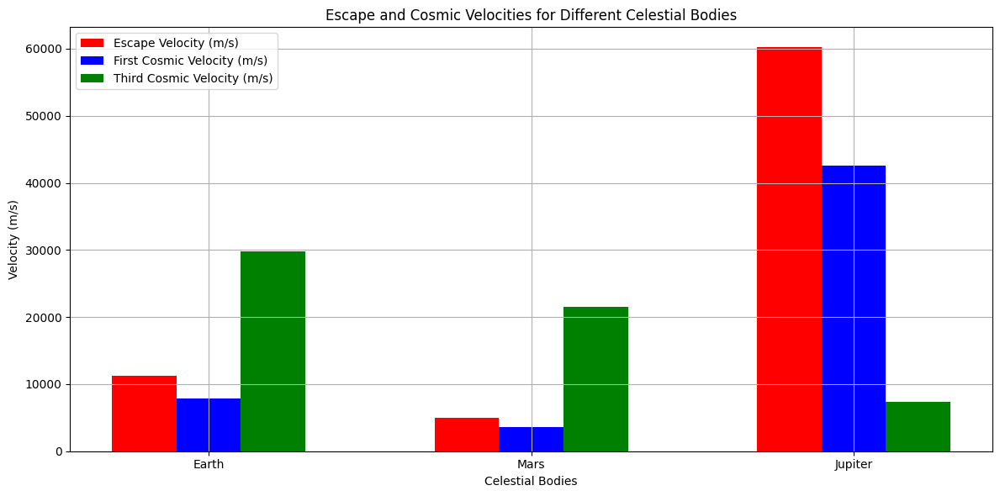

# Problem 2
Definitions of Cosmic Velocities
Escape Velocity ((v_e)): The minimum velocity an object must reach to break free from a celestial body's gravitational pull without any further propulsion. It is given by the formula: [ v_e = \sqrt{\frac{2GM}{r}} ] Where:

(G) is the gravitational constant ((6.674 \times 10^{-11} , \text{m}^3 , \text{kg}^{-1} , \text{s}^{-2})),
(M) is the mass of the celestial body,
(r) is the radius of the celestial body.
First Cosmic Velocity ((v_1)): The velocity required to maintain a low Earth orbit (LEO). It is approximately: [ v_1 = \sqrt{\frac{GM}{r}} ]

Second Cosmic Velocity ((v_2)): The escape velocity from the surface of a celestial body, as defined above.

Third Cosmic Velocity ((v_3)): The velocity required to the gravitational influence of a star system (e.g., the Solar System). It can be approximated as: [ v_3 = \sqrt{2GM_{\text{sun}} \left( \frac{1}{r} - \frac{1}{R} \right)} ] Where:

(M_{\text{sun}}) is the mass of the Sun,
(R) is the distance from the Sun to the celestial body.
2 Derivations and Parameters
The escape velocity depends on the mass and radius of the celestial body. The first cosmic velocity is influenced by the same parameters but is lower than the escape velocity. The third cosmic velocity depends on the gravitational influence of the Sun and the distance from it.

3. Python Code for Calculating and Visualizing Velocities
Below is a Python script that calculates and visualizes the escape velocities and cosmic velocities for Earth, Mars, and Jupiter.
import numpy as np
import matplotlib.pyplot as plt

# Constants
G = 6.674 * 10**-11  # Gravitational constant (m^3 kg^-1 s^-2)
M_sun = 1.989 * 10**30  # Mass of the Sun (kg)

# Celestial bodies data: (name, mass (kg), radius (m), distance from Sun (m))
celestial_bodies = {
    'Earth': (5.972 * 10**24, 6.371 * 10**6, 1.496 * 10**11),
    'Mars': (0.64171 * 10**24, 3.3895 * 10**6, 2.279 * 10**11),
    'Jupiter': (1.898 * 10**27, 6.9911 * 10**7, 7.785 * 10**11)
}

# Function to calculate escape velocity
def escape_velocity(M, r):
    return np.sqrt(2 * G * M / r)

# Function to calculate first cosmic velocity
def first_cosmic_velocity(M, r):
    return np.sqrt(G * M / r)

# Function to calculate third cosmic velocity
def third_cosmic_velocity(M, r):
    return np.sqrt(2 * G * M_sun * (1/r - 1/(r + 1.496 * 10**11)))  # Approximation

# Store results
results = {}

for body, (mass, radius, distance) in celestial_bodies.items():
    v_e = escape_velocity(mass, radius)
    v_1 = first_cosmic_velocity(mass, radius)
    v_3 = third_cosmic_velocity(mass, distance)
    results[body] = (v_e, v_1, v_3)

# Plotting the results
labels = list(results.keys())
escape_velocities = [results[body][0] for body in labels]
first_cosmic_velocities = [results[body][1] for body in labels]
third_cosmic_velocities = [results[body][2] for body in labels]

x = np.arange(len(labels))  # the label locations

plt.figure(figsize=(12, 6))
plt.bar(x - 0.2, escape_velocities, width=0.2, label='Escape Velocity (m/s)', color='red')
plt.bar(x, first_cosmic_velocities, width=0.2, label='First Cosmic Velocity (m/s)', color='blue')
plt.bar(x + 0.2, third_cosmic_velocities, width=0.2, label='Third Cosmic Velocity (m/s)', color='green')

# Add some text for labels, title and custom x-axis tick labels, etc.
plt.xlabel('Celestial Bodies')
plt.ylabel('Velocity (m/s)')
plt.title('Escape and Cosmic Velocities for Different Celestial Bodies')
plt.xticks(x, labels)
plt.legend()
plt.grid()
plt.tight_layout()
plt.show()

# Print results
for body, (v_e, v_1, v_3) in results.items():
    print(f"{body}: Escape Velocity = {v_e:.2f} m/s, First Cosmic Velocity = {v_1:.2f} m/s, Third Cosmic Velocity = {v_3:.2f} m/s")

