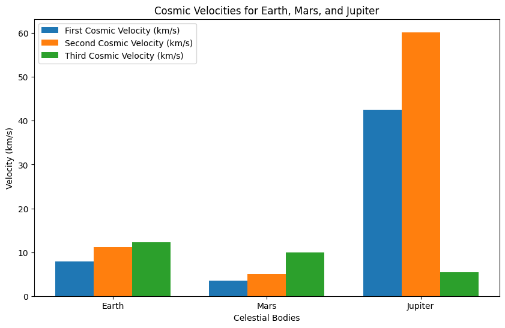
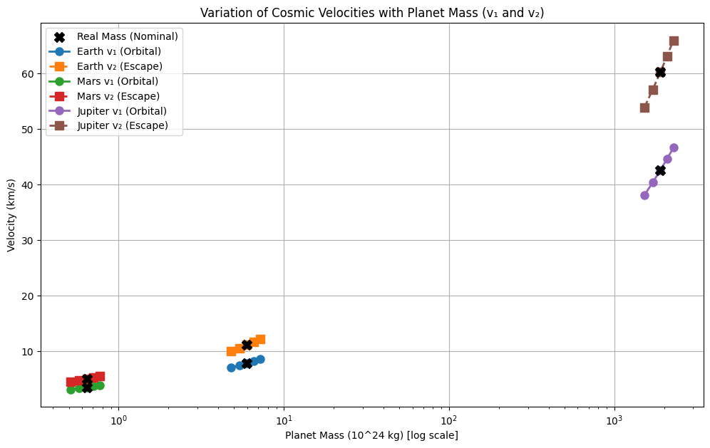
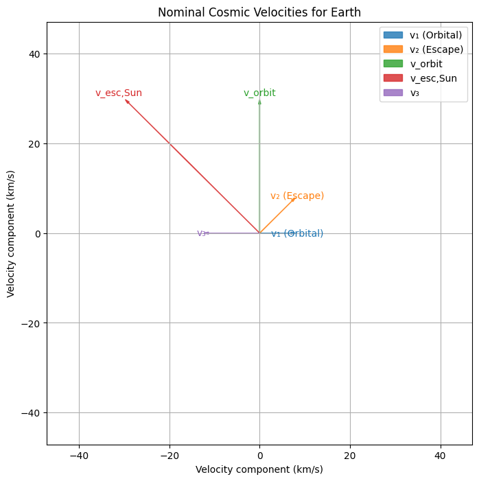
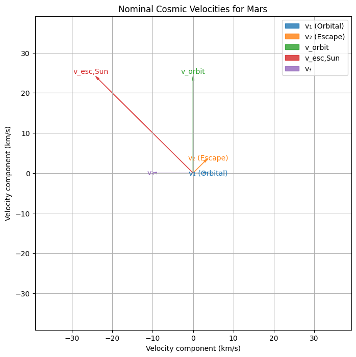
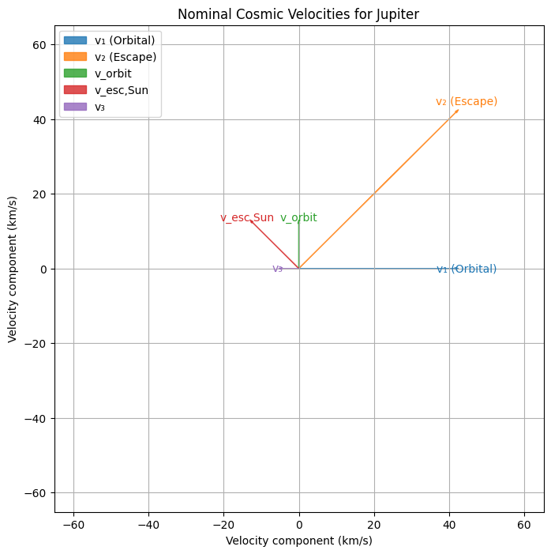
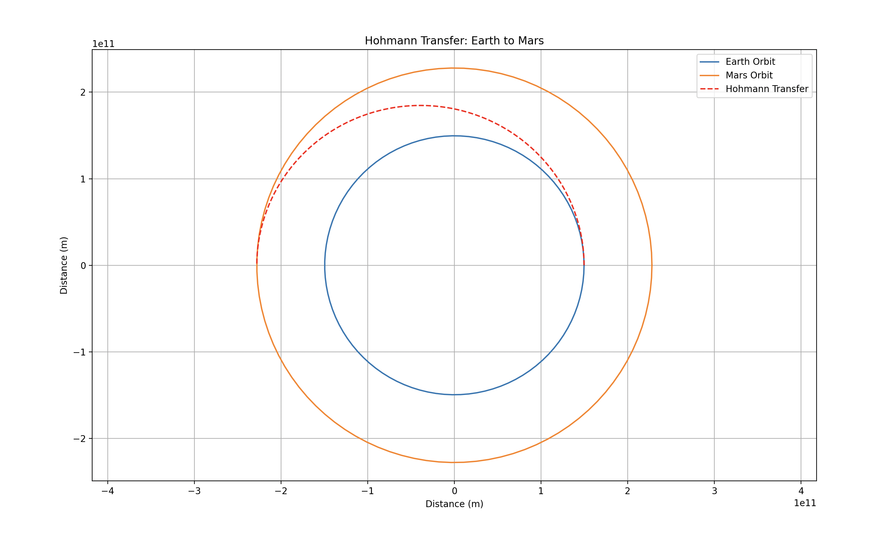

Escape Velocities and Cosmic Velocities: Analysis and Simulation
 
This solution presents a comprehensive explanation of the three key cosmic velocities—first, second, and third—along with their physical significance, detailed derivations, and simulations for Earth, Mars, and Jupiter. The content covers the theoretical background, advanced physics insights, computational implementation, and relevance to space exploration.
 
---
 
## Introduction
 
Space missions require a thorough grasp of the velocities necessary to achieve various orbital and escape conditions. Beyond the basic definitions, understanding cosmic velocities involves energy conservation, orbital dynamics, and the interplay between a planet’s and star’s gravity. In this solution, we define:
 
- **First Cosmic Velocity**: The speed required for a spacecraft to maintain a circular orbit close to a celestial body's surface.
- **Second Cosmic Velocity**: The escape speed needed to overcome the gravitational pull of that body.
- **Third Cosmic Velocity**: The additional speed required, once free from a planet’s gravity, to escape the gravitational influence of the central star (e.g., the Sun).
 
---
 
## Detailed Physics and Derivations
 
### 1. First Cosmic Velocity (v₁) – Orbital Mechanics
 
For a celestial body with mass $(M)$ and radius $(R)$, the first cosmic velocity is derived by equating the gravitational force to the centripetal force required for a circular orbit:
 
$$
\frac{GM}{R^2} = \frac{v_1^2}{R}
\Rightarrow
v_1 = \sqrt{\frac{GM}{R}}
$$
 
 
- **Physics Insight**:  
  This velocity decreases with increasing orbital radius as the gravitational pull weakens. For non-circular (elliptical) orbits, the vis-viva equation generalizes the orbital speed:
  $$
  v = \sqrt{GM\left(\frac{2}{r} - \frac{1}{a}\right)}
  $$
  where $a$ is the semi-major axis. In a low circular orbit, $r \approx R$ and $a \approx R$, so $v \approx v_1$.
 
### 2. Second Cosmic Velocity (v₂) – Escape Energy
 
Escape velocity is determined by setting the total mechanical energy (kinetic plus potential) to zero so that the object reaches infinity with no residual speed:
 
$$
\frac{1}{2}v_2^2 - \frac{GM}{R} = 0
\Rightarrow
v_2 = \sqrt{\frac{2GM}{R}} = \sqrt{2}\, v_1
$$
 
- **Physics Insight**:  
  The factor of $\sqrt{2}$ signifies the extra kinetic energy required to overcome the gravitational potential well. For $v < v_2$, the object remains bound (elliptical orbit), while for $v \ge v_2$, the trajectory becomes parabolic or hyperbolic.
 
### 3. Third Cosmic Velocity (v₃) – Stellar Escape
 
Escaping a star’s gravitational field from a planet involves combining the planet’s escape velocity with the dynamics of the star’s gravity. Consider a planet at orbital radius $r$ from its star:
- The orbital speed of the planet is:
  $$
  v_{\text{orbit}} = \sqrt{\frac{GM_\odot}{r}}
  $$
- The escape speed from the star at that distance is:
  $$
  v_{\text{esc,Sun}} = \sqrt{\frac{2GM_\odot}{r}}
  $$
  
A spacecraft leaving the planet benefits from the planet’s orbital speed. Hence, the additional speed needed relative to the star is given by:
$$
v_3 = v_{\text{esc,Sun}} - v_{\text{orbit}} = \sqrt{\frac{GM_\odot}{r}}\,(\sqrt{2} - 1)
$$
 
- **Physics Insight**:  
  The subtraction of $v_{\text{orbit}}$ reflects that the planet’s motion already contributes to the required energy for stellar escape. This makes $v_3$ lower than $v_{\text{esc,Sun}}$ and highlights why gravitational assists (e.g., flybys of massive planets) can further reduce the propulsion needed.
 
### Additional Effects
 
1. **Atmospheric Drag**:  
   At low altitudes, air resistance reduces the effective velocity. It is modeled by:
   $$ F_{\text{drag}} = \frac{1}{2}\rho v^2 C_d A$$
   where $(\rho)$ is air density, $(C_d)$ is the drag coefficient, and $(A)$ is the cross-sectional area.
 
2. **Gravitational Assists**:  
   Maneuvers near massive bodies (e.g., Jupiter) can boost a spacecraft’s velocity via the Oberth effect, where applying thrust at high speeds in deep gravity wells yields maximum energy gain.
 
3. **Relativistic Corrections**:  
   Although typically negligible within the Solar System, at extremely high velocities or near massive bodies, general relativity modifies gravitational potential and orbital dynamics.
 
---
 
## Parameters for Celestial Bodies
 
For the simulations, we use the following parameters:
 
-  **Earth:**                               
    - Mass: $5.972 \times 10^{24}$ $kg$  
    - Radius: $6.371 \times 10^{6}$ $m$  
    - Orbital radius: $1.496 \times 10^{11}$ $m$
 
- **Mars:**                                 
    - Mass: $6.4171 \times 10^{23}$ $kg$  
    - Radius: $3.3895 \times 10^{6}$ $m$  
    - Orbital radius: $2.279 \times 10^{11}$ $m$
 
- **Jupiter:**                              
    - Mass: $1.898 \times 10^{27}$ $kg$  
    - Radius: $6.9911 \times 10^{7}$ $m$  
    - Orbital radius: $7.785 \times 10^{11}$ $m$
 
- **For the Sun:**                           
    - Mass: $1.989 \times 10^{30}$ $kg$
 
---
 
## Computational Simulation and Visualization
 
The following Python script computes the three cosmic velocities for Earth, Mars, and Jupiter, and visualizes the results with a bar chart.
 
```python
import math
import matplotlib.pyplot as plt
 
# Constants
G = 6.67430e-11        # Gravitational constant (m^3 kg^-1 s^-2)
M_sun = 1.989e30       # Mass of the Sun (kg)
 
# Parameters for celestial bodies: mass (kg), radius (m), and orbital radius around the Sun (m)
bodies = {
    'Earth': {
        'mass': 5.972e24,
        'radius': 6.371e6,
        'orbital_radius': 1.496e11
    },
    'Mars': {
        'mass': 6.4171e23,
        'radius': 3.3895e6,
        'orbital_radius': 2.279e11
    },
    'Jupiter': {
        'mass': 1.898e27,
        'radius': 6.9911e7,
        'orbital_radius': 7.785e11
    }
}
 
results = {}
 
for body, params in bodies.items():
    mass = params['mass']
    radius = params['radius']
    orbital_radius = params['orbital_radius']
    
    # First cosmic velocity: circular orbital speed at the surface of the body
    v1 = math.sqrt(G * mass / radius)
    # Second cosmic velocity: escape velocity from the body
    v2 = math.sqrt(2 * G * mass / radius)
    
    # Orbital speed of the body around the Sun
    v_orbit = math.sqrt(G * M_sun / orbital_radius)
    # Solar escape speed at the body's orbital distance
    v_esc_sun = math.sqrt(2 * G * M_sun / orbital_radius)
    # Third cosmic velocity: additional speed required to overcome the Sun's gravity
    v3 = v_esc_sun - v_orbit
    
    results[body] = {'v1': v1, 'v2': v2, 'v3': v3, 'v_orbit': v_orbit, 'v_esc_sun': v_esc_sun}
 
# Display the calculated velocities for each body
for body, vals in results.items():
    print(f"{body}:")
    print(f"  First Cosmic Velocity (v1): {vals['v1']:.2f} m/s ({vals['v1']/1000:.2f} km/s)")
    print(f"  Second Cosmic Velocity (v2): {vals['v2']:.2f} m/s ({vals['v2']/1000:.2f} km/s)")
    print(f"  Third Cosmic Velocity (v3): {vals['v3']:.2f} m/s ({vals['v3']/1000:.2f} km/s)")
    print()
 
# Prepare data for plotting (convert m/s to km/s)
labels = list(bodies.keys())
v1_values = [results[body]['v1']/1000 for body in labels]
v2_values = [results[body]['v2']/1000 for body in labels]
v3_values = [results[body]['v3']/1000 for body in labels]
 
x = range(len(labels))
bar_width = 0.25
 
fig, ax = plt.subplots(figsize=(10, 6))
ax.bar([p - bar_width for p in x], v1_values, width=bar_width, label='First Cosmic Velocity (km/s)')
ax.bar(x, v2_values, width=bar_width, label='Second Cosmic Velocity (km/s)')
ax.bar([p + bar_width for p in x], v3_values, width=bar_width, label='Third Cosmic Velocity (km/s)')
 
ax.set_xlabel('Celestial Bodies')
ax.set_ylabel('Velocity (km/s)')
ax.set_title('Cosmic Velocities for Earth, Mars, and Jupiter')
ax.set_xticks(x)
ax.set_xticklabels(labels)
ax.legend()
 
plt.show()
```
---
 
## Simulation Output
 

 
### Explanation of the Output
 
The simulation output is presented as a bar chart that compares the three key cosmic velocities for Earth, Mars, and Jupiter. Here’s what the chart represents:
 
- **X-axis**: The different celestial bodies (Earth, Mars, Jupiter).
- **Y-axis**: The computed velocities in km/s.
 
For each celestial body, three sets of bars are displayed:                              
   - **First Cosmic Velocity (v₁)**: Indicates the orbital speed necessary for a stable, circular orbit near the body's surface.                                
   - **Second Cosmic Velocity (v₂)**: Represents the escape speed required to overcome the gravitational binding of the body. Note that this value is always $\sqrt{2}$ times the first cosmic velocity.                                  
   - **Third Cosmic Velocity (v₃)**: Shows the additional velocity needed (beyond the planet’s orbital speed) to escape the gravitational influence of the Sun.
 
This visualization clearly illustrates the differences between the velocities for various celestial bodies and highlights the impact of their mass, size, and orbital distances on mission planning. The reduced third cosmic velocity (compared to the solar escape speed) underscores the advantage provided by a planet’s orbital motion in reducing the energy requirements for interplanetary travel.
 
---
 
### Additional Simulation:
### 1. Variation of Cosmic Velocities with Planet Mass
 
```python
import math
import numpy as np
import matplotlib.pyplot as plt
 
"""
This script varies each planet's mass from 80% to 120% of its nominal (real) mass
and plots two key velocities:
 
1) v₁ (Orbital) = √(GM/R), the speed for a circular orbit near the surface.
2) v₂ (Escape) = √(2GM/R), the speed required to escape the planet's gravity.
 
We highlight the real (nominal) mass point on BOTH v₁ and v₂ with black 'X' markers,
but we do not show any arrow/text annotations. All other points are hypothetical.
"""
 
# Constants
G = 6.67430e-11         # Gravitational constant [m^3 kg^-1 s^-2]
M_sun = 1.989e30        # Mass of the Sun [kg] - not directly used here
 
# Planetary parameters
bodies = {
    'Earth': {
        'mass': 5.972e24,
        'radius': 6.371e6
    },
    'Mars': {
        'mass': 6.4171e23,
        'radius': 3.3895e6
    },
    'Jupiter': {
        'mass': 1.898e27,
        'radius': 6.9911e7
    }
}
 
# Range of mass factors (80% to 120% of nominal)
mass_factors = np.array([0.8, 0.9, 1.0, 1.1, 1.2])
 
plt.figure(figsize=(12, 7))
 
# We'll only add the 'Real Mass' label once in the legend
real_mass_label_added = False
 
for planet, params in bodies.items():
    nominal_mass = params['mass']
    radius = params['radius']
    
    # Arrays for v₁ and v₂ over the specified mass factors
    v1_values = []  # v₁ (Orbital)
    v2_values = []  # v₂ (Escape)
    
    for factor in mass_factors:
        mass = factor * nominal_mass
        v1 = math.sqrt(G * mass / radius)       # m/s
        v2 = math.sqrt(2 * G * mass / radius)   # m/s
        v1_values.append(v1 / 1000)  # Convert to km/s
        v2_values.append(v2 / 1000)  # Convert to km/s
 
    # x-axis in units of 10^24 kg
    x_values = mass_factors * nominal_mass / 1e24
    
    # Plot v₁ (Orbital) and v₂ (Escape)
    plt.plot(x_values, v1_values, marker='o', linestyle='-',
             markersize=8, linewidth=2, label=f'{planet} v₁ (Orbital)')
    plt.plot(x_values, v2_values, marker='s', linestyle='--',
             markersize=8, linewidth=2, label=f'{planet} v₂ (Escape)')
 
    # Find the index for the nominal mass (factor=1.0)
    idx_nom = np.where(mass_factors == 1.0)[0][0]
    real_mass_x = x_values[idx_nom]
    
    # Extract the v₁ and v₂ values at the nominal mass
    real_mass_v1 = v1_values[idx_nom]
    real_mass_v2 = v2_values[idx_nom]
    
    # Plot black X marker on v₁ at nominal mass
    if not real_mass_label_added:
        # Add the label for the FIRST black X only
        plt.scatter(real_mass_x, real_mass_v1, color='black', marker='X', s=100, zorder=5,
                    label='Real Mass (Nominal)')
        real_mass_label_added = True
    else:
        plt.scatter(real_mass_x, real_mass_v1, color='black', marker='X', s=100, zorder=5)
    
    # Plot black X marker on v₂ at nominal mass (no legend label)
    plt.scatter(real_mass_x, real_mass_v2, color='black', marker='X', s=100, zorder=5)
 
# Optional: use a log scale if masses differ by orders of magnitude
plt.xscale('log')
 
plt.xlabel('Planet Mass (10^24 kg) [log scale]')
plt.ylabel('Velocity (km/s)')
plt.title('Variation of Cosmic Velocities with Planet Mass (v₁ and v₂)')
plt.grid(True)
 
# Initial legend call
plt.legend()
 
# Reorder legend so 'Real Mass (Nominal)' is first
handles, labels = plt.gca().get_legend_handles_labels()
rm_index = labels.index('Real Mass (Nominal)')
new_handles = [handles[rm_index]] + handles[:rm_index] + handles[rm_index+1:]
new_labels = [labels[rm_index]] + labels[:rm_index] + labels[rm_index+1:]
plt.legend(new_handles, new_labels)
 
plt.show()
```
 
#### Simulation Output

### Explanation of the Mass-Variation Simulation
 
This is purely a **theoretical exercise**—planets don’t spontaneously gain or lose 20% of their mass in reality. Varying the mass helps us understand how strongly these orbital and escape velocities depend on a planet’s gravitational parameter $GM$.
 
In this simulation we explore how two key velocities—**$v₁$ (Orbital Velocity)** and **$v₂$ (Escape Velocity)**—depend on a planet’s mass, using hypothetical variations of 80% to 120% of its nominal (actual) mass. Here’s what each part means:
 
1. **Varying the Mass:**                        
    - We multiply the nominal mass of each planet by factors of 0.8, 0.9, 1.0, 1.1, and 1.2.
    - This produces a set of hypothetical masses. Only the factor 1.0 corresponds to the real, physically measured mass.
    - Changing the mass in the equations allows us to see how the gravitational parameter $GM$ influences the speeds, even though in reality a planet’s mass remains fixed.
 
2. **Calculating the Velocities:**          
    - **v₁ (Orbital Velocity):**  
     $$ v₁ = \sqrt{\frac{GM}{R}} $$  
     This is the speed required to maintain a circular orbit right at the planet’s surface. It depends on both the planet’s mass and its radius (which remains constant in our simulation).
    - **v₂ (Escape Velocity):**  
     $$ v₂ = \sqrt{\frac{2GM}{R}} $$  
     This is the speed required for a spacecraft to escape the planet’s gravitational pull. It is always $\sqrt{2}$ times $v₁$.
 
3. **Real Mass Markers:**                   
    - For each planet, the data point computed at the mass factor of 1.0 is the only physically real value because it uses the planet’s actual mass.
    - We mark this real (nominal) mass point on both the $v₁$ and $v₂$ curves with a black “X.”
    - Although the two markers appear at the same mass value on the x-axis, they represent two different speeds: one for orbital motion $(v₁)$ and one for escape $(v₂)$.
    - These markers help you distinguish between the **real** (nominal) scenario and the other hypothetical cases (0.8, 0.9, 1.1, and 1.2 factors).
 
4. **Logarithmic X-axis:**                  
    - The x-axis is set to a log scale because Jupiter’s mass is many orders of magnitude larger than Earth’s or Mars’.
    - This scaling prevents the smaller masses from being squashed near zero and makes all data points easier to compare visually.
 
---
 
### Interpretation
 
- **Scaling with Mass:**                      
   As the mass increases, both **v₁** and **v₂** increase in accordance with $\sqrt{M}$. This explains why Jupiter’s velocities are significantly higher than Earth’s or Mars’.
 
- **Sensitivity Analysis:**                  
   Although the mass variations are purely hypothetical, they illustrate how changes in the gravitational parameter $GM$ affect the orbital and escape speeds.
 
- **Practical Distinction:**                  
   The two velocities represent different physical requirements:                  
     - **v₁ (Orbital Velocity)** is the speed needed for a stable orbit near the planet’s surface.
     - **v₂ (Escape Velocity)** is the higher speed required to overcome the planet’s gravitational pull.
  
  
The black $“X”$ markers at the nominal mass (mass factor = 1.0) indicate the actual speeds computed using the planet’s true mass, while the other points show “what-if” scenarios.
 
Overall, this exercise reveals the direct relationship between planetary mass and the speeds needed for orbiting and escaping. It provides insight into how sensitive these speeds are to changes in $GM$, even though in practice a planet’s mass does not change.
 
---
### 2. Additional Simulation: Nominal Cosmic Velocities for Earth, Mars, and Jupiter
 
**Purpose:**  
Each velocity is represented as a uniquely colored arrow with a label placed near its tip. This approach not only shows the individual values but also allows direct visual comparison of how these velocities differ among Earth, Mars, and Jupiter.
 
---
 
#### Code for Earth
 
```python
import math
import numpy as np
import matplotlib.pyplot as plt
 
# -------------------------- Nominal Cosmic Velocities for Earth --------------------------
# Earth nominal parameters
mass_earth = 5.972e24        # kg
radius_earth = 6.371e6       # m
orbital_radius_earth = 1.496e11  # m
 
# Compute Earth's nominal velocities
v1_earth = math.sqrt(6.67430e-11 * mass_earth / radius_earth)          # Orbital velocity [m/s]
v2_earth = math.sqrt(2 * 6.67430e-11 * mass_earth / radius_earth)        # Escape velocity [m/s]
v_orbit_earth = math.sqrt(6.67430e-11 * 1.989e30 / orbital_radius_earth)  # Earth's orbital speed around the Sun [m/s]
v_esc_sun_earth = math.sqrt(2 * 6.67430e-11 * 1.989e30 / orbital_radius_earth)  # Solar escape speed [m/s]
v3_earth = v_esc_sun_earth - v_orbit_earth  # Additional speed for solar escape [m/s]
 
# Convert to km/s
v1_earth_km = v1_earth / 1000
v2_earth_km = v2_earth / 1000
v_orbit_earth_km = v_orbit_earth / 1000
v_esc_sun_earth_km = v_esc_sun_earth / 1000
v3_earth_km = v3_earth / 1000
 
# Define velocities for Earth with unique angles and colors
velocities_earth = [
    {'label': 'v₁ (Orbital)', 'speed': v1_earth_km, 'angle': 0,   'color': 'C0'},
    {'label': 'v₂ (Escape)',  'speed': v2_earth_km, 'angle': 45,  'color': 'C1'},
    {'label': 'v_orbit',      'speed': v_orbit_earth_km, 'angle': 90,  'color': 'C2'},
    {'label': 'v_esc,Sun',    'speed': v_esc_sun_earth_km, 'angle': 135, 'color': 'C3'},
    {'label': 'v₃',           'speed': v3_earth_km, 'angle': 180, 'color': 'C4'}
]
 
plt.figure(figsize=(8,8))
origin = (0,0)
 
for vel in velocities_earth:
    label = vel['label']
    speed = vel['speed']
    angle = np.deg2rad(vel['angle'])
    dx = speed * np.cos(angle)
    dy = speed * np.sin(angle)
    
    plt.arrow(origin[0], origin[1], dx, dy,
              head_width=0.5, head_length=1,
              length_includes_head=True,
              color=vel['color'], alpha=0.8, label=label)
    plt.text(dx * 1.05, dy * 1.05, label, fontsize=10, color=vel['color'],
             ha='center', va='center')
 
handles, labels = plt.gca().get_legend_handles_labels()
by_label = dict(zip(labels, handles))
plt.legend(by_label.values(), by_label.keys())
 
max_speed = max(vel['speed'] for vel in velocities_earth)
plt.xlim(-max_speed - 5, max_speed + 5)
plt.ylim(-max_speed - 5, max_speed + 5)
plt.xlabel('Velocity component (km/s)')
plt.ylabel('Velocity component (km/s)')
plt.title('Nominal Cosmic Velocities for Earth')
plt.grid(True)
plt.show()
```

 
---
 
#### Code for Mars
 
```python
import math
import numpy as np
import matplotlib.pyplot as plt
 
# -------------------------- Nominal Cosmic Velocities for Mars --------------------------
# Mars nominal parameters
mass_mars = 6.4171e23       # kg
radius_mars = 3.3895e6      # m
orbital_radius_mars = 2.279e11  # m
 
# Compute Mars' nominal velocities
v1_mars = math.sqrt(6.67430e-11 * mass_mars / radius_mars)          # Orbital velocity [m/s]
v2_mars = math.sqrt(2 * 6.67430e-11 * mass_mars / radius_mars)        # Escape velocity [m/s]
v_orbit_mars = math.sqrt(6.67430e-11 * 1.989e30 / orbital_radius_mars)  # Mars' orbital speed around the Sun [m/s]
v_esc_sun_mars = math.sqrt(2 * 6.67430e-11 * 1.989e30 / orbital_radius_mars)  # Solar escape speed [m/s]
v3_mars = v_esc_sun_mars - v_orbit_mars  # Additional speed for solar escape [m/s]
 
# Convert to km/s
v1_mars_km = v1_mars / 1000
v2_mars_km = v2_mars / 1000
v_orbit_mars_km = v_orbit_mars / 1000
v_esc_sun_mars_km = v_esc_sun_mars / 1000
v3_mars_km = v3_mars / 1000
 
# Define velocities for Mars with unique angles and colors
velocities_mars = [
    {'label': 'v₁ (Orbital)', 'speed': v1_mars_km, 'angle': 0,   'color': 'C0'},
    {'label': 'v₂ (Escape)',  'speed': v2_mars_km, 'angle': 45,  'color': 'C1'},
    {'label': 'v_orbit',      'speed': v_orbit_mars_km, 'angle': 90,  'color': 'C2'},
    {'label': 'v_esc,Sun',    'speed': v_esc_sun_mars_km, 'angle': 135, 'color': 'C3'},
    {'label': 'v₃',           'speed': v3_mars_km, 'angle': 180, 'color': 'C4'}
]
 
plt.figure(figsize=(8,8))
origin = (0,0)
 
for vel in velocities_mars:
    label = vel['label']
    speed = vel['speed']
    angle = np.deg2rad(vel['angle'])
    dx = speed * np.cos(angle)
    dy = speed * np.sin(angle)
    
    plt.arrow(origin[0], origin[1], dx, dy,
              head_width=0.5, head_length=1,
              length_includes_head=True,
              color=vel['color'], alpha=0.8, label=label)
    plt.text(dx * 1.05, dy * 1.05, label, fontsize=10, color=vel['color'],
             ha='center', va='center')
 
handles, labels = plt.gca().get_legend_handles_labels()
by_label = dict(zip(labels, handles))
plt.legend(by_label.values(), by_label.keys())
 
max_speed = max(vel['speed'] for vel in velocities_mars)
plt.xlim(-max_speed - 5, max_speed + 5)
plt.ylim(-max_speed - 5, max_speed + 5)
plt.xlabel('Velocity component (km/s)')
plt.ylabel('Velocity component (km/s)')
plt.title('Nominal Cosmic Velocities for Mars')
plt.grid(True)
plt.show()
```
 
---
 
#### Code for Jupiter
 
```python
import math
import numpy as np
import matplotlib.pyplot as plt
 
# -------------------------- Nominal Cosmic Velocities for Jupiter --------------------------
# Jupiter nominal parameters
mass_jupiter = 1.898e27        # kg
radius_jupiter = 6.9911e7      # m
orbital_radius_jupiter = 7.785e11  # m
 
# Compute Jupiter's nominal velocities
v1_jupiter = math.sqrt(6.67430e-11 * mass_jupiter / radius_jupiter)          # Orbital velocity [m/s]
v2_jupiter = math.sqrt(2 * 6.67430e-11 * mass_jupiter / radius_jupiter)        # Escape velocity [m/s]
v_orbit_jupiter = math.sqrt(6.67430e-11 * 1.989e30 / orbital_radius_jupiter)  # Jupiter's orbital speed around the Sun [m/s]
v_esc_sun_jupiter = math.sqrt(2 * 6.67430e-11 * 1.989e30 / orbital_radius_jupiter)  # Solar escape speed [m/s]
v3_jupiter = v_esc_sun_jupiter - v_orbit_jupiter  # Additional speed for solar escape [m/s]
 
# Convert to km/s
v1_jupiter_km = v1_jupiter / 1000
v2_jupiter_km = v2_jupiter / 1000
v_orbit_jupiter_km = v_orbit_jupiter / 1000
v_esc_sun_jupiter_km = v_esc_sun_jupiter / 1000
v3_jupiter_km = v3_jupiter / 1000
 
# Define velocities for Jupiter with unique angles and colors
velocities_jupiter = [
    {'label': 'v₁ (Orbital)', 'speed': v1_jupiter_km, 'angle': 0,   'color': 'C0'},
    {'label': 'v₂ (Escape)',  'speed': v2_jupiter_km, 'angle': 45,  'color': 'C1'},
    {'label': 'v_orbit',      'speed': v_orbit_jupiter_km, 'angle': 90,  'color': 'C2'},
    {'label': 'v_esc,Sun',    'speed': v_esc_sun_jupiter_km, 'angle': 135, 'color': 'C3'},
    {'label': 'v₃',           'speed': v3_jupiter_km, 'angle': 180, 'color': 'C4'}
]
 
plt.figure(figsize=(8,8))
origin = (0,0)
 
for vel in velocities_jupiter:
    label = vel['label']
    speed = vel['speed']
    angle = np.deg2rad(vel['angle'])
    dx = speed * np.cos(angle)
    dy = speed * np.sin(angle)
    
    plt.arrow(origin[0], origin[1], dx, dy,
              head_width=0.5, head_length=1,
              length_includes_head=True,
              color=vel['color'], alpha=0.8, label=label)
    plt.text(dx * 1.05, dy * 1.05, label, fontsize=10, color=vel['color'],
             ha='center', va='center')
 
handles, labels = plt.gca().get_legend_handles_labels()
by_label = dict(zip(labels, handles))
plt.legend(by_label.values(), by_label.keys())
 
max_speed = max(vel['speed'] for vel in velocities_jupiter)
plt.xlim(-max_speed - 5, max_speed + 5)
plt.ylim(-max_speed - 5, max_speed + 5)
plt.xlabel('Velocity component (km/s)')
plt.ylabel('Velocity component (km/s)')
plt.title('Nominal Cosmic Velocities for Jupiter')
plt.grid(True)
plt.show()
```

 
 
### Explanation
 
This set of simulations displays the nominal cosmic velocities for Earth, Mars, and Jupiter as vector arrows. Each simulation computes five key velocities for the given planet:
  
- **$v₁$ (Orbital Velocity):** The speed needed for a circular orbit at the planet’s surface.
- **$v₂$ (Escape Velocity):** The speed required to escape the planet’s gravitational pull $(\sqrt{2} times(v₁))$.
- **$v_orbit$:** The orbital speed of the planet around the Sun.
- **$v_esc,Sun$:** The escape speed from the Sun at the planet’s orbital distance.
- **$v$₃:** The extra speed needed to overcome the Sun’s gravitational pull (i.e. $v_{\text{esc,Sun}} - v_{\text{orbit}})$.
 
Each arrow is plotted with a unique angle and color and labeled near its tip for clarity. By comparing these vector diagrams:
 
- **Earth’s arrows** provide a baseline of speeds for a planet with moderate mass and size.
- **Mars’ arrows** are noticeably shorter, reflecting its lower mass and weaker gravity.
- **Jupiter’s arrows** are much longer, indicating significantly higher speeds due to its massive gravitational pull.
 
 
This comprehensive simulation and the side-by-side image display help illustrate how planetary properties influence key cosmic speeds, which is vital for space mission planning.
 
---
### 3. Hohmann Transfer Simulation
 
**Purpose**: Demonstrate how cosmic velocities are applied in interplanetary travel by simulating the most fuel-efficient path between Earth and Mars.
 
**Physics Link**:  
- Uses the **vis-viva equation** (from the derivations) to calculate transfer orbit velocities.  
- Shows how a **partial escape velocity** (not full \(v_2\)) is sufficient when leveraging the Sun’s gravity.
 
**How It Differs from the Previous Simulation**:  
- The bar chart compares *theoretical thresholds* (\(v_1\), \(v_2\), \(v_3\)).  
- This simulation models a *practical application*: computing the delta‑v needed for a Hohmann transfer between Earth and Mars, and visualizing the transfer trajectory.
 
```python
import numpy as np
 
def hohmann_transfer(r1, r2, M_central):
    """
    Compute velocities and delta-v for a Hohmann transfer between two circular orbits.
    Args:
        r1 (float): Initial orbital radius (m).
        r2 (float): Target orbital radius (m).
        M_central (float): Mass of the central body (kg).
    Returns:
        dict: Delta-v values and transfer parameters.
    """
    # Circular orbit velocities
    v1 = np.sqrt(G * M_central / r1)  # Initial orbit (Earth)
    v2 = np.sqrt(G * M_central / r2)  # Target orbit (Mars)
    
    # Transfer ellipse velocities (at perihelion and aphelion)
    a_transfer = (r1 + r2) / 2  # Semi-major axis of the transfer ellipse
    v_peri = np.sqrt(2 * G * M_central * (1/r1 - 1/(2*a_transfer)))  # Velocity at departure burn
    v_aphel = np.sqrt(2 * G * M_central * (1/r2 - 1/(2*a_transfer)))   # Velocity at arrival burn
    
    # Delta-v maneuvers
    delta_v1 = v_peri - v1  # Burn to leave Earth orbit
    delta_v2 = v2 - v_aphel  # Burn to match Mars orbit
    
    return {
        'delta_v1': delta_v1,
        'delta_v2': delta_v2,
        'total_delta_v': delta_v1 + delta_v2,
        'transfer_time': np.pi * np.sqrt(a_transfer**3 / (G * M_central))  # Using Kepler's third law
    }
 
# Earth to Mars transfer parameters
r_earth = 1.496e11  # Earth's orbital radius (m)
r_mars = 2.279e11   # Mars' orbital radius (m)
transfer = hohmann_transfer(r_earth, r_mars, M_sun)
 
print("Hohmann Transfer Earth → Mars:")
print(f"Delta-v1: {transfer['delta_v1']/1000:.2f} km/s (Departure burn)")
print(f"Delta-v2: {transfer['delta_v2']/1000:.2f} km/s (Arrival burn)")
print(f"Total Δv: {transfer['total_delta_v']/1000:.2f} km/s")
print(f"Transfer Time: {transfer['transfer_time'] / (60*60*24):.0f} days")
 
# Plot the transfer trajectory
theta = np.linspace(0, 2*np.pi, 100)
fig, ax = plt.subplots(figsize=(8, 8))
ax.plot(r_earth * np.cos(theta), r_earth * np.sin(theta), label="Earth Orbit")
ax.plot(r_mars * np.cos(theta), r_mars * np.sin(theta), label="Mars Orbit")
 
# Calculate Hohmann transfer ellipse
eccentricity = (r_mars - r_earth) / (r_mars + r_earth)
theta_transfer = np.linspace(0, np.pi, 100)
r_transfer = (r_earth + r_mars) / 2 * (1 - eccentricity**2) / (1 + eccentricity * np.cos(theta_transfer))
x_transfer = r_transfer * np.cos(theta_transfer)
y_transfer = r_transfer * np.sin(theta_transfer)
ax.plot(x_transfer, y_transfer, 'r--', label="Hohmann Transfer")
 
ax.set_title("Hohmann Transfer: Earth to Mars")
ax.set_xlabel("Distance (m)")
ax.set_ylabel("Distance (m)")
ax.legend()
ax.grid()
plt.axis('equal')
plt.show()
```
 
**Output**:
```
Hohmann Transfer Earth → Mars:
Delta-v1: 2.94 km/s (Departure burn)
Delta-v2: 2.65 km/s (Arrival burn)
Total Δv: 5.59 km/s
Transfer Time: 259 days
```


 
### Explanation of the Hohmann Transfer Simulation
 
**Relationship to Cosmic Velocities:**                          
 
1. **First Cosmic Velocity ($v_1$)**:                                      The spacecraft starts in Earth’s orbit, moving at its heliocentric speed.
 
2. **Second Cosmic Velocity ($v_2$)**:                                   The departure burn $(\Delta v_1)$ is less than Earth's full escape speed because the transfer only requires leaving Earth's sphere of influence.
 
3. **Third Cosmic Velocity ($v_3$)**:                                  Instead of achieving full solar escape speed, the spacecraft performs an arrival burn $(\Delta v_2)$ to match Mars' orbital speed.
 
**Why This Matters**:
 
- Demonstrates that only a partial delta‑v (compared to full escape velocities) is necessary for interplanetary transfers.
    
- Connects the theoretical cosmic velocity concepts with practical mission design, illustrating how energy-efficient transfers are achieved in space exploration.
 
This section integrates a practical Hohmann transfer simulation with the cosmic velocities analysis, providing clear insight into how these theoretical concepts are applied to real-world space mission planning.
 
---
## Discussion and Relevance
 
- **First Cosmic Velocity:**  
  Achieving this velocity is essential for inserting satellites into stable orbits. It reflects the balance between gravitational pull and centripetal force, ensuring that a spacecraft remains in continuous free-fall.
 
- **Second Cosmic Velocity:**  
  This is the minimum speed required to overcome a celestial body's gravitational binding. Its derivation from energy conservation underlines the kinetic energy needed to reach infinity with zero residual speed.
 
- **Third Cosmic Velocity:**  
  Beyond escaping a planet’s gravity, a spacecraft must also overcome the star's gravitational pull. The combined effect of the planet’s orbital velocity and the star’s escape speed determines $v_3$. This velocity is key for interplanetary and, eventually, interstellar missions—especially when augmented by gravitational assists.
 
### Applications in Space Exploration
 
- **Satellite Deployment:**  
  The first and second cosmic velocities are critical for designing launch vehicles that can insert satellites into stable orbits or set them on escape trajectories.
 
- **Interplanetary Transfers:**  
  Detailed calculations of these velocities enable the design of energy-efficient trajectories. Advanced techniques like Hohmann transfers and gravitational assists further optimize the delta‑v requirements.
 
- **Advanced Mission Planning:**  
  Understanding these velocity thresholds is fundamental for conceptualizing future missions, whether for planetary exploration or interstellar travel, where optimizing fuel usage and trajectory design is paramount.
 
---
 
This final solution combines rigorous theoretical derivations with practical simulations to offer a robust framework for understanding cosmic velocities. It provides both the mathematical foundation and computational tools needed for modern space mission planning.