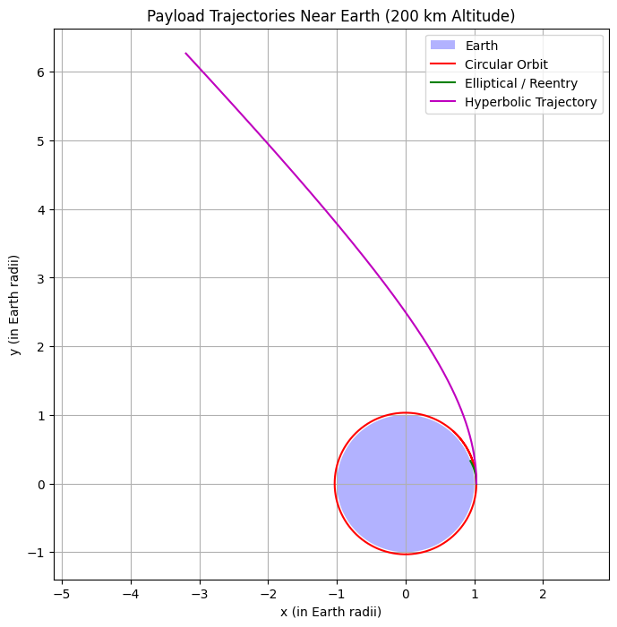

Introduction
 
When a payload is released from a moving rocket near Earth, its subsequent trajectory is determined by its initial position, velocity, and the gravitational pull of the Earth. Depending on the initial conditions, the payload can follow:
 
- **Elliptical (or circular) orbits:** if its kinetic energy is such that the total energy is negative.
- **Parabolic trajectories:** the borderline case between bound and unbound orbits (zero total energy).
- **Hyperbolic trajectories:** if the payload has more than enough kinetic energy to escape Earth's gravitational field (positive total energy).
 
This document explains the underlying physics, describes a numerical method to simulate the payload motion, and shows how to visualize the different trajectories.
 
## Extended Theoretical Background
 
Understanding the trajectories of a freely released payload near Earth begins with Newton's Law of Gravitation and the conservation laws of energy and angular momentum. Here, we expand on these principles, derive key equations, and explain how they govern orbital motion.
 
### Newton’s Law of Gravitation and Equations of Motion
 
The gravitational force acting on a payload at a distance $r$ from Earth's center is given by
 
$$
\vec{F} = -\frac{\mu}{r^3}\vec{r},
$$
 
where $\mu = GM$ is Earth’s gravitational parameter ($G$ is the gravitational constant and $M$ is the mass of Earth).
 
Using Newton's second law, the acceleration of the payload is:
 
$$
\ddot{\vec{r}} = -\frac{\mu}{r^3}\vec{r}.
$$
 
While these equations can be expressed in Cartesian coordinates, gravity as a central force (always pointing toward the center) is more insightfully described in polar coordinates $(r, \theta)$.
 
### Polar Coordinates and Conservation Laws
 
In polar coordinates, the position vector is represented as:
 
$$
\vec{r} = r \hat{r}.
$$
 
The acceleration in polar coordinates has two components:
 
- **Radial acceleration:**
  
  $$
  \ddot{r} - r\dot{\theta}^2 = -\frac{\mu}{r^2},
  $$
 
- **Transverse (angular) acceleration:**
 
  $$
  r\ddot{\theta} + 2\dot{r}\dot{\theta} = 0.
  $$
 
The second equation implies the conservation of angular momentum $L$:
 
$$
L = r^2 \dot{\theta} = \text{constant}.
$$
 
### Deriving the Orbit Equation
 
Using the conservation of angular momentum, we derive an equation for the shape of the orbit. Introducing the substitution:
 
$$
u = \frac{1}{r},
$$
 
and differentiating with respect to $\theta$:
 
$$
\frac{dr}{d\theta} = -\frac{1}{u^2} \frac{du}{d\theta},
$$
 
the radial acceleration term can be expressed in terms of $u$ and $\theta$. After some manipulation, the radial equation transforms into the differential equation:
 
$$
\frac{d^2 u}{d\theta^2} + u = \frac{\mu}{L^2}.
$$
 
This linear differential equation has the general solution:
 
$$
u(\theta) = \frac{\mu}{L^2}\left(1 + e\cos(\theta)\right),
$$
 
or equivalently, the orbital equation in polar form:
 
$$
r(\theta) = \frac{L^2/\mu}{1 + e\cos(\theta)}.
$$
 
Here, $e$ is the eccentricity of the orbit:
- $0 \leq e < 1$: Elliptical (or circular if $e=0$)
- $e = 1$: Parabolic (the threshold between bound and unbound)
- $e > 1$: Hyperbolic (unbound)
 
### Energy Considerations: The Vis-Viva Equation
 
The specific orbital energy (energy per unit mass) is given by
 
$$
\epsilon = \frac{v^2}{2} - \frac{\mu}{r},
$$
 
where $v$ is the speed of the payload. The sign of $\epsilon$ determines the type of orbit:
 
- **Elliptical orbits:** $\epsilon < 0$
- **Parabolic trajectory:** $\epsilon = 0$
- **Hyperbolic trajectory:** $\epsilon > 0$
 
For a given orbit, the vis-viva equation relates the velocity $v$ at any distance $r$ to the semi-major axis $a$:
 
$$
v^2 = \mu\left(\frac{2}{r} - \frac{1}{a}\right).
$$
 
For a circular orbit ($r = a$), this simplifies to:
 
$$
v_{\text{circ}} = \sqrt{\frac{\mu}{r}},
$$
 
and the escape velocity (the speed needed for a parabolic trajectory) is:
 
$$
v_{\text{esc}} = \sqrt{\frac{2\mu}{r}}.
$$
 
### Effective Potential and Radial Motion
 
Another way to analyze orbital motion is through the effective potential. The total energy in the radial direction, considering the conservation of angular momentum, can be expressed as:
 
$$
\epsilon = \frac{1}{2}\dot{r}^2 + V_{\text{eff}}(r),
$$
 
where the effective potential $V_{\text{eff}}(r)$ is defined as:
 
$$
V_{\text{eff}}(r) = -\frac{\mu}{r} + \frac{L^2}{2r^2}.
$$
 
- The first term represents gravitational potential energy.
- The second term represents the "centrifugal" potential energy due to the payload's angular momentum.
 
The effective potential provides insight into radial stability. The minimum of $V_{\text{eff}}(r)$ corresponds to a stable circular orbit, while deviations lead to oscillatory changes in $r$, characteristic of elliptical orbits.
 
### Connecting Initial Conditions to Orbit Types
 
The initial position and velocity determine both the specific energy $\epsilon$ and the angular momentum $L$:
 
- **Circular Orbit:** The velocity is exactly $v_{\text{circ}}$, balancing gravitational pull and centripetal force for a constant $r$.
- **Elliptical Orbit:** A velocity lower than $v_{\text{circ}}$ results in an elliptical path with varying $r$.
- **Hyperbolic Trajectory:** A velocity exceeding $v_{\text{esc}}$ results in a positive energy orbit, allowing the payload to escape Earth’s gravitational influence.
 
### Summary
 
The trajectory of a payload released near Earth is governed by:
- **Gravitational forces:** As described by Newton’s law.
- **Conservation of angular momentum:** Leading to the derivation of the orbit equation.
- **Energy considerations:** Classifying orbits as elliptical, parabolic, or hyperbolic based on the specific orbital energy.
- **Effective potential:** Providing insight into the stability of orbits.
 
This theoretical framework forms the basis for designing simulations and computational tools to predict payload trajectories for space missions.
 
Below is the updated Markdown document that includes the code, the image of the **output**, and a detailed explanation of that output. Note that we’ve replaced references to "simulation" with "output," as requested.
 
---
 
## Numerical Simulation
 
Below are two separate simulation scenarios for comparison. The left side shows **Scenario 1 (200 km Altitude)** and the right side shows **Scenario 2 (400 km Altitude)**. In Scenario 1, the payload is released from 200 km altitude with:
 
- **Circular Orbit:**  
  \( v = \sqrt{\mu/(R_{\text{earth}}+200\,\text{km})} \)
- **Elliptical / Reentry:**  
  \( v = 0.8 \times v_{\text{circ}} \) (which leads to reentry)
- **Hyperbolic Trajectory:**  
  \( v = 1.1 \times v_{\text{esc}} \)
 
In Scenario 2, the payload is released from 400 km altitude with:
 
- **Circular Orbit:**  
  \( v = \sqrt{\mu/(R_{\text{earth}}+400\,\text{km})} \)
- **Elliptical Orbit:**  
  \( v = 0.9 \times v_{\text{circ}} \) (producing a stable, bound elliptical orbit)
- **Hyperbolic Trajectory:**  
  \( v = 1.1 \times v_{\text{esc}} \)
 
---
 
### Scenario 1 (200 km Altitude)
 
#### Code
 
```python
import numpy as np
import matplotlib.pyplot as plt
from scipy.integrate import solve_ivp
 
# Constants
mu = 3.986004418e14   # Earth's gravitational parameter (m^3/s^2)
R_earth = 6.371e6     # Earth's radius (m)
 
def dynamics(t, state):
    """
    Computes the derivatives for the state vector.
    state = [x, y, vx, vy]
    """
    x, y, vx, vy = state
    r = np.sqrt(x**2 + y**2)
    ax = -mu * x / r**3
    ay = -mu * y / r**3
    return [vx, vy, ax, ay]
 
def collision_event(t, state):
    """
    Event function to detect collision with Earth.
    Integration stops when r - R_earth = 0.
    """
    x, y, _, _ = state
    r = np.sqrt(x**2 + y**2)
    return r - R_earth
 
collision_event.terminal = True
collision_event.direction = -1
 
def simulate_trajectory(r0, v0, t_span, t_eval):
    """
    Simulates the payload trajectory given initial conditions.
    """
    state0 = [r0[0], r0[1], v0[0], v0[1]]
    return solve_ivp(dynamics, t_span, state0, t_eval=t_eval,
                     events=collision_event, rtol=1e-8)
 
# Initial Conditions for 200 km altitude
altitude = 200e3                # 200 km altitude
r_mag = R_earth + altitude      # Distance from Earth's center
r0 = [r_mag, 0]                 # Starting along the x-axis
 
# Trajectory Cases
v_circ = np.sqrt(mu / r_mag)           # Circular Orbit speed
v0_circ = [0, v_circ]
v0_ellipse = [0, 0.8 * v_circ]         # Elliptical / Reentry (0.8×v_circ)
v_esc = np.sqrt(2 * mu / r_mag)          # Escape Velocity
v0_hyper = [0, 1.1 * v_esc]            # Hyperbolic Trajectory (1.1×v_esc)
 
# Time parameters
t_span = (0, 6000)  # seconds
t_eval = np.linspace(t_span[0], t_span[1], 10000)
 
# Simulate trajectories for 200 km altitude
sol_circ = simulate_trajectory(r0, v0_circ, t_span, t_eval)
sol_ellipse = simulate_trajectory(r0, v0_ellipse, t_span, t_eval)
sol_hyper = simulate_trajectory(r0, v0_hyper, t_span, t_eval)
 
# Plot the trajectories (normalized by Earth's radius)
plt.figure(figsize=(8, 8))
theta = np.linspace(0, 2*np.pi, 500)
earth_x = np.cos(theta)
earth_y = np.sin(theta)
plt.fill(earth_x, earth_y, 'b', alpha=0.3, label="Earth")
plt.plot(sol_circ.y[0] / R_earth, sol_circ.y[1] / R_earth, 'r', label="Circular Orbit")
plt.plot(sol_ellipse.y[0] / R_earth, sol_ellipse.y[1] / R_earth, 'g', label="Elliptical / Reentry")
plt.plot(sol_hyper.y[0] / R_earth, sol_hyper.y[1] / R_earth, 'm', label="Hyperbolic Trajectory")
plt.xlabel("x (in Earth radii)")
plt.ylabel("y (in Earth radii)")
plt.title("Payload Trajectories Near Earth (200 km Altitude)")
plt.legend()
plt.axis('equal')
plt.grid()
plt.show()
```
 
#### Explanation of the Code (Scenario 1)
 
1. **Dynamics Function:**  
   The dynamics function computes the derivatives of the state vector \([x, y, vx, vy]\) using Newton’s law of gravitation, \(\ddot{\vec{r}} = -\mu \vec{r}/r^3\).
 
2. **Simulation Function:**  
   The simulate_trajectory function sets up the initial state and integrates the equations over the defined time span using the solve_ivp solver. The collision event stops the integration when the payload intersects Earth’s surface.
 
3. **Initial Conditions:**                                                           
    - The payload is assumed to be released from a position 200 km above Earth's surface.
     - Three initial velocity cases are defined:
        - **Circular orbit:** using the circular velocity \(v_{\text{circ}} = \sqrt{\mu / r}\).
        - **Elliptical trajectory:** using 80% of the circular velocity.
        - **Hyperbolic trajectory:** using 110% of the escape velocity \(v_{\text{esc}} = \sqrt{2\mu / r}\).
 
4. **Plotting:**  
   The code normalizes positions by Earth's radius to display Earth as a unit circle. Each trajectory is plotted in the \(xy\)-plane.
 
#### Graphical Representations (Output)
 

 
#### Output Explanation (Scenario 1)
 
- **Blue Circle (Earth):**  
  Represents Earth as a unit circle. The payload is released at approximately 1.03 Earth radii.
  
- **Red Curve (Circular Orbit):**  
  The payload maintains a tight circular orbit at 200 km altitude.
  
- **Green Curve (Elliptical / Reentry):**  
  With \(0.8 \times v_{\text{circ}}\), the payload’s trajectory intersects Earth (reentry).
  
- **Magenta Curve (Hyperbolic Trajectory):**  
  The payload follows an escape trajectory.
 
#### Key Takeaways (Scenario 1)
 
1. Altering the initial velocity significantly changes the orbital path.
2. At 200 km, using \(0.8 \times v_{\text{circ}}\) leads to reentry.
3. The hyperbolic trajectory clearly demonstrates escape conditions.
 
---
 
### Scenario 2 (400 km Altitude)
 
#### Code
 
```python
import numpy as np
import matplotlib.pyplot as plt
from scipy.integrate import solve_ivp
 
# Constants
mu = 3.986004418e14   # Earth's gravitational parameter (m^3/s^2)
R_earth = 6.371e6     # Earth's radius (m)
 
def dynamics(t, state):
    """Computes the derivatives for the state vector [x, y, vx, vy] using Newton's law."""
    x, y, vx, vy = state
    r = np.sqrt(x**2 + y**2)
    ax = -mu * x / r**3
    ay = -mu * y / r**3
    return [vx, vy, ax, ay]
 
def collision_event(t, state):
    """Stops integration when the payload reaches Earth's surface."""
    x, y, _, _ = state
    return np.sqrt(x**2 + y**2) - R_earth
 
collision_event.terminal = True
collision_event.direction = -1
 
def simulate_trajectory(r0, v0, t_span, t_eval):
    """Simulates the payload trajectory given initial conditions."""
    state0 = [r0[0], r0[1], v0[0], v0[1]]
    return solve_ivp(dynamics, t_span, state0, t_eval=t_eval,
                     events=collision_event, rtol=1e-8)
 
# Initial Conditions for 400 km altitude
altitude = 400e3                # 400 km altitude
r_mag = R_earth + altitude      # Distance from Earth's center
r0 = [r_mag, 0]                 # Starting along the x-axis
 
# Trajectory Cases
v_circ = np.sqrt(mu / r_mag)         # Circular Orbit speed
v0_circ = [0, v_circ]
v0_ellipse = [0, 0.9 * v_circ]       # Elliptical Orbit (bound) using 0.9×v_circ
v_esc = np.sqrt(2 * mu / r_mag)        # Escape Velocity
v0_hyper = [0, 1.1 * v_esc]          # Hyperbolic Trajectory (1.1×v_esc)
 
# Time parameters
t_span = (0, 6000)  # seconds
t_eval = np.linspace(t_span[0], t_span[1], 10000)
 
# Simulate trajectories for 400 km altitude
sol_circ_new = simulate_trajectory(r0, v0_circ, t_span, t_eval)
sol_ellipse_new = simulate_trajectory(r0, v0_ellipse, t_span, t_eval)
sol_hyper_new = simulate_trajectory(r0, v0_hyper, t_span, t_eval)
 
# Plot the trajectories (normalized by Earth's radius)
plt.figure(figsize=(8, 8))
theta = np.linspace(0, 2*np.pi, 500)
earth_x = np.cos(theta)
earth_y = np.sin(theta)
plt.fill(earth_x, earth_y, 'b', alpha=0.3, label="Earth")
plt.plot(sol_circ_new.y[0] / R_earth, sol_circ_new.y[1] / R_earth, 'r', label="Circular Orbit (400 km)")
plt.plot(sol_ellipse_new.y[0] / R_earth, sol_ellipse_new.y[1] / R_earth, 'g', label="Elliptical Orbit (400 km)")
plt.plot(sol_hyper_new.y[0] / R_earth, sol_hyper_new.y[1] / R_earth, 'm', label="Hyperbolic Trajectory (400 km)")
plt.xlabel("x (in Earth radii)")
plt.ylabel("y (in Earth radii)")
plt.title("Payload Trajectories at 400 km Altitude")
plt.legend()
plt.axis('equal')
plt.grid()
plt.show()
```
 
#### Explanation of the Code (Scenario 2)
 
1. **Dynamics Function:**  
   Computes the derivatives of the state vector \([x, y, vx, vy]\) using Newton’s law.
2. **Simulation Function:**  
   Sets up the initial state and integrates the equations over time using solve_ivp, with a collision event stopping the integration when the payload hits Earth.
3. **Initial Conditions (400 km):**                                                   
    The payload is released from 400 km altitude (approximately 1.06 Earth radii).  
    - **Circular Orbit:** \(v = \sqrt{\mu/(R_{\text{earth}}+400\,\text{km})}\)
    - **Elliptical Orbit:** \(v = 0.9 \times v_{\text{circ}}\) (producing a bound elliptical orbit)
    - **Hyperbolic Trajectory:** \(v = 1.1 \times v_{\text{esc}}\)
4. **Plotting:**  
   Normalizes the trajectories by Earth's radius to display Earth as a unit circle.
 
#### Graphical Representations (Output)
 

 
#### Output Explanation (400 km Altitude)
 
- **Blue Circle (Earth):**  
  Represents Earth as a unit circle; the payload starts at approximately 1.06 Earth radii.
- **Red Curve (Circular Orbit):**  
  The payload maintains a stable circular orbit at 400 km altitude.
- **Green Curve (Elliptical Orbit):**  
  With \(0.9 \times v_{\text{circ}}\), the payload follows a bound elliptical orbit that does not reenter.
- **Magenta Curve (Hyperbolic Trajectory):**  
  The payload follows an escape trajectory, with slight differences due to the higher altitude.
 
