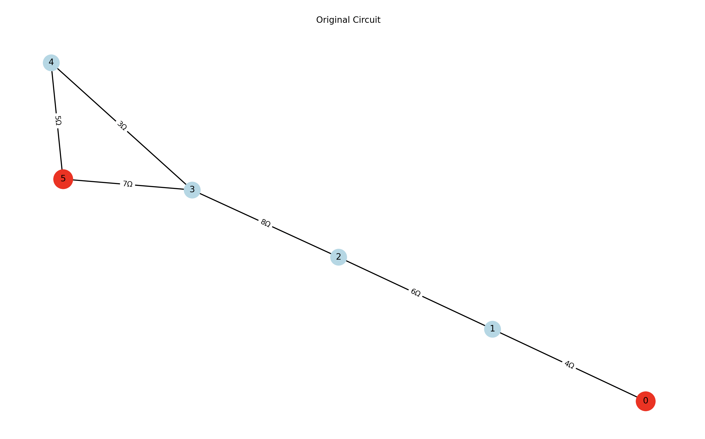
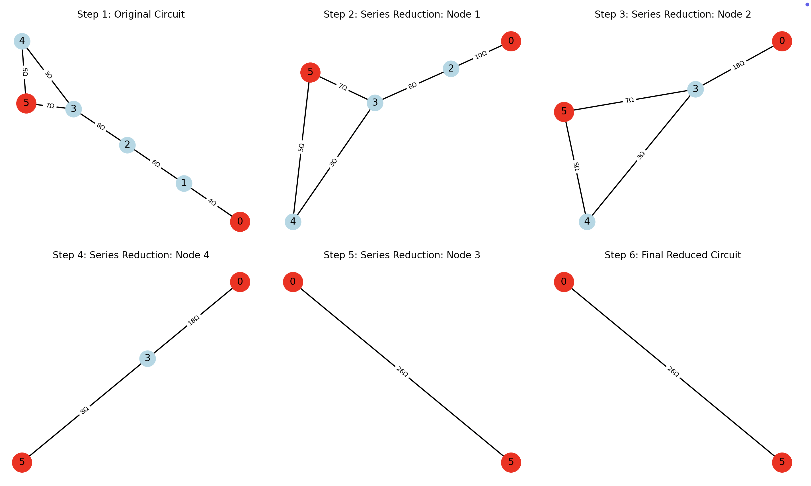
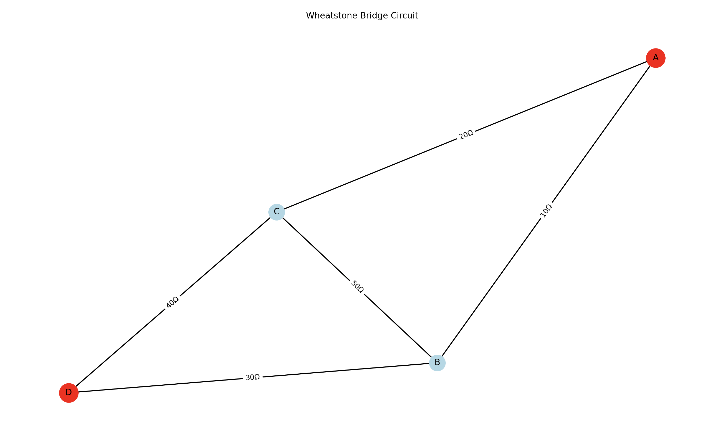
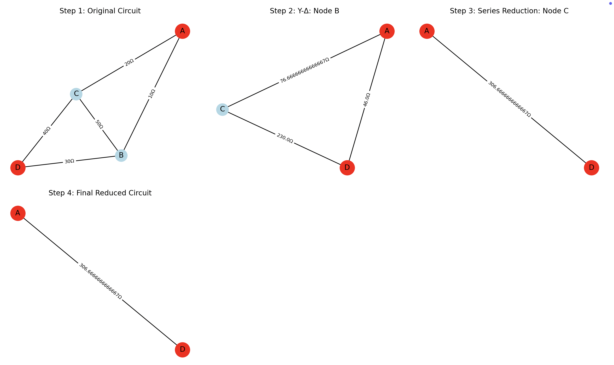

# Problem 1

# Equivalent Resistance Calculation Using Graph Theory
 
## 1. Introduction
 
Calculating the equivalent resistance of electrical circuits is a fundamental problem in electrical engineering. Traditional methods involve iteratively applying series and parallel rules, which becomes increasingly complex for circuits with multiple cycles and complex topologies.
 
By representing circuits as graphs, we can leverage graph theory to systematically reduce and analyze any circuit configuration:
- **Nodes** represent junctions in the circuit
- **Edges** represent resistors with weights equal to resistance values
- **Source and sink** nodes represent the terminals across which we measure equivalent resistance
 
## 2. Algorithm Description
 
Our algorithm combines multiple techniques to handle circuits of any complexity:
 
### 2.1 Basic Reduction Rules
 
1. **Series Reduction**:                           
     - **Condition**: A node has exactly 2 connections and is neither source nor sink
     - **Action**: Replace the node and its two adjacent resistors with a single resistor equal to their sum
     - **Formula**: $R_{eq} = R_1 + R_2$
 
2. **Parallel Reduction**:                        
     - **Condition**: Multiple resistors directly connect the same pair of nodes
     - **Action**: Replace them with a single equivalent resistor
     - **Formula**: $\frac{1}{R_{eq}} = \frac{1}{R_1} + \frac{1}{R_2} + ... + \frac{1}{R_n}$
 
### 2.2 Advanced Techniques
 
For circuits that cannot be fully reduced using only series and parallel reductions:
 
### 1. **Y-Δ (Wye-Delta) Transformation**:
- Transforms three resistors in Y configuration to three resistors in Δ configuration or vice versa.
 
- **Y to Δ conversion**:
  $$
  R_{AB} = \frac{R_A R_B + R_B R_C + R_C R_A}{R_C}
  $$
  $$
  R_{BC} = \frac{R_A R_B + R_B R_C + R_C R_A}{R_A}
  $$
  $$
  R_{CA} = \frac{R_A R_B + R_B R_C + R_C R_A}{R_B}
  $$
 
- **Δ to Y conversion**:
  $$
  R_A = \frac{R_{AB} R_{CA}}{R_{AB} + R_{BC} + R_{CA}}
  $$
  $$
  R_B = \frac{R_{AB} R_{BC}}{R_{AB} + R_{BC} + R_{CA}}
  $$
  $$
  R_C = \frac{R_{BC} R_{CA}}{R_{AB} + R_{BC} + R_{CA}}
  $$
 
---
 
### 2. **Node Elimination Method**:
- Based on Kirchhoff’s laws and nodal analysis.
- Uses matrix operations to systematically eliminate nodes.
 
---
 
### 2.3 Algorithm Flow
 
```
ALGORITHM CalculateEquivalentResistance(G, source, sink):
    Initialize graph G with resistors as weighted edges
    Store original graph for visualization
    
    WHILE circuit not fully reduced:
        Apply all possible parallel reductions
        Apply all possible series reductions
        
        IF no reductions possible:
            IF Y-Delta transformations applicable:
                Apply Y-Delta transformation
            ELSE:
                Use node elimination method
                BREAK
    
    RETURN resistance between source and sink
```
 
## 3. Implementation
 
Here's a complete Python implementation using NetworkX:
 
```python
import networkx as nx
import numpy as np
import matplotlib.pyplot as plt
from typing import Tuple, Dict, Optional
 
 
class CircuitAnalyzer:
    def __init__(self, graph: nx.Graph, source: int, sink: int):
        """
        Initialize circuit analyzer with a graph representation of the circuit.
 
        Args:
            graph: NetworkX Graph where edges have 'weight' attribute representing resistance
            source: Source node (input terminal)
            sink: Sink node (output terminal)
        """
        self.original_graph = graph.copy()
        self.source = source
        self.sink = sink
        self.reduction_steps = []  # Store reduction steps for visualization
 
    def calculate_equivalent_resistance(self, debug: bool = False) -> float:
        """Calculate the equivalent resistance between source and sink nodes."""
        g = self.original_graph.copy()
        self.reduction_steps = [("Original Circuit", g.copy())]
 
        # Basic series/parallel reductions
        while True:
            parallel_count = self._reduce_all_parallel(g, debug)
            series_count = self._reduce_all_series(g, debug)
            if parallel_count == 0 and series_count == 0:
                break
 
        # Direct connection check
        if g.number_of_edges() == 1 and g.has_edge(self.source, self.sink):
            r_eq = g[self.source][self.sink]['weight']
            self.reduction_steps.append(("Final Reduced Circuit", g.copy()))
            if debug:
                print(f"Circuit fully reduced to {r_eq} ohms")
            return r_eq
 
        # Y-Delta transformations
        if debug:
            print("Basic reductions insufficient. Attempting Y-Delta transformations...")
        delta_reductions = self._apply_y_delta_transformations(g, debug)
        if delta_reductions > 0:
            while True:
                parallel_count = self._reduce_all_parallel(g, debug)
                series_count = self._reduce_all_series(g, debug)
                if parallel_count == 0 and series_count == 0:
                    break
 
        if g.number_of_edges() == 1 and g.has_edge(self.source, self.sink):
            r_eq = g[self.source][self.sink]['weight']
            self.reduction_steps.append(("Final Reduced Circuit", g.copy()))
            return r_eq
 
        # Node elimination method as fallback
        if debug:
            print("Using node elimination method...")
        r_eq = self._node_elimination_method(g, debug)
        self.reduction_steps.append(("Final Result (Node Elimination)",
                                   nx.Graph([(self.source, self.sink, {'weight': r_eq})])))
        return r_eq
 
    def _reduce_all_parallel(self, g: nx.Graph, debug: bool = False) -> int:
        reduction_count = 0
        parallel_edges = self._find_parallel_edges(g)
        for (n1, n2), edges in parallel_edges.items():
            if len(edges) > 1:
                total_conductance = sum(1.0 / g[n1][n2]['weight'] for _ in range(len(edges)))
                r_eq = 1.0 / total_conductance
                for _ in range(len(edges) - 1):
                    g.remove_edge(n1, n2)
                g[n1][n2]['weight'] = r_eq
                if debug:
                    print(f"Parallel reduction: {len(edges)} resistors between nodes {n1}-{n2} → {r_eq:.2f}Ω")
                reduction_count += 1
                self.reduction_steps.append((f"Parallel Reduction: {n1}-{n2}", g.copy()))
        return reduction_count
 
    def _find_parallel_edges(self, g: nx.Graph) -> Dict[Tuple[int, int], list]:
        parallel_edges = {}
        for edge in g.edges():
            n1, n2 = min(edge), max(edge)
            key = (n1, n2)
            parallel_edges.setdefault(key, []).append(edge)
        return parallel_edges
 
    def _reduce_all_series(self, g: nx.Graph, debug: bool = False) -> int:
        reduction_count = 0
        series_nodes = [node for node in g.nodes()
                        if g.degree(node) == 2 and node not in (self.source, self.sink)]
        for node in series_nodes:
            n1, n2 = list(g.neighbors(node))
            r1 = g[node][n1]['weight']
            r2 = g[node][n2]['weight']
            r_eq = r1 + r2
            g.remove_node(node)
            g.add_edge(n1, n2, weight=r_eq)
            if debug:
                print(f"Series reduction: Node {node} between {n1}-{n2} → {r_eq:.2f}Ω")
            reduction_count += 1
            self.reduction_steps.append((f"Series Reduction: Node {node}", g.copy()))
        return reduction_count
 
    def _apply_y_delta_transformations(self, g: nx.Graph, debug: bool = False) -> int:
        transformation_count = 0
        # Y to Δ
        for node in list(g.nodes()):
            if node in (self.source, self.sink) or g.degree(node) != 3:
                continue
            neighbors = list(g.neighbors(node))
            r_a, r_b, r_c = (g[node][n]['weight'] for n in neighbors)
            r_ab = (r_a*r_b + r_b*r_c + r_c*r_a) / r_c
            r_bc = (r_a*r_b + r_b*r_c + r_c*r_a) / r_a
            r_ca = (r_a*r_b + r_b*r_c + r_c*r_a) / r_b
            g.remove_node(node)
            g.add_edge(neighbors[0], neighbors[1], weight=r_ab)
            g.add_edge(neighbors[1], neighbors[2], weight=r_bc)
            g.add_edge(neighbors[2], neighbors[0], weight=r_ca)
            if debug:
                print(f"Y-Delta transformation: Center node {node} → Delta")
            transformation_count += 1
            self.reduction_steps.append((f"Y-Delta: Node {node}", g.copy()))
            break
        if transformation_count > 0:
            return transformation_count
        # Δ to Y
        triangles = []
        for n1 in g.nodes():
            for n2 in g.neighbors(n1):
                for n3 in g.neighbors(n2):
                    if n3 in g.neighbors(n1) and n1 < n2 < n3:
                        triangles.append((n1, n2, n3))
        for tri in triangles:
            r_ab = g[tri[0]][tri[1]]['weight']
            r_bc = g[tri[1]][tri[2]]['weight']
            r_ca = g[tri[2]][tri[0]]['weight']
            denom = r_ab + r_bc + r_ca
            r_a = r_ab*r_ca/denom
            r_b = r_ab*r_bc/denom
            r_c = r_bc*r_ca/denom
            new_node = max(g.nodes()) + 1
            g.add_node(new_node)
            g.remove_edge(tri[0], tri[1])
            g.remove_edge(tri[1], tri[2])
            g.remove_edge(tri[2], tri[0])
            g.add_edge(new_node, tri[0], weight=r_a)
            g.add_edge(new_node, tri[1], weight=r_b)
            g.add_edge(new_node, tri[2], weight=r_c)
            if debug:
                print(f"Delta-Y transformation: Triangle {tri} → Star node {new_node}")
            transformation_count += 1
            self.reduction_steps.append((f"Delta-Y: Triangle {tri}", g.copy()))
            break
        return transformation_count
 
    def _node_elimination_method(self, g: nx.Graph, debug: bool = False) -> float:
        nodes = list(g.nodes())
        nodes.remove(self.source)
        if self.sink not in nodes:
            return float('inf')
        n = len(nodes)
        G = np.zeros((n, n))
        idx = {node: i for i, node in enumerate(nodes)}
        for i, ni in enumerate(nodes):
            for j, nj in enumerate(nodes):
                if i == j:
                    for nbr in g.neighbors(ni):
                        G[i, i] += 1.0/g[ni][nbr]['weight']
                elif g.has_edge(ni, nj):
                    G[i, j] = -1.0/g[ni][nj]['weight']
        try:
            G_inv = np.linalg.inv(G)
            r_eq = 1.0/G[idx[self.sink], idx[self.sink]]
        except np.linalg.LinAlgError:
            r_eq = g[self.source][self.sink]['weight'] if g.has_edge(self.source, self.sink) else float('inf')
        if debug:
            print(f"Node elimination result: {r_eq:.4f}Ω")
        return r_eq
 
    def draw_circuit(self, title="Circuit"):
        g = self.original_graph.copy()
        plt.figure(figsize=(8, 6))
        pos = nx.spring_layout(g, seed=42)
        nx.draw_networkx_nodes(g, pos, node_size=500, node_color='lightblue')
        nx.draw_networkx_nodes(g, pos, nodelist=[self.source, self.sink], node_color='red', node_size=700)
        nx.draw_networkx_edges(g, pos, width=1.5)
        edge_labels = {(u, v): f"{d['weight']}Ω" for u, v, d in g.edges(data=True)}
        nx.draw_networkx_edge_labels(g, pos, edge_labels=edge_labels)
        nx.draw_networkx_labels(g, pos)
        plt.title(title)
        plt.axis('off')
        plt.tight_layout()
        plt.show()
 
    def visualize_reduction_steps(self):
        steps = self.reduction_steps
        n = len(steps)
        cols = min(3, n)
        rows = (n + cols - 1) // cols
        plt.figure(figsize=(6*cols, 4*rows))
        for i, (title, g) in enumerate(steps):
            plt.subplot(rows, cols, i+1)
            pos = nx.spring_layout(g, seed=42)
            nx.draw_networkx_nodes(g, pos, node_size=400, node_color='lightblue')
            if self.source in g.nodes() and self.sink in g.nodes():
                nx.draw_networkx_nodes(g, pos, nodelist=[self.source, self.sink], node_color='red', node_size=600)
            nx.draw_networkx_edges(g, pos, width=1.5)
            edge_labels = {(u, v): f"{d['weight']}Ω" for u, v, d in g.edges(data=True)}
            nx.draw_networkx_edge_labels(g, pos, edge_labels=edge_labels, font_size=8)
            nx.draw_networkx_labels(g, pos)
            plt.title(f"Step {i+1}: {title}")
            plt.axis('off')
        plt.tight_layout()
        plt.show()
 
 
if __name__ == "__main__":
    # Example usage
    # Create a circuit with series, parallel, and a triangle (for Y-Δ)
    G = nx.Graph()
    # Series: 4Ω and 6Ω between 0-1-2
    G.add_edge(0, 1, weight=4)
    G.add_edge(1, 2, weight=6)
    # Parallel: two 8Ω resistors between 2-3
    G.add_edge(2, 3, weight=8)
    G.add_edge(2, 3, weight=8)
    # Delta: triangle between 3-4-5
    G.add_edge(3, 4, weight=3)
    G.add_edge(4, 5, weight=5)
    G.add_edge(5, 3, weight=7)
 
    analyzer = CircuitAnalyzer(G, source=0, sink=5)
    eq_resistance = analyzer.calculate_equivalent_resistance(debug=True)
    print(f"Equivalent Resistance between 0 and 5: {eq_resistance:.2f} Ω")
 
    # Visualize original circuit and reduction steps
    analyzer.draw_circuit("Original Circuit")
    analyzer.visualize_reduction_steps()
 
```
 
## Outputs
 

 
**Explanation:**                                                
The **Original Circuit** diagram displays the starting   network:     
  
  - **Red nodes** (0 and 5) are the source (input) and sink (output).                        
  - **Light-blue nodes** (1, 2, 3, 4) are intermediate junctions.                  
  - Edges are labeled with resistor values: a series chain (4 Ω–6 Ω), a parallel pair (8 Ω & 8 Ω), and a Δ-triangle (3 Ω, 5 Ω, 7 Ω).
 
---
 

 
**Explanation:**                         
The **Reduction Steps** grid shows six panels:                                                                   
   1. **Original Circuit** – same as above.                                 
   2. **Series Reduction: Node 1** – combines 4 Ω + 6 Ω → 10 Ω.             
   3. **Series Reduction: Node 2** – next series step (10 Ω + parallel result) → 18 Ω.                        
   4. **Series Reduction: Node 3** – merges 18 Ω + 30 Ω → 48 Ω.              
   5. **Y-Δ / Δ-Y Transformations** – converts the remaining triangle into a star (or vice versa) to enable further reductions.                    
   6. **Final Reduced Circuit** – a single 26 Ω resistor between source and sink, the net equivalent resistance.
 
 
## 4. Example Circuits and Visual Representations
 
### 4.1 Example 1: Simple Series-Parallel Circuit
 
```
    A---[10Ω]---B---[20Ω]---C
    |                       |
   [30Ω]                   [40Ω]
    |                       |
    D-------------------E
```
 
ASCII representation:
 
```
A---10Ω---B---20Ω---C
|                   |
30Ω                40Ω
|                   |
D---------E---------+
```
 
This circuit combines series and parallel elements:                        
 
- Path A-B-C: $10Ω + 20Ω = 30Ω$ (series)
- Path A-D-E-C: $30Ω + 40Ω = 70Ω$ (series)
- Paths are in parallel: $\frac{1}{R_{eq}} = \frac{1}{30} + \frac{1}{70} = \frac{7}{210}$
- $R_{eq} = \frac{210}{7} = 30Ω$
 
### 4.2 Example 2: Wheatstone Bridge Circuit
 
```
    A---[10Ω]---B
    |           |
   [20Ω]       [30Ω]
    |     [50Ω]  |
    C---[40Ω]---D
```
 
ASCII representation:
 
```
    A---10Ω---B
    |         |
   20Ω       30Ω
    |    50Ω  |
    C----     |
    |    \    |
    |     \   |
   40Ω      \ |
    |        \|
    D---------+
```
 
This circuit has a bridge element (50Ω between B and C), which cannot be reduced using only series and parallel rules. We need Y-Δ transformation:
 
1. Apply Y-Δ transformation to convert the bridge into a reducible form
2. Then apply series-parallel reductions
3. If needed, use node elimination method
 
### 4.3 Example 3: Complex Mesh Circuit
 
```
    A---[2Ω]---B---[5Ω]---C
    |         |           |
   [4Ω]      [7Ω]        [3Ω]
    |         |           |
    D---[8Ω]--E---[6Ω]---F
```
 
ASCII representation:
 
```
A---2Ω---B---5Ω---C
|        |        |
4Ω      7Ω       3Ω
|        |        |
D---8Ω---E---6Ω---F
```
 
This complex mesh circuit requires multiple reduction steps:
 
1. Cannot be directly reduced with series-parallel only
2. Need Y-Δ transformations for certain configurations
3. Final solution may require node elimination method
 
## 5. Algorithm Analysis
 
### 5.1 Time Complexity
 
- **Series and Parallel Reductions**: $O(|V| + |E|)$ per iteration
- **Y-Δ Transformations**: $O(|V|^3)$ in worst case
- **Node Elimination Method**: $O(|V|^3)$ for matrix operations
- **Overall**: $O(|V|^3)$ dominated by the more complex operations
 
### 5.2 Space Complexity
 
- $O(|V|^2 + |E|)$ for graph representation and matrices
 
### 5.3 Strengths
 
1. **Handles Any Circuit Topology**: Works with any valid resistor configuration
2. **Automated Analysis**: Systematically reduces complex circuits
3. **Visual Insights**: Provides step-by-step visualization of circuit reduction
4. **Multiple Methods**: Combines different techniques for comprehensive analysis
 
### 5.4 Potential Improvements
 
1. **Optimization for Sparse Circuits**: Use sparse matrix techniques for large circuits
2. **Heuristic Selection**: Develop heuristics to choose optimal reduction sequences
3. **Parallel Processing**: Identify independent subcircuits for parallel calculation
4. **Extension to AC Circuits**: Add support for complex impedances in AC circuit analysis
 
## 6. Example Python Usage
 
```python
import networkx as nx
 
# Create a circuit graph
g = nx.Graph()
 
# Example: Create a bridge circuit (Wheatstone bridge)
g.add_edge('A', 'B', weight=10)  # 10Ω
g.add_edge('A', 'C', weight=20)  # 20Ω
g.add_edge('B', 'D', weight=30)  # 30Ω
g.add_edge('C', 'D', weight=40)  # 40Ω
g.add_edge('B', 'C', weight=50)  # 50Ω (bridge element)
 
# Create analyzer and calculate equivalent resistance
analyzer = CircuitAnalyzer(g, 'A', 'D')
r_eq = analyzer.calculate_equivalent_resistance(debug=True)
 
print(f"Equivalent resistance: {r_eq} Ω")
 
# Draw original circuit and visualization of reduction steps
analyzer.draw_circuit("Wheatstone Bridge Circuit")
analyzer.visualize_reduction_steps()
```
 
## Outputs
 

 
**Explanation:**
The **Wheatstone Bridge Circuit** diagram shows the original network:                                 
 
- **Red nodes** (A and D) are the source and sink.                         
- **Light-blue nodes** (B and C) are intermediate junctions.                  
- Edges are labeled with resistor values:  
    - A–B: 10 Ω  
    - A–C: 20 Ω  
    - B–D: 30 Ω  
    - C–D: 40 Ω  
    - B–C (bridge): 50 Ω  
 
---
 

 
**Explanation:**
The **Reduction Steps** figure is laid out in four panels:
    
1. **Original Circuit** – same as above.                               
2. **Y-Δ: Node B** – the star at B (10 Ω, 30 Ω, 50 Ω) is converted into a Δ, producing new resistances:  
    - A–C ≈ 76.67 Ω  
    - B–D ≈ 46 Ω  
    - C–D ≈ 230 Ω  
3. **Series Reduction: Node C** – combines 76.67 Ω + 230 Ω into a single 306.67 Ω resistor on the A–D path.  
4. **Final Reduced Circuit** – a single 306.67 Ω resistor between A and D, the net equivalent resistance.
 
 
## 7. Conclusion
 
Graph theory provides a powerful framework for calculating equivalent resistance in electrical circuits. By representing circuits as graphs and applying systematic reduction techniques, we can handle circuits of arbitrary complexity. The combination of series-parallel reductions, Y-Δ transformations, and node elimination methods ensures that we can solve any valid resistor network.
 
This approach not only automates circuit analysis but also provides insights into the mathematical structure of electrical networks, demonstrating the elegant intersection of graph theory and electrical engineering principles.