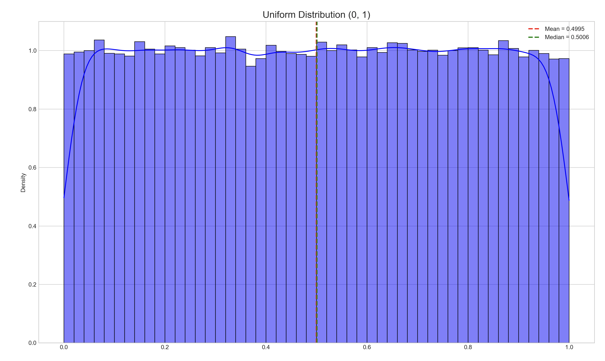
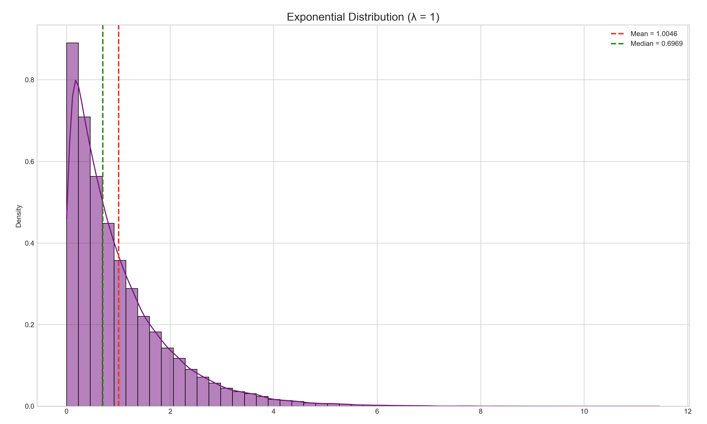
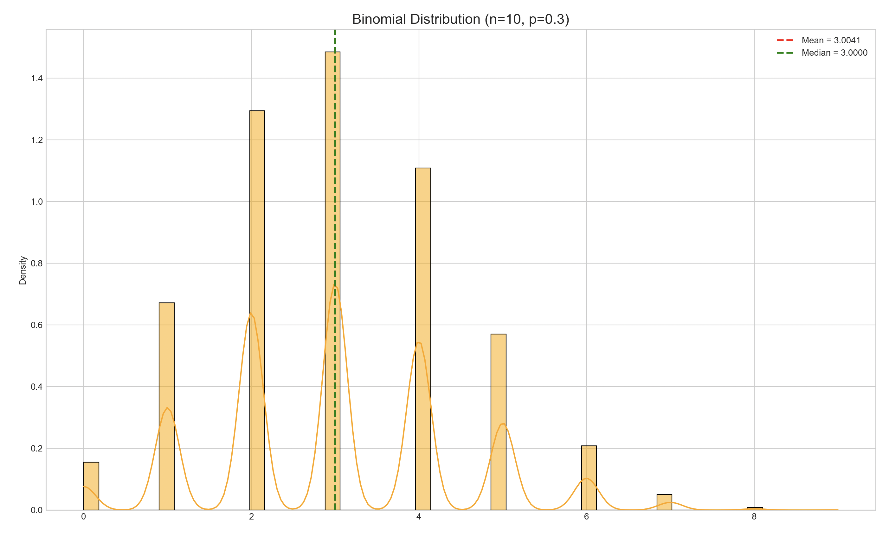
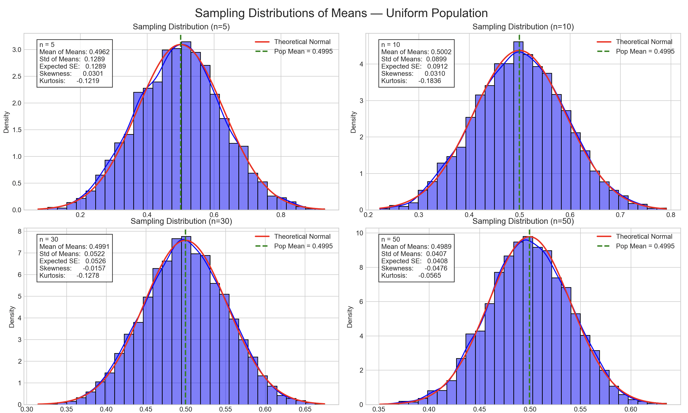
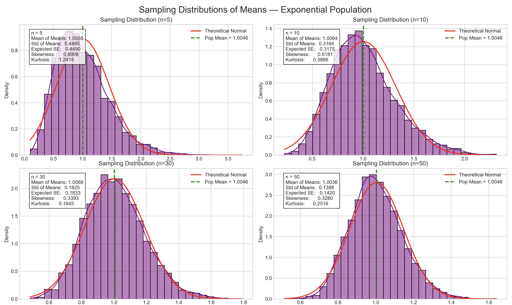
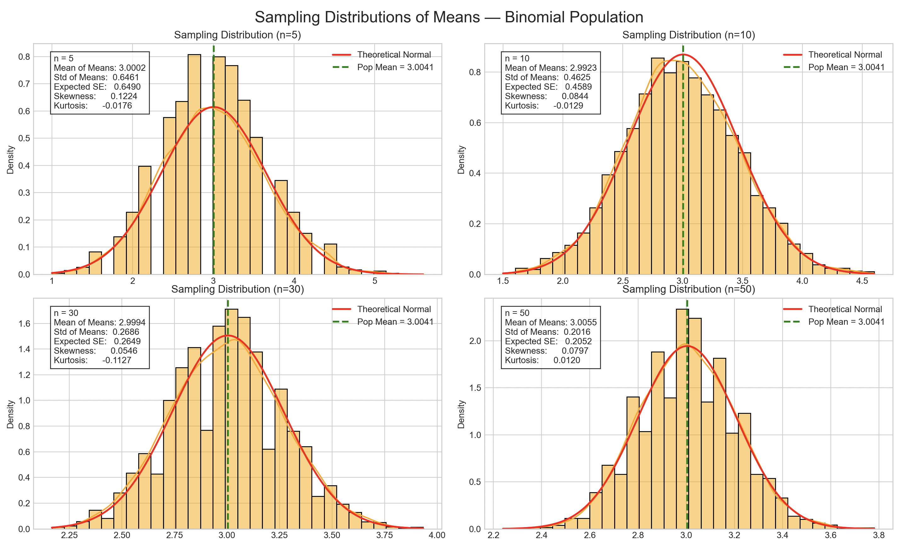
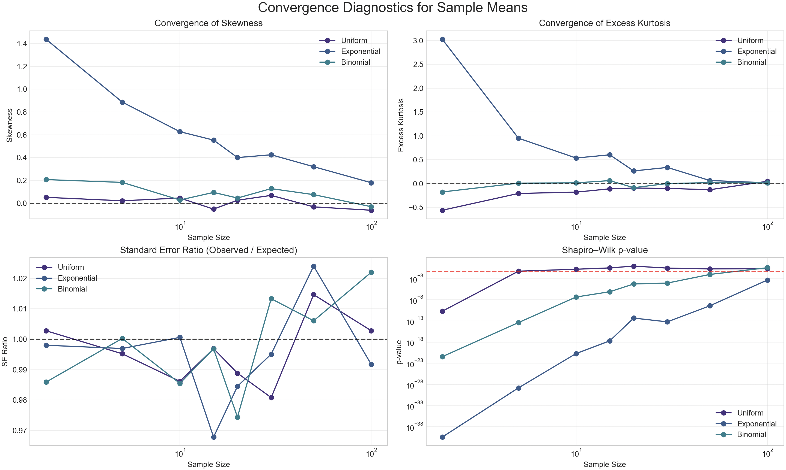
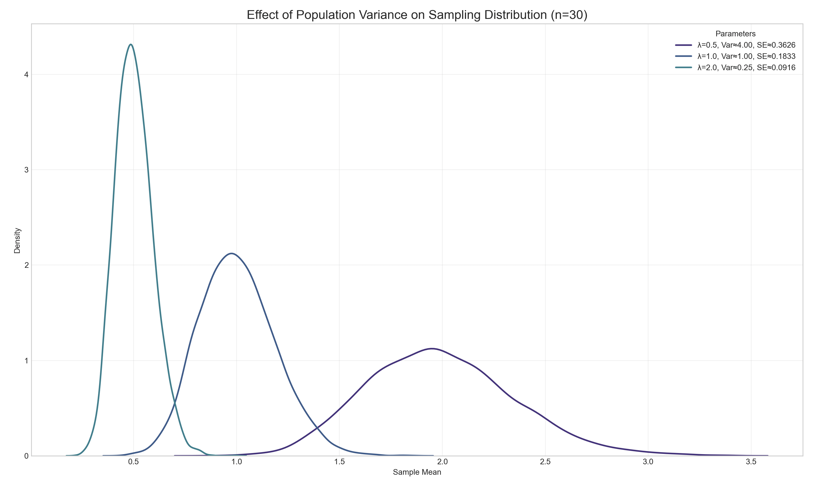

# Exploring the Central Limit Theorem through Simulations
 
## Introduction
 
The Central Limit Theorem (CLT) is a fundamental concept in probability theory and statistics that describes the behavior of the sampling distribution of the mean. According to the CLT, as the sample size increases, the sampling distribution of the sample mean approaches a normal distribution, regardless of the original population distribution's shape. This remarkable property holds true even when the underlying population distribution is non-normal.
 
This document explores the Central Limit Theorem through computational simulations, visualizing how sampling distributions evolve toward normality as sample sizes increase.
 
## Implementation and Analysis
 
### 1. Simulating Population Distributions
 
We'll begin by generating large datasets from different types of distributions to represent our populations:
- Uniform distribution (flat probability across a range)
- Exponential distribution (skewed with a long tail)
- Binomial distribution (discrete, representing count data)
 
```python
import os
import numpy as np
import matplotlib.pyplot as plt
import seaborn as sns
 
# Print current working directory
print("Current working directory:", os.getcwd())
 
# For reproducibility
np.random.seed(42)
 
# Aesthetic parameters
plt.style.use('seaborn-v0_8-whitegrid')
sns.set_palette("viridis")
 
# Population size
population_size = 100_000
 
# 1. Uniform Distribution (0,1)
uniform_population = np.random.uniform(0, 1, population_size)
# 2. Exponential Distribution (λ = 1)
exponential_population = np.random.exponential(scale=1.0, size=population_size)
# 3. Binomial Distribution (n=10, p=0.3)
binomial_population = np.random.binomial(n=10, p=0.3, size=population_size)
 
# Helper function to plot one distribution, save, show, then close
def plot_and_show(data, title, filename, color):
    mean = np.mean(data)
    median = np.median(data)
    print(f"\n{title} → mean={mean:.4f}, median={median:.4f}, std={np.std(data):.4f}")
    
    plt.figure(figsize=(8, 6))
    sns.histplot(data, kde=True, stat='density', bins=50, color=color)
    plt.title(title, fontsize=16)
    plt.axvline(mean, color='red', linestyle='--', linewidth=2, label=f"Mean = {mean:.4f}")
    plt.axvline(median, color='green', linestyle='--', linewidth=2, label=f"Median = {median:.4f}")
    plt.legend()
    plt.tight_layout()
    
    plt.savefig(filename, dpi=300)
    print(f"Saved plot to: {os.path.abspath(filename)}")
    
    plt.show()
    plt.close()
 
# Plot each distribution one by one
plot_and_show(
    uniform_population,
    "Uniform Distribution (0, 1)",
    "uniform_distribution.png",
    color='blue'
)
 
plot_and_show(
    exponential_population,
    "Exponential Distribution (λ = 1)",
    "exponential_distribution.png",
    color='purple'
)
 
plot_and_show(
    binomial_population,
    "Binomial Distribution (n=10, p=0.3)",
    "binomial_distribution.png",
    color='orange'
)
```
 
### Output: Population Distributions
 

 
*Figure 1: Histogram and KDE of 100 000 draws from a Uniform(0,1) population. The red dashed line marks the empirical mean (~0.500), and the green dashed line marks the median (~0.500), illustrating the flat shape with equal probability across [0,1].*
 

 
*Figure 2: Histogram and KDE of 100 000 draws from an Exponential(λ=1) population. Note the pronounced right skew and long tail. The red dashed line shows the empirical mean (~1.005), and the green dashed line shows the median (~0.693).*
 

 
*Figure 3: Histogram and KDE of 100 000 draws from a Binomial(n=10, p=0.3) population. The discrete bars at integer values are visible. The red dashed line is the mean (~3.004), and the green dashed line is the median (3.000), reflecting the count‐data nature of this distribution.*  
 
 
### 2. Sampling and Visualization
 
Next, we'll implement a sampling process where we:
1. Randomly draw samples of different sizes from each population
2. Calculate the sample mean for each draw
3. Repeat this process many times to create a sampling distribution
4. Visualize how these sampling distributions evolve as sample size increases
 
```python
import os
import numpy as np
import matplotlib.pyplot as plt
import seaborn as sns
from scipy import stats
 
# ----------------------------------------
# Section 2: Sampling and Visualization
# ----------------------------------------
 
# Print current working directory
print("Current working directory:", os.getcwd())
 
# For reproducibility
np.random.seed(42)
 
# Aesthetic parameters
plt.style.use('seaborn-v0_8-whitegrid')
sns.set_palette("viridis")
 
# Regenerate populations (if you ran Section 1 in a separate script, you can omit these)
population_size = 100_000
uniform_population     = np.random.uniform(0, 1, population_size)
exponential_population = np.random.exponential(scale=1.0, size=population_size)
binomial_population    = np.random.binomial(n=10, p=0.3, size=population_size)
 
# Define the sample sizes and number of replicates
sample_sizes = [5, 10, 30, 50]
num_samples  = 5000
 
def generate_sampling_distribution(population, sample_sizes, num_samples):
    """Draw many samples of each size, return dict mapping n -> array of sample means."""
    distributions = {}
    for n in sample_sizes:
        means = [
            np.mean(np.random.choice(population, size=n, replace=True))
            for _ in range(num_samples)
        ]
        distributions[n] = np.array(means)
    return distributions
 
# Generate sampling distributions for each population
print("\nGenerating sampling distributions...")
uniform_samps     = generate_sampling_distribution(uniform_population,     sample_sizes, num_samples)
exponential_samps = generate_sampling_distribution(exponential_population, sample_sizes, num_samples)
binomial_samps    = generate_sampling_distribution(binomial_population,    sample_sizes, num_samples)
print("Done.\n")
 
def plot_and_show_sampling(samp_dist, population, title, filename, color):
    """Plot 2×2 grid of sampling distributions for each n, save & show sequentially."""
    pop_mean = np.mean(population)
    pop_std  = np.std(population)
 
    fig, axes = plt.subplots(2, 2, figsize=(14, 12))
    axes = axes.flatten()
 
    for ax, n in zip(axes, sample_sizes):
        means = samp_dist[n]
        se = pop_std / np.sqrt(n)
 
        sns.histplot(means, kde=True, stat="density", ax=ax, color=color, bins=30)
        # Overlay theoretical normal curve
        x = np.linspace(means.min(), means.max(), 500)
        ax.plot(x, stats.norm.pdf(x, loc=pop_mean, scale=se),
                'r-', linewidth=2, label='Theoretical Normal')
 
        # Population mean line
        ax.axvline(pop_mean, color='green', linestyle='--', linewidth=2,
                   label=f'Pop Mean = {pop_mean:.4f}')
 
        # Compute diagnostics
        mean_of_means = means.mean()
        std_of_means  = means.std()
        skewness      = stats.skew(means)
        kurtosis      = stats.kurtosis(means)
 
        # Annotate
        ax.text(0.05, 0.95,
                f"n = {n}\n"
                f"Mean of Means: {mean_of_means:.4f}\n"
                f"Std of Means:  {std_of_means:.4f}\n"
                f"Expected SE:   {se:.4f}\n"
                f"Skewness:      {skewness:.4f}\n"
                f"Kurtosis:      {kurtosis:.4f}",
                transform=ax.transAxes, va='top',
                bbox=dict(facecolor='white', alpha=0.8))
 
        ax.set_title(f"Sampling Distribution (n={n})")
        ax.legend()
 
    plt.suptitle(title, fontsize=18)
    plt.tight_layout()
    plt.subplots_adjust(top=0.92)
 
    # Save and display
    plt.savefig(filename, dpi=300)
    print(f"Saved sampling plot to: {os.path.abspath(filename)}")
    plt.show()
    plt.close()
 
# Plot and show each population in sequence
plot_and_show_sampling(
    uniform_samps,
    uniform_population,
    "Sampling Distributions of Means — Uniform Population",
    "uniform_sampling_distributions.png",
    color='blue'
)
 
plot_and_show_sampling(
    exponential_samps,
    exponential_population,
    "Sampling Distributions of Means — Exponential Population",
    "exponential_sampling_distributions.png",
    color='purple'
)
 
plot_and_show_sampling(
    binomial_samps,
    binomial_population,
    "Sampling Distributions of Means — Binomial Population",
    "binomial_sampling_distributions.png",
    color='orange'
)
 
print("\nSection 2 complete! Three figures have been displayed and saved.")
```
 
### Output: Sampling and Visualization
 

 
*Figure 4: Four histograms (n=5, 10, 30, 50) of sample‐means drawn from the Uniform(0,1) population. As $n$ increases, the distribution of the sample mean becomes more tightly clustered around the population mean $(~0.5)$ and more closely matches the overlaid normal curve. Note the decrease in spread (standard error) and the skew/kurtosis approaching 0.*
 

 
*Figure 5: Sampling distributions of means from the $Exponential(λ=1)$ population. For small $n$ (e.g. 5), the sampling distribution retains some right skew; by $n=50$, it is well‐approximated by a normal distribution centered at the population mean $(~1.0)$. The red curve is the CLT‐predicted normal with standard error $\sigma/\sqrt{n}$.*
 

*Figure 6: Sampling distributions of means from the Binomial(n=10, p=0.3) population. Even at $n=5$, the sample‐mean distribution is fairly symmetric; by $n=50$, it is almost indistinguishable from the theoretical normal curve. The mean of means converges to the true population mean (~3.0) and the spread shrinks as $n$ increases.*
 
 
### 3. Parameter Exploration: Convergence Analysis
 
Let's investigate how different factors affect the convergence to normality. We'll quantify this by measuring how the sampling distribution's characteristics (like skewness and kurtosis) approach those of a normal distribution as sample size increases.
 
```python
import os
import numpy as np
import pandas as pd
import matplotlib.pyplot as plt
import seaborn as sns
from scipy import stats
 
# ----------------------------------------
# Section 3: Parameter Exploration: Convergence Analysis
# ----------------------------------------
 
# Print current working directory
print("Current working directory:", os.getcwd())
 
# For reproducibility
np.random.seed(42)
 
# Aesthetic parameters
plt.style.use('seaborn-v0_8-whitegrid')
sns.set_palette("viridis")
 
# (Re)generate populations
population_size = 100_000
uniform_population     = np.random.uniform(0, 1, population_size)
exponential_population = np.random.exponential(scale=1.0, size=population_size)
binomial_population    = np.random.binomial(n=10, p=0.3, size=population_size)
 
# Detailed sample sizes and replicates
detailed_sample_sizes = [2, 5, 10, 15, 20, 30, 50, 100]
num_samples = 3000
 
def generate_sampling_distribution(population, sample_sizes, num_samples):
    """Return dict mapping each n to an array of sample means."""
    d = {}
    for n in sample_sizes:
        means = [
            np.mean(np.random.choice(population, size=n, replace=True))
            for _ in range(num_samples)
        ]
        d[n] = np.array(means)
    return d
 
print("\nGenerating detailed sampling distributions...")
uniform_detailed     = generate_sampling_distribution(uniform_population,     detailed_sample_sizes, num_samples)
exponential_detailed = generate_sampling_distribution(exponential_population, detailed_sample_sizes, num_samples)
binomial_detailed    = generate_sampling_distribution(binomial_population,    detailed_sample_sizes, num_samples)
print("Done.\n")
 
def calculate_sampling_statistics(sampling_distributions, population):
    """Compute diagnostics for each sampling distribution."""
    pop_std = np.std(population)
    records = []
    for n, means in sampling_distributions.items():
        expected_se = pop_std / np.sqrt(n)
        observed_se = means.std()
        # Shapiro–Wilk p-value (subset if >5000)
        subset = means if len(means) <= 5000 else np.random.choice(means, 5000, replace=False)
        _, p_sw = stats.shapiro(subset)
        records.append({
            'Sample Size': n,
            'Skewness': stats.skew(means),
            'Kurtosis': stats.kurtosis(means),
            'SE Ratio': observed_se / expected_se,
            'Shapiro-Wilk p-value': p_sw
        })
    return pd.DataFrame(records)
 
print("Calculating convergence statistics...")
df_uni = calculate_sampling_statistics(uniform_detailed, uniform_population)
df_uni['Distribution'] = 'Uniform'
df_exp = calculate_sampling_statistics(exponential_detailed, exponential_population)
df_exp['Distribution'] = 'Exponential'
df_bin = calculate_sampling_statistics(binomial_detailed, binomial_population)
df_bin['Distribution'] = 'Binomial'
 
all_stats = pd.concat([df_uni, df_exp, df_bin], ignore_index=True)
print("Done.\n")
 
# Create 2×2 figure with constrained_layout to avoid overlaps
fig, axes = plt.subplots(2, 2, figsize=(14, 12), constrained_layout=True)
axes = axes.flatten()
 
# 1. Skewness
for dist in ['Uniform', 'Exponential', 'Binomial']:
    sub = all_stats[all_stats['Distribution'] == dist]
    axes[0].plot(sub['Sample Size'], sub['Skewness'], 'o-', label=dist)
axes[0].axhline(0, linestyle='--', color='black', alpha=0.7)
axes[0].set_xscale('log')
axes[0].set_title('Convergence of Skewness')
axes[0].set_xlabel('Sample Size')
axes[0].set_ylabel('Skewness')
axes[0].legend()
axes[0].grid(alpha=0.3)
 
# 2. Excess Kurtosis
for dist in ['Uniform', 'Exponential', 'Binomial']:
    sub = all_stats[all_stats['Distribution'] == dist]
    axes[1].plot(sub['Sample Size'], sub['Kurtosis'], 'o-', label=dist)
axes[1].axhline(0, linestyle='--', color='black', alpha=0.7)
axes[1].set_xscale('log')
axes[1].set_title('Convergence of Excess Kurtosis')
axes[1].set_xlabel('Sample Size')
axes[1].set_ylabel('Excess Kurtosis')
axes[1].legend()
axes[1].grid(alpha=0.3)
 
# 3. SE Ratio
for dist in ['Uniform', 'Exponential', 'Binomial']:
    sub = all_stats[all_stats['Distribution'] == dist]
    axes[2].plot(sub['Sample Size'], sub['SE Ratio'], 'o-', label=dist)
axes[2].axhline(1, linestyle='--', color='black', alpha=0.7)
axes[2].set_xscale('log')
axes[2].set_title('Standard Error Ratio (Observed / Expected)')
axes[2].set_xlabel('Sample Size')
axes[2].set_ylabel('SE Ratio')
axes[2].legend()
axes[2].grid(alpha=0.3)
 
# 4. Shapiro–Wilk p-value
for dist in ['Uniform', 'Exponential', 'Binomial']:
    sub = all_stats[all_stats['Distribution'] == dist]
    axes[3].plot(sub['Sample Size'], sub['Shapiro-Wilk p-value'], 'o-', label=dist)
axes[3].axhline(0.05, linestyle='--', color='red', alpha=0.7)
axes[3].set_xscale('log')
axes[3].set_yscale('log')
axes[3].set_title('Shapiro–Wilk p-value')
axes[3].set_xlabel('Sample Size')
axes[3].set_ylabel('p-value')
axes[3].legend()
axes[3].grid(alpha=0.3)
 
# Save and show
output_file = 'convergence_analysis.png'
fig.suptitle('Convergence Diagnostics for Sample Means', fontsize=18)
fig.savefig(output_file, dpi=300)
print(f"Saved plot to: {os.path.abspath(output_file)}")
plt.show()
plt.close()
```
 
### Output: Convergence Analysis
 

 
*Figure 7: Four‐panel plot illustrating how the sampling distribution of the mean converges to normality as sample size increases.  
1. **Skewness** (top‐left) approaches 0.  
2. **Excess kurtosis** (top‐right) approaches 0.  
3. **Standard error ratio** (bottom‐left) converges to 1 (observed vs. theoretical SE).  
4. **Shapiro–Wilk p-value** (bottom‐right) rises above the 0.05 threshold, indicating normality for large \(n\).*  
 
 
### 4. Variance Impact Analysis
 
Let's investigate how the population variance affects the sampling distribution:
 
```python
import os
import numpy as np
import matplotlib.pyplot as plt
import seaborn as sns
 
# ----------------------------------------
# Section 4: Variance Impact Analysis
# ----------------------------------------
 
# Print current working directory
print("Current working directory:", os.getcwd())
 
# For reproducibility
np.random.seed(42)
 
# Aesthetic parameters
plt.style.use('seaborn-v0_8-whitegrid')
sns.set_palette("viridis")
 
# 1. Create exponential populations with different variances
#    Var(exponential) = 1 / λ²
lambdas = [0.5, 1.0, 2.0]   # variances: 4, 1, 0.25
population_size = 100_000
 
variance_populations = {}
for lam in lambdas:
    variance_populations[lam] = np.random.exponential(scale=1/lam, size=population_size)
 
# 2. Print expected vs. actual variances
print("\nPopulation Variance Check:")
for lam in lambdas:
    expected_var = 1 / (lam ** 2)
    actual_var   = np.var(variance_populations[lam])
    print(f" λ = {lam:<4} → Expected Var = {expected_var:.4f}, Actual Var = {actual_var:.4f}")
 
# 3. Generate sampling distributions (fixed sample size)
sample_size = 30
num_samples = 5000
 
variance_samp = {}
for lam, pop in variance_populations.items():
    means = [
        np.mean(np.random.choice(pop, size=sample_size, replace=True))
        for _ in range(num_samples)
    ]
    variance_samp[lam] = np.array(means)
 
# 4. Plot KDEs of sample means for each λ
plt.figure(figsize=(12, 8))
for lam in lambdas:
    pop      = variance_populations[lam]
    means    = variance_samp[lam]
    pop_std  = np.std(pop)
    expected_se = pop_std / np.sqrt(sample_size)
    label = f"λ={lam}, Var≈{1/lam**2:.2f}, SE≈{expected_se:.4f}"
    sns.kdeplot(means, label=label, fill=False, linewidth=2)
 
plt.title(f"Effect of Population Variance on Sampling Distribution (n={sample_size})", fontsize=16)
plt.xlabel("Sample Mean")
plt.ylabel("Density")
plt.legend(title="Parameters")
plt.grid(alpha=0.3)
 
# 5. Save, show, and close
output_file = "variance_impact.png"
plt.tight_layout()
plt.savefig(output_file, dpi=300)
print(f"\nSaved plot to: {os.path.abspath(output_file)}")
plt.show()
plt.close()
```
 
## Output: Variance Impact Analysis
 

 
\*Figure 8: KDEs of sample‐means (n=30) from Exponential populations with different rate parameters λ.
 
* **λ=0.5 (Var≈4.00, SE≈0.3626)** produces the widest sampling distribution (purple curve).
* **λ=1.0 (Var≈1.00, SE≈0.1833)** yields an intermediate spread (blue curve).
* **λ=2.0 (Var≈0.25, SE≈0.0916)** gives the narrowest distribution (teal curve).
  The curves confirm the CLT prediction that the standard error of the mean scales as $\sigma/\sqrt{n}$.
 
 
## Discussion and Practical Applications
 
### Key Findings
 
From our simulations, we can observe several key properties of the Central Limit Theorem:
 
1. **Convergence to Normality**: Regardless of the original population distribution (uniform, exponential, or binomial), the sampling distribution of the mean approaches a normal distribution as the sample size increases.
 
2. **Rate of Convergence**: The rate at which the sampling distribution approaches normality depends on:                                                
     - The shape of the original population distribution                        
     - The sample size                                                          
     - The population variance                                                  
 
3. **Standard Error Behavior**: The standard error (standard deviation of the sampling distribution) decreases proportionally to √n, where n is the sample size, confirming the theoretical prediction from the CLT.
 
4. **Distribution Shape Impact**: More skewed distributions like the exponential require larger sample sizes to achieve normality compared to more symmetric distributions like the uniform.
 
5. **Variance Effect**: The higher the population variance, the wider the sampling distribution, affecting the precision of our estimates.
 
### Practical Applications
 
The Central Limit Theorem has numerous practical applications across various fields:
 
#### 1. Estimating Population Parameters
 
In statistical inference, the CLT allows us to make probability statements about population parameters using sample statistics, even when we don't know the population distribution. This is fundamental in:
 
- **Polling and Surveys**: When estimating public opinion, the CLT enables pollsters to calculate margins of error for their sample means.
- **Medical Research**: When testing the effectiveness of treatments, researchers can apply CLT principles to determine if observed differences are statistically significant.
- **Economic Indicators**: Government agencies use sample data to estimate economic indicators like unemployment rates, applying CLT to establish confidence intervals.
 
#### 2. Quality Control in Manufacturing
 
In industrial settings, the CLT is applied to:
 
- **Process Control**: Manufacturers sample products to monitor quality, using the CLT to establish control limits for process parameters.
- **Acceptance Sampling**: Quality inspectors test a small sample from a larger batch, relying on the CLT to make inferences about the entire batch's quality.
- **Reliability Engineering**: Engineers use sampling to estimate component lifetimes and failure rates, applying the CLT to model uncertainty.
 
#### 3. Financial Modeling and Risk Assessment
 
The financial sector heavily leverages the CLT for:
 
- **Portfolio Management**: Investment returns are often modeled as normally distributed (per the CLT) when the portfolio contains many assets.
- **Value at Risk (VaR) Calculations**: Risk managers use the CLT to estimate potential losses in investment portfolios.
- **Option Pricing**: The Black-Scholes model for option pricing assumes normally distributed returns, which is justified by the CLT when considering many small price movements.
 
#### 4. Big Data and Machine Learning
 
In data science applications:
 
- **Feature Engineering**: The CLT helps data scientists understand how aggregated features behave, informing preprocessing decisions.
- **Bootstrap Methods**: Resampling techniques rely on CLT principles to estimate parameter uncertainty.
- **Model Evaluation**: Statistical tests for model comparison often rely on CLT assumptions.
 
### Limitations and Considerations
 
While the CLT is powerful, it's important to recognize its limitations:
 
1. **Sample Size Requirements**: For highly skewed distributions, larger sample sizes may be needed before the CLT applies effectively.
 
2. **Independence Assumption**: The CLT assumes independent observations, which may not hold in time series or spatially correlated data.
 
3. **Finite Variance Requirement**: For distributions with infinite variance (like the Cauchy distribution), the CLT doesn't apply in its standard form.
 
## Conclusion
 
The Central Limit Theorem represents one of the most profound results in probability theory, providing a bridge between various probability distributions and enabling powerful statistical inference methods. Our simulations have demonstrated how the sampling distribution of the mean converges to normality as sample size increases, regardless of the underlying population distribution.
 
This property is not just a mathematical curiosity but has far-reaching practical implications across countless fields. By understanding and applying the CLT appropriately, statisticians, researchers, and analysts can make reliable inferences about populations using sample data, quantify uncertainty, and make evidence-based decisions.
 
The CLT stands as a testament to the elegant mathematical patterns that emerge when we study large numbers of random events - even when individual outcomes seem chaotic or unpredictable, their averages often display remarkable regularity and predictability.