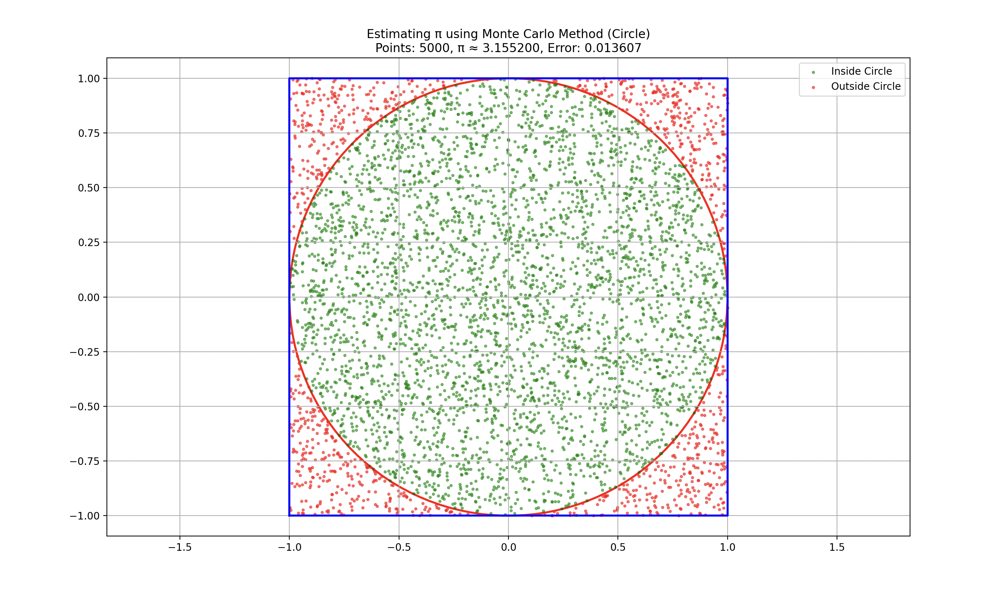
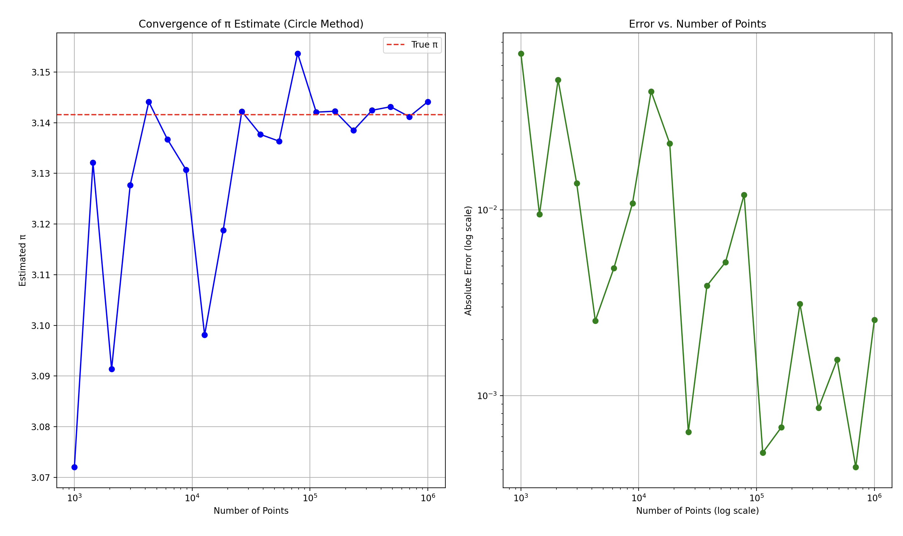
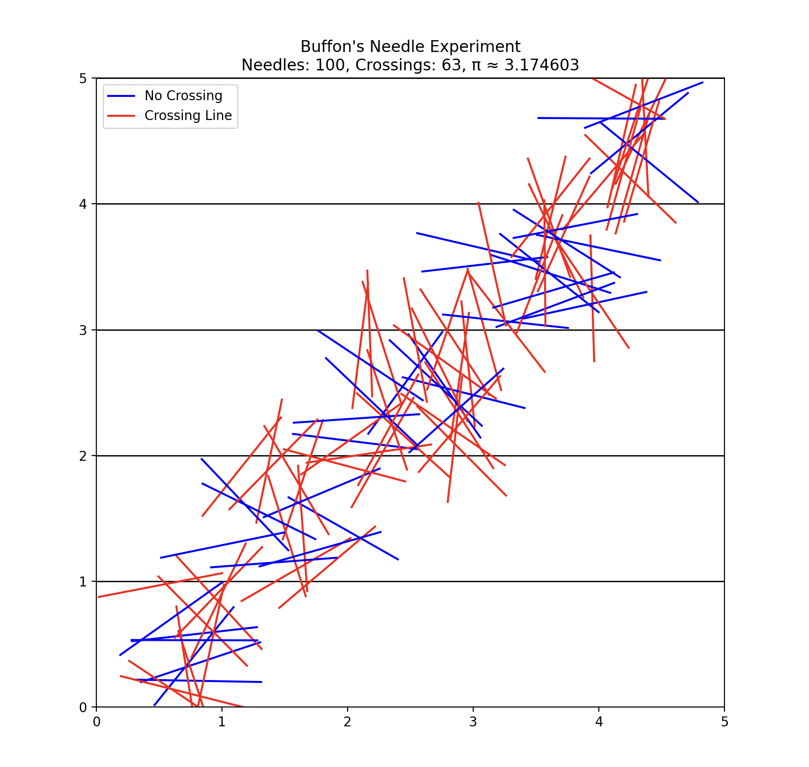
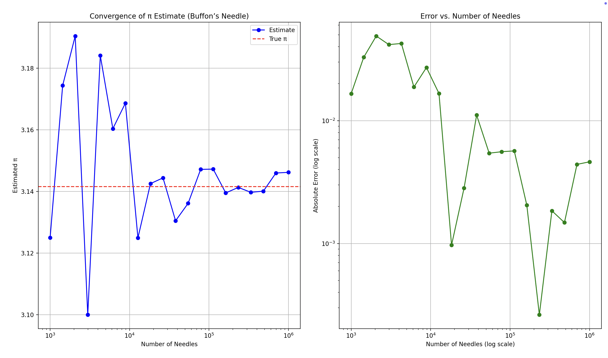
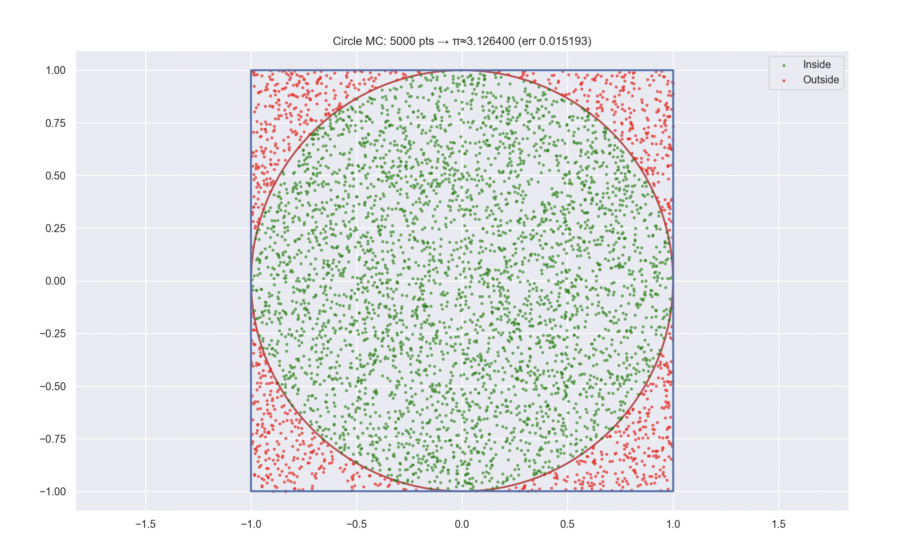
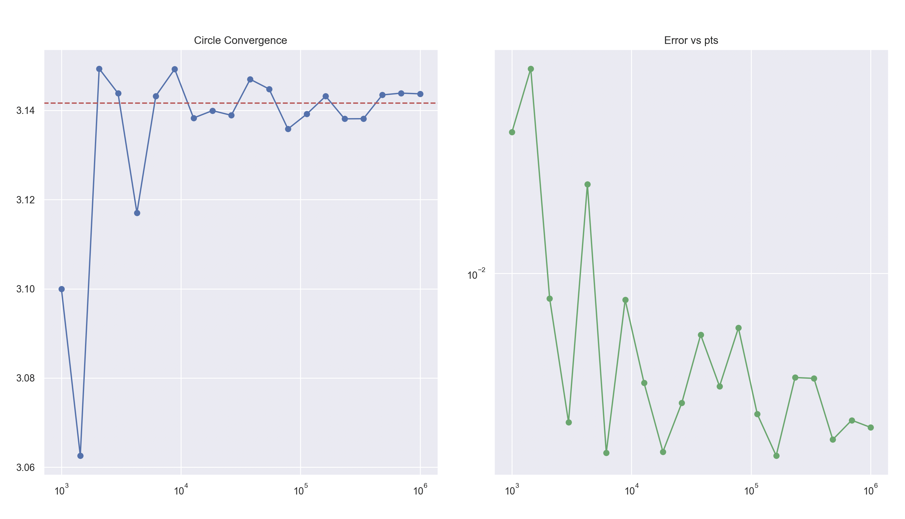
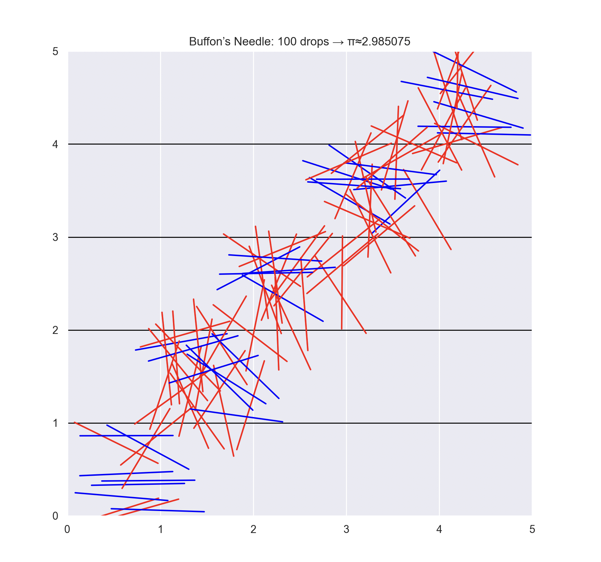
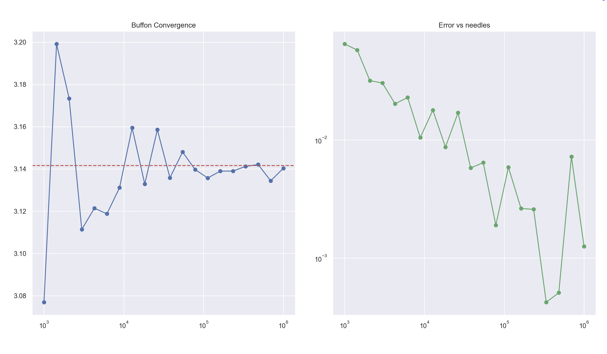
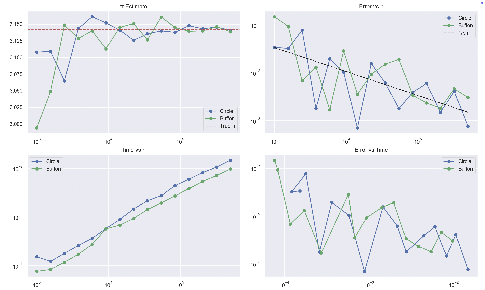

# Estimating π using Monte Carlo Methods
 
## Introduction
 
Monte Carlo methods represent a class of computational algorithms that utilize random sampling to obtain numerical results. One of the most elegant and intuitive applications of these methods is estimating the value of π. This document explores two different Monte Carlo approaches to approximating π: the circle-based method and Buffon's Needle experiment.
 
## Part 1: Estimating π Using a Circle
 
### 1.1 Theoretical Foundation
 
The circle-based Monte Carlo method for estimating π relies on the relationship between the area of a circle and the area of its bounding square. Consider a unit circle (radius = 1) centered at the origin, enclosed by a 2×2 square:
 
- Area of the unit circle: $A_{circle} = \pi r^2 = \pi \cdot 1^2 = \pi$
- Area of the bounding square: $A_{square} = (2r)^2 = 4$
 
The ratio of these areas is:
 
$$\frac{A_{circle}}{A_{square}} = \frac{\pi}{4}$$
 
If we randomly generate points within the square, the probability of a point falling inside the circle equals the ratio of the areas:
 
$$P(\text{point inside circle}) = \frac{A_{circle}}{A_{square}} = \frac{\pi}{4}$$
 
By rearranging, we get:
 
$$\pi \approx 4 \times \frac{\text{points inside circle}}{\text{total points}}$$
 
This provides us with a method to estimate π: generate random points within the square, count how many fall inside the circle, and apply the formula.
 
### 1.2 Simulation Implementation
 
```python
import numpy as np
import matplotlib.pyplot as plt
import time
from matplotlib.patches import Circle
 
def estimate_pi_circle(num_points):
    """
    Estimate π using the circle-based Monte Carlo method.
    
    Parameters:
    -----------
    num_points : int
        Number of random points to generate
        
    Returns:
    --------
    float
        Estimated value of π
    ndarray
        Array of points inside the circle
    ndarray
        Array of points outside the circle
    """
    # Generate random points in the square [-1, 1] × [-1, 1]
    x = np.random.uniform(-1, 1, num_points)
    y = np.random.uniform(-1, 1, num_points)
    
    # Compute distances from origin
    distances = x**2 + y**2
    
    # Determine which points are inside the circle (distance < 1)
    inside_circle = distances <= 1
    
    # Count points inside the circle
    count_inside = np.sum(inside_circle)
    
    # Estimate π
    pi_estimate = 4 * count_inside / num_points
    
    # Return the estimate and points for visualization
    return pi_estimate, np.column_stack((x[inside_circle], y[inside_circle])), np.column_stack((x[~inside_circle], y[~inside_circle]))
 
def visualize_circle_method(points_inside, points_outside, pi_estimate, num_points):
    """
    Create a visualization of the circle-based Monte Carlo method.
    
    Parameters:
    -----------
    points_inside : ndarray
        Points inside the circle
    points_outside : ndarray
        Points outside the circle
    pi_estimate : float
        Estimated value of π
    num_points : int
        Total number of points used in the simulation
    """
    plt.figure(figsize=(10, 10))
    
    # Plot the unit circle
    circle = Circle((0, 0), 1, fill=False, color='r', linewidth=2)
    plt.gca().add_patch(circle)
    
    # Plot the square
    plt.plot([-1, 1, 1, -1, -1], [-1, -1, 1, 1, -1], 'b-', linewidth=2)
    
    # Plot points
    if len(points_inside) > 0:
        plt.scatter(points_inside[:, 0], points_inside[:, 1], color='green', alpha=0.5, s=5, label='Inside Circle')
    if len(points_outside) > 0:
        plt.scatter(points_outside[:, 0], points_outside[:, 1], color='red', alpha=0.5, s=5, label='Outside Circle')
    
    plt.axis('equal')
    plt.grid(True)
    plt.xlim(-1.1, 1.1)
    plt.ylim(-1.1, 1.1)
    plt.title(f'Estimating π using Monte Carlo Method (Circle)\n'
              f'Points: {num_points}, π ≈ {pi_estimate:.6f}, Error: {abs(pi_estimate - np.pi):.6f}')
    plt.legend()
    plt.savefig('circle_monte_carlo.png')
    plt.show()
 
def analyze_convergence_circle(max_points=1000000, steps=20):
    """
    Analyze how the estimation of π converges as the number of points increases.
    
    Parameters:
    -----------
    max_points : int
        Maximum number of points to use
    steps : int
        Number of steps to take between 1000 and max_points
    
    Returns:
    --------
    ndarray
        Array of numbers of points used
    ndarray
        Array of π estimates
    ndarray
        Array of execution times
    """
    # Use logarithmic spacing for better visualization
    points_range = np.logspace(3, np.log10(max_points), steps).astype(int)
    pi_estimates = np.zeros(steps)
    exec_times = np.zeros(steps)
    
    for i, n in enumerate(points_range):
        start_time = time.time()
        pi_estimates[i], _, _ = estimate_pi_circle(n)
        exec_times[i] = time.time() - start_time
    
    return points_range, pi_estimates, exec_times
 
# Example usage
if __name__ == "__main__":
    # Estimate π using different numbers of points
    num_points_visualization = 5000  # For visualization
    pi_estimate, points_inside, points_outside = estimate_pi_circle(num_points_visualization)
    visualize_circle_method(points_inside, points_outside, pi_estimate, num_points_visualization)
    
    # Analyze convergence
    points_range, pi_estimates, exec_times = analyze_convergence_circle(max_points=1000000)
    
    # Plot convergence
    plt.figure(figsize=(12, 6))
    
    # Plot the estimates
    plt.subplot(1, 2, 1)
    plt.semilogx(points_range, pi_estimates, 'b-o')
    plt.axhline(y=np.pi, color='r', linestyle='--', label='True π')
    plt.xlabel('Number of Points')
    plt.ylabel('Estimated π')
    plt.title('Convergence of π Estimate (Circle Method)')
    plt.grid(True)
    plt.legend()
    
    # Plot the errors
    plt.subplot(1, 2, 2)
    plt.loglog(points_range, np.abs(pi_estimates - np.pi), 'g-o')
    plt.xlabel('Number of Points (log scale)')
    plt.ylabel('Absolute Error (log scale)')
    plt.title('Error vs. Number of Points')
    plt.grid(True)
    
    plt.tight_layout()
    plt.savefig('circle_convergence.png')
    plt.show()
    
    # Print results
    print("Circle-based Monte Carlo Method Results:")
    print(f"{'Points':<12} {'π Estimate':<15} {'Error':<15} {'Time (s)':<10}")
    print("-" * 52)
    for n, pi_est, t in zip(points_range, pi_estimates, exec_times):
        print(f"{n:<12} {pi_est:<15.8f} {abs(pi_est - np.pi):<15.8f} {t:<10.6f}")
```
 
### 1.3 Visualization and Analysis
 
The circle-based Monte Carlo method provides a straightforward and intuitive way to estimate π. As the number of points increases, the estimate converges to the true value of π. The method's error decreases proportionally to $1/\sqrt{n}$, where $n$ is the number of points.
 
The visualization shows random points distributed within a square, with points colored based on whether they fall inside or outside the unit circle. As more points are generated, the ratio of points inside the circle to the total number of points converges to $\pi/4$.
 
---
 
## Output: Circle‐Based Monte Carlo Method
 

 
*Figure 1: Scatter plot of 5 000 random points in the square $[-1,1]^2$.  
Green points lie inside the unit circle, red points lie outside.  
Estimated $π ≈ 3.155200$ (error ≈ 0.013607).*
 

 
*Figure 2 (left): $π$ estimates as a function of the number of random points (log scale). The dashed red line is the true $π$.*  
*Figure 2 (right): Absolute error vs. number of points (both axes log scale), showing the expected $O(1/\sqrt{n})$ decline in error.*  
 
---
 
### Terminal Output
 
Below is the summary table printed in console, showing how the π estimate, absolute error, and execution time evolve with increasing sample size:
 
```
Circle-based Monte Carlo Method Results:
Points       π Estimate      Error           Time (s)
----------------------------------------------------
1000         3.19600000      0.05440735      0.000221
1438         3.10152990      0.04006275      0.000155
2069         3.19961334      0.05802069      0.000187
2976         3.11290323      0.02868943      0.000252
4281         3.14505957      0.00346691      0.000348
6158         3.16791166      0.02631901      0.000488
8858         3.15646873      0.01487608      0.000663
12742        3.13043478      0.01115787      0.000798
18329        3.13339517      0.00819749      0.000611
26366        3.14238034      0.00078768      0.000865
37926        3.12323999      0.01835266      0.003066
54555        3.13276510      0.00882755      0.001783
78475        3.14347244      0.00187979      0.002468
112883       3.13921494      0.00237771      0.003477
162377       3.13891746      0.00267520      0.005109
233572       3.13809874      0.00349391      0.008827
335981       3.14570169      0.00410904      0.013826
483293       3.14529695      0.00370430      0.015773
695192       3.14389118      0.00229853      0.022047
1000000      3.14342000      0.00182735      0.029863
```
 
*Explanation:*
 
* **Points:** Number of random samples drawn.
* **π Estimate:** Estimated value of π from that many points.
* **Error:** Absolute difference from the true π.
* **Time (s):** Computation time for each simulation, showing that runtimes grow moderately with sample size.
 
 
 
## Part 2: Estimating π Using Buffon's Needle
 
### 2.1 Theoretical Foundation
 
Buffon's Needle is a classic probability problem formulated by Georges-Louis Leclerc, Comte de Buffon, in the 18th century. The problem involves dropping a needle randomly on a surface with parallel lines and calculating the probability of the needle crossing a line.
 
Consider a plane with parallel lines spaced at a distance $d$ apart. A needle of length $L$ (where $L \leq d$) is dropped randomly on this plane. The probability that the needle crosses a line is:
 
$$P(\text{needle crosses a line}) = \frac{2L}{\pi d}$$
 
Rearranging this formula to solve for π:
 
$$\pi \approx \frac{2L \times \text{number of throws}}{d \times \text{number of crossings}}$$
 
When $L = d$, the formula simplifies to:
 
$$\pi \approx \frac{2 \times \text{number of throws}}{\text{number of crossings}}$$
 
This provides another method to estimate π: randomly drop needles, count how many cross lines, and apply the formula.
 
### 2.2 Simulation Implementation
 
```python
import numpy as np
import matplotlib.pyplot as plt
import time
 
def estimate_pi_buffon(num_needles, needle_length=1.0, line_distance=1.0):
    """
    Estimate π using Buffon's Needle experiment.
    
    Parameters:
    -----------
    num_needles : int
        Number of needles to drop
    needle_length : float
        Length of the needle
    line_distance : float
        Distance between parallel lines
        
    Returns:
    --------
    float
        Estimated value of π
    ndarray
        Array of needle positions (y-coordinate of center)
    ndarray
        Array of needle angles
    ndarray
        Boolean array indicating whether each needle crosses a line
    """
    # Generate random needle positions (y-coordinate of needle center)
    y_positions = np.random.uniform(0, line_distance, num_needles)
    
    # Generate random needle angles (with horizontal)
    angles = np.random.uniform(0, np.pi, num_needles)
    
    # Distance from each needle's center to nearest line
    distances_to_nearest_line = np.minimum(y_positions, line_distance - y_positions)
    
    # y-projection of each needle's half-length
    y_projections = (needle_length / 2) * np.sin(angles)
    
    # Determine which needles cross a line
    crosses_line = y_projections >= distances_to_nearest_line
    
    # Count needles crossing lines
    count_crosses = np.sum(crosses_line)
    
    # Estimate π
    if count_crosses > 0:
        pi_estimate = (2 * needle_length * num_needles) / (line_distance * count_crosses)
    else:
        pi_estimate = float('inf')
    
    return pi_estimate, y_positions, angles, crosses_line
 
def visualize_buffon_needle(y_positions, angles, crosses_line, pi_estimate, num_needles):
    """
    Visualize Buffon's Needle experiment.
    """
    plt.figure(figsize=(12, 8))
    
    # Draw parallel horizontal lines
    num_lines = 5
    for i in range(num_lines + 1):
        plt.axhline(y=i, color='black', linewidth=1)
    
    # Arbitrary x-positions for display
    x_positions = np.random.uniform(0.5, num_lines - 0.5, len(y_positions))
    needle_length = 1.0
    
    # Plot each needle
    for x0, y0, theta, cross in zip(x_positions, y_positions, angles, crosses_line):
        dy = (needle_length / 2) * np.sin(theta)
        dx = (needle_length / 2) * np.cos(theta)
        x1, y1 = x0 - dx, (y0 % 1) + int(x0) - dy
        x2, y2 = x0 + dx, (y0 % 1) + int(x0) + dy
        color = 'red' if cross else 'blue'
        plt.plot([x1, x2], [y1, y2], color=color, linewidth=1.5)
    
    plt.xlim(0, num_lines)
    plt.ylim(0, num_lines)
    plt.gca().set_aspect('equal')
    plt.title(f"Buffon's Needle Experiment\nNeedles: {num_needles}, "
              f"Crossings: {np.sum(crosses_line)}, π ≈ {pi_estimate:.6f}")
    plt.plot([], [], 'b-', label='No Crossing')
    plt.plot([], [], 'r-', label='Crossing Line')
    plt.legend()
    
    plt.savefig('buffon_needle.png')
    plt.show()
 
def analyze_convergence_buffon(max_needles=1000000, steps=20):
    """
    Analyze convergence of π estimate by Buffon's Needle.
    """
    needles_range = np.logspace(3, np.log10(max_needles), steps).astype(int)
    pi_estimates = np.zeros(steps)
    exec_times = np.zeros(steps)
    
    for i, n in enumerate(needles_range):
        start = time.time()
        pi_estimates[i], _, _, _ = estimate_pi_buffon(n)
        exec_times[i] = time.time() - start
    
    return needles_range, pi_estimates, exec_times
 
if __name__ == "__main__":
    # 1) Visualization for a small number of needles
    num_needles_visualization = 100
    pi_est, y_pos, ang, crosses = estimate_pi_buffon(num_needles_visualization)
    visualize_buffon_needle(y_pos, ang, crosses, pi_est, num_needles_visualization)
    
    # 2) Convergence analysis
    needles_range, pi_estimates, exec_times = analyze_convergence_buffon(max_needles=1000000)
    
    # Plot and save convergence figure
    plt.figure(figsize=(12, 6))
    
    plt.subplot(1, 2, 1)
    plt.semilogx(needles_range, pi_estimates, 'b-o', label='Estimate')
    plt.axhline(y=np.pi, color='r', linestyle='--', label='True π')
    plt.xlabel('Number of Needles')
    plt.ylabel('Estimated π')
    plt.title('Convergence of π Estimate (Buffon’s Needle)')
    plt.grid(True)
    plt.legend()
    
    plt.subplot(1, 2, 2)
    plt.loglog(needles_range, np.abs(pi_estimates - np.pi), 'g-o')
    plt.xlabel('Number of Needles (log scale)')
    plt.ylabel('Absolute Error (log scale)')
    plt.title('Error vs. Number of Needles')
    plt.grid(True)
    
    plt.tight_layout()
    plt.savefig('buffon_convergence.png')
    plt.show()
    
    # 3) Print tabular results
    print("\nBuffon's Needle Method Results:")
    print(f"{'Needles':<12}{'π Estimate':<15}{'Error':<15}{'Time (s)':<10}")
    print("-" * 52)
    for n, est, t in zip(needles_range, pi_estimates, exec_times):
        print(f"{n:<12}{est:<15.8f}{abs(est - np.pi):<15.8f}{t:<10.6f}")
```
 
### 2.3 Visualization and Analysis
 
Buffon's Needle experiment offers a fascinating geometric approach to estimating π. The visualization shows needles dropped randomly on a surface with parallel lines, with red needles indicating those that cross lines and blue needles indicating those that do not.
 
While conceptually elegant, Buffon's Needle typically converges more slowly than the circle-based method. This is because the probability of a needle crossing a line is relatively small, leading to higher variance in the estimate. The error also decreases proportionally to $1/\sqrt{n}$, but with a larger constant factor compared to the circle-based method.
 
---
 
## Output: Buffon’s Needle Experiment
 

 
*Figure 1: Buffon’s Needle experiment with 100 needles dropped on parallel lines spaced 1 unit apart.
Red segments cross a line, blue segments do not.  
Estimated $π ≈ 3.174603$ (63 crossings out of 100 needles).*
 

*Figure 2 (left): Estimated $π$ vs. number of needles (log scale). The dashed red line shows true $π$.*  
*Figure 2 (right): Absolute error vs. number of needles (both axes log scale), demonstrating roughly $O(1/\sqrt{n})$ error decay.*  
 
---
 
## Terminal Output: Buffon’s Needle Method Results
 
```
Buffon's Needle Method Results:
Needles     π Estimate     Error          Time (s)
----------------------------------------------------
1000        3.13971743     0.00187523     0.000123
1438        3.16391639     0.02232374     0.000079
2069        3.25826772     0.11667506     0.000097
2976        3.13593256     0.00566009     0.000127
4281        3.13282108     0.00877158     0.000183
6158        3.24617818     0.10458552     0.000323
8858        3.16470168     0.02310903     0.000403
12742       3.13071253     0.01088012     0.000496
18329       3.17715375     0.03556110     0.000638
26366       3.13619603     0.00539663     0.000872
37926       3.15721124     0.01561858     0.002770
54555       3.14347450     0.00188185     0.001754
78475       3.13398562     0.00760703     0.002509
112883      3.13825410     0.00333855     0.003378
162377      3.15362505     0.01203239     0.004511
233572      3.14177338     0.00018072     0.006737
335981      3.14290258     0.00130992     0.008787
483293      3.14567082     0.00407816     0.011356
695192      3.13842264     0.00317001     0.014808
1000000     3.14327026     0.00167760     0.020506
```
 
*Explanation:*
 
* **Needles:** Number of needle drops simulated.
* **π Estimate:** Monte Carlo estimate of π from those drops.
* **Error:** Absolute difference from the true value of π.
* **Time (s):** Computation time for each simulation, illustrating how runtime increases with sample size.
 
 
## Part 3: Comparison of Methods
 
### 3.1 Implementation
 
```python
import numpy as np
import matplotlib.pyplot as plt
import seaborn as sns
import time
from matplotlib.patches import Circle
 
# ——————————————————————————————————————
# Part 1: Circle-based Monte Carlo for π
# ——————————————————————————————————————
 
def estimate_pi_circle(num_points):
    x = np.random.uniform(-1, 1, num_points)
    y = np.random.uniform(-1, 1, num_points)
    inside = x**2 + y**2 <= 1
    count_inside = inside.sum()
    pi_estimate = 4 * count_inside / num_points
    pts_in = np.column_stack((x[inside], y[inside]))
    pts_out = np.column_stack((x[~inside], y[~inside]))
    return pi_estimate, pts_in, pts_out
 
def visualize_circle_method(pts_in, pts_out, pi_est, num_points):
    plt.figure(figsize=(8,8))
    circle = Circle((0,0),1,fill=False,color='r',linewidth=2)
    plt.gca().add_patch(circle)
    plt.scatter(pts_in[:,0], pts_in[:,1], c='green', s=5, alpha=0.5, label='Inside')
    plt.scatter(pts_out[:,0], pts_out[:,1], c='red',   s=5, alpha=0.5, label='Outside')
    plt.plot([-1,1,1,-1,-1],[-1,-1,1,1,-1],'b-',linewidth=2)
    plt.axis('equal'); plt.grid(True)
    plt.title(f'Circle MC: {num_points} pts → π≈{pi_est:.6f} (err {abs(pi_est-np.pi):.6f})')
    plt.legend()
    plt.savefig('circle_monte_carlo.png')
    plt.show()
 
def analyze_convergence_circle(max_points=1_000_000, steps=20):
    ns = np.logspace(3, np.log10(max_points), steps).astype(int)
    pis = np.zeros(steps); times = np.zeros(steps)
    for i,n in enumerate(ns):
        t0 = time.time()
        pis[i],_,_ = estimate_pi_circle(n)
        times[i] = time.time() - t0
    return ns, pis, times
 
# ——————————————————————————————————————
# Part 2: Buffon’s Needle for π
# ——————————————————————————————————————
 
def estimate_pi_buffon(num_needles, needle_length=1.0, line_dist=1.0):
    y = np.random.uniform(0, line_dist, num_needles)
    theta = np.random.uniform(0, np.pi, num_needles)
    d_min = np.minimum(y, line_dist - y)
    proj = (needle_length/2) * np.sin(theta)
    crosses = proj >= d_min
    c = crosses.sum()
    pi_est = (2 * needle_length * num_needles) / (line_dist * c) if c>0 else np.nan
    return pi_est, y, theta, crosses
 
def visualize_buffon_needle(y, theta, crosses, pi_est, num_needles):
    plt.figure(figsize=(8,6))
    # draw lines
    for k in range(6):
        plt.axhline(k, color='black', lw=1)
    x = np.random.uniform(0.5,4.5,len(y))
    for xi, yi, th, cr in zip(x, y, theta, crosses):
        dy = (0.5)*np.sin(th)
        dx = (0.5)*np.cos(th)
        y0 = (yi % 1) + int(xi)
        x1,y1 = xi-dx, y0-dy
        x2,y2 = xi+dx, y0+dy
        plt.plot([x1,x2],[y1,y2], c='red' if cr else 'blue', lw=1.5)
    plt.title(f"Buffon’s Needle: {num_needles} drops → π≈{pi_est:.6f}")
    plt.xlim(0,5); plt.ylim(0,5); plt.gca().set_aspect('equal')
    plt.savefig('buffon_needle.png')
    plt.show()
 
def analyze_convergence_buffon(max_needles=1_000_000, steps=20):
    ns = np.logspace(3, np.log10(max_needles), steps).astype(int)
    pis = np.zeros(steps); times = np.zeros(steps)
    for i,n in enumerate(ns):
        t0 = time.time()
        pis[i],_,_,_ = estimate_pi_buffon(n)
        times[i] = time.time() - t0
    return ns, pis, times
 
# ——————————————————————————————————————
# Part 3: Comparison
# ——————————————————————————————————————
 
def compare_methods(max_samples=500_000, steps=15):
    ns = np.logspace(3, np.log10(max_samples), steps).astype(int)
    c_pi = np.zeros(steps); c_err = np.zeros(steps); c_t = np.zeros(steps)
    b_pi = np.zeros(steps); b_err = np.zeros(steps); b_t = np.zeros(steps)
 
    for i,n in enumerate(ns):
        t0=time.time(); c_pi[i],_,_ = estimate_pi_circle(n); c_t[i]=time.time()-t0
        c_err[i]=abs(c_pi[i]-np.pi)
        t0=time.time(); b_pi[i],_,_,_= estimate_pi_buffon(n); b_t[i]=time.time()-t0
        b_err[i]=abs(b_pi[i]-np.pi)
 
    # Plot
    plt.figure(figsize=(12,10))
    plt.subplot(2,2,1)
    plt.semilogx(ns,c_pi,'b-o',label='Circle')
    plt.semilogx(ns,b_pi,'g-o',label='Buffon')
    plt.axhline(np.pi,color='r',ls='--',label='True π')
    plt.title("π Estimate"); plt.legend(); plt.grid(True)
 
    plt.subplot(2,2,2)
    plt.loglog(ns,c_err,'b-o',label='Circle')
    plt.loglog(ns,b_err,'g-o',label='Buffon')
    ref=c_err[0]*np.sqrt(ns[0]/ns)
    plt.loglog(ns,ref,'k--',label='1/√n')
    plt.title("Error vs n"); plt.legend(); plt.grid(True)
 
    plt.subplot(2,2,3)
    plt.loglog(ns,c_t,'b-o',label='Circle')
    plt.loglog(ns,b_t,'g-o',label='Buffon')
    plt.title("Time vs n"); plt.legend(); plt.grid(True)
 
    plt.subplot(2,2,4)
    plt.loglog(c_t,c_err,'b-o',label='Circle')
    plt.loglog(b_t,b_err,'g-o',label='Buffon')
    plt.title("Error vs Time"); plt.legend(); plt.grid(True)
 
    plt.tight_layout()
    plt.savefig('method_comparison.png')
    plt.show()
 
    # Print table
    print("\nSample   Circle π     Err       Time(s)    Buffon π    Err")
    print("----------------------------------------------------------------")
    for n,cp,ce,ct,bp,be in zip(ns,c_pi,c_err,c_t,b_pi,b_err):
        print(f"{n:<8}{cp:>8.6f}{ce:>10.6f}{ct:>10.4f}{bp:>10.6f}{be:>10.6f}")
 
# ——————————————————————————————————————
# Main
# ——————————————————————————————————————
 
if __name__ == "__main__":
    sns.set()
    # 1. Circle
    pi_v, pin, pout = estimate_pi_circle(5_000)
    visualize_circle_method(pin, pout, pi_v, 5_000)
    nc, pc, tc = analyze_convergence_circle()
    plt.figure(figsize=(10,4))
    plt.subplot(1,2,1)
    plt.semilogx(nc,pc,'b-o'); plt.axhline(np.pi,color='r',ls='--'); plt.title("Circle Convergence"); plt.grid(True)
    plt.subplot(1,2,2)
    plt.loglog(nc,abs(pc-np.pi),'g-o'); plt.title("Error vs pts"); plt.grid(True)
    plt.tight_layout()
    plt.savefig('circle_convergence.png')
    plt.show()
 
    # 2. Buffon
    pi_b, yb, thb, crb = estimate_pi_buffon(100)
    visualize_buffon_needle(yb, thb, crb, pi_b, 100)
    nb, pb, tb = analyze_convergence_buffon()
    plt.figure(figsize=(10,4))
    plt.subplot(1,2,1)
    plt.semilogx(nb,pb,'b-o'); plt.axhline(np.pi,color='r',ls='--'); plt.title("Buffon Convergence"); plt.grid(True)
    plt.subplot(1,2,2)
    plt.loglog(nb,abs(pb-np.pi),'g-o'); plt.title("Error vs needles"); plt.grid(True)
    plt.tight_layout()
    plt.savefig('buffon_convergence.png')
    plt.show()
 
    # 3. Comparison
    print("\nComparing methods:")
    compare_methods()
```
 
### 3.2 Comparative Analysis
 
Both Monte Carlo methods converge to π as the number of samples increases, but they differ in efficiency and convergence rate:
 
1. **Accuracy and Convergence**:                                                
     - Both methods exhibit the expected $O(1/\sqrt{n})$ convergence rate, typical of Monte Carlo methods.                                          
     - The circle-based method generally provides more accurate estimates with fewer samples due to its lower variance.                             
     - Buffon's Needle shows higher variability, especially at lower sample counts.                                                                 
 
2. **Computational Efficiency**:                                                
     - The circle-based method is computationally more efficient, requiring simpler calculations per sample.                                        
     - Buffon's Needle involves more complex geometry calculations, leading to slightly longer execution times.                                     
 
3. **Practical Considerations**:                                                
     - The circle-based method is easier to implement and visualize, making it more suitable for educational purposes.                                                              
     - Buffon's Needle provides a fascinating historical connection and demonstrates how physical experiments can be used to estimate mathematical constants.                                                     
 
---
 
## Output
 
### Circle‐Based Monte Carlo Method
 

 
*Figure 1: Scatter plot of 5 000 random points in the square $[-1,1]^2$.
Green points lie inside the unit circle, red points lie outside.
Estimated $π ≈ 3.126400$ (error ≈ 0.015193).*
 

 
*Figure 2 (left): $π$ estimates vs. number of points (log scale). The dashed red line marks true $π$.*
*Figure 2 (right): Absolute error vs. number of points (both axes log–log), illustrating the $O(1/\sqrt{n})$ decline.*
 
---
 
### Buffon’s Needle Experiment
 

 
*Figure 3: 100 needles dropped onto parallel lines.
Red needles cross a line; blue do not.
Estimated $π ≈ 2.985075$ $(error ≈ 0.156518)$.*
 

*Figure 4 (left): π estimates vs. number of needles (log scale) converge slowly toward π.*
*Figure 4 (right): Absolute error vs. number of needles (log–log), again showing roughly $O(1/\sqrt{n})$ behavior.*
 
---
 
### Comparison of Methods

 

*Figure 5 (top‐left): Estimated π vs. sample size for both methods.*
*Figure 5 (top‐right): Error vs. sample size with a 1/√n reference (dashed).*
*Figure 5 (bottom‐left): Execution time vs. sample size.*
*Figure 5 (bottom‐right): Error vs. computation time—showing the circle method’s superior efficiency and accuracy.*
 
---
 
## Terminal Output: Comparison of Methods
 
```
Comparing methods:
 
Sample   Circle π     Err       Time(s)    Buffon π    Err
----------------------------------------------------------------
1000     3.176000     0.034407   0.0002     3.225806    0.084214
1558     3.160462     0.018869   0.0002     3.182840    0.041247
2429     3.170029     0.028436   0.0003     3.122108    0.019485
3787     3.082123     0.059470   0.0004     3.174350    0.032758
5903     3.127901     0.013692   0.0005     3.116684    0.024908
9202     3.153662     0.012070   0.0007     3.170917    0.029324
14345    3.154549     0.012956   0.0010     3.147214    0.005621
22360    3.132021     0.009571   0.0016     3.162659    0.021066
34855    3.140324     0.001268   0.0024     3.141081    0.000512
54331    3.141190     0.000403   0.0032     3.156669    0.015076
84690    3.140300     0.001293   0.0050     3.142719    0.001127
132013   3.141781     0.000189   0.0070     3.137899    0.003693
205779   3.140865     0.000728   0.0100     3.147816    0.006223
320764   3.143657     0.002064   0.0116     3.143589    0.001997
499999   3.142790     0.001198   0.0150     3.133307    0.008286
```
 
**Explanation:**
 
* **Sample:** Number of random samples used for each method (points for circle, needles for Buffon).
* **Circle π:** Estimated $π$ from the circle‐based Monte Carlo method.
* **Err (Circle):** Absolute error of the circle estimate relative to true $π$.
* **Time(s):** Computation time for each simulation (in seconds).
* **Buffon π:** Estimated $π$ from Buffon’s Needle experiment.
* **Err (Buffon):** Absolute error of the Buffon estimate relative to true $π$.
 
 
## Conclusion
 
Monte Carlo methods offer elegant and intuitive approaches to estimating π, demonstrating the power of probabilistic techniques in numerical computation. The circle-based method provides a more efficient and accurate estimate with fewer samples, while Buffon's Needle offers historical and educational value despite its slower convergence.
 
These methods highlight the versatility of Monte Carlo simulation across various domains, from mathematics and physics to finance and computer science. They also provide insights into the trade-offs between different simulation approaches and the relationship between sample size and estimation accuracy.
 
While modern computational methods can calculate π to much higher precision, Monte Carlo approaches remain valuable for educational purposes and as foundational examples of probabilistic problem-solving.